# 600 w SC Arena Sport Flood Light

<!--
source_file: 600 w SC Arena Sport Flood Light.pdf
pages: 15
images_extracted: 57
needs_manual_review: True
-->

## Page 1

ABSTRACT
Short circuit Arena Sport Flood light.
High performance of 98% of led efficiency within
more than 50,000 operating hours.
SC Arena Sport is protected against the
electricity instability with over voltage,
current, and temperature protection.
SHORT CIRCUIT SC arena sport consists of Philips chips and
Philips drivers with warranty of 5 years.
ARENA SPORT
High lux, High performance, High protection with
long life-span for industrial use.

## Page 2

Table of Contents
1 General product information......................................................................................................................................
1.1 General Specifications ...............................................................................................................................................
1.2 Environmental Compliance
1.3 Compatibilities .......................................................................................................................................................
1.4 Product Main Parts ............................................................................................................................................
2 Body and Heat-Sink ....................................................................................................................................................
2.1 Heat-Sink Operation Theory.....................................................................................................................................
2.2 Body and Heat-Sink Description............................................................................................................................
3 LED Chips .....................................................................................................................................................................
3.1 Chip Performance Characteristics ...........................................................................................................................
3.2 Electrical and Thermal Characteristics ..................................................................................................................
3.3 Absolute Maximum Ratings................................................................................................................................
3.4 Characteristics Curves......................................................................................................................................
3.4.1 Light Output Characteristics ........................................................................................................................
3.4.2 Forward Current Characteristics ..............................................................................................................
3.4.3 Polar Curve ............................................................................................................................................
4 Driver ...........................................................................................................................................................................

## Page 3

1. Product General Information
1.1 General Specifications:
Table1: Product General Specifications
Item Specification Unit
LED Chip Philips 3030
Driver Philips
LED efficiency 145 Lm\W
Wattage 600 W
Total Luminous 87,000 Lm
N.O.Drivers 3 Drivers of 200 w
Beam angle 60 Degree
Color temperature 3000-6500 K
CRI > 90
Power factor > 0.95
Input voltage AC~100-277 V
Frequency 50-60 Hz
Operating -40 To 85 C
Temperature
Humidity Up to 90 %
IP 65
Life time 50,000 Hour
Warranty 5 Year

| Item | Specification | Unit |
| --- | --- | --- |
| LED Chip | Philips 3030 |  |
| Driver | Philips |  |
| LED efficiency | 145 | Lm\W |
| Wattage | 600 | W |
| Total Luminous | 87,000 | Lm |
| N.O.Drivers | 3 Drivers of 200 w |  |
| Beam angle | 60 | Degree |
| Color temperature | 3000-6500 | K |
| CRI | > 90 |  |
| Power factor | > 0.95 |  |
| Input voltage | AC~100-277 | V |
| Frequency | 50-60 | Hz |
| Operating
Temperature | -40 To 85 | C |
| Humidity | Up to 90 % |  |
| IP | 65 |  |
| Life time | 50,000 | Hour |
| Warranty | 5 | Year |

## Page 4

1.2 Environmental Compliance:
Short Circuit is committed to providing environmentally friendly products to the solid-state lighting market.
Arena sport floodlight LED is compliant to the general environmental duty (GED). Short Circuit will not
intentionally add the following restricted materials to its products: lead, mercury, cadmium, hexavalent
chromium, polybrominated biphenyls (PBB) or polybrominated diphenyl ethers (PBDE).
1.3 Compatibilities
1.4 Product Main Parts:
Flood light arena sport LED is mainly consisted of three parts described as following:
Body and heat sink which is made of Aluminum alloy to dissipate the internal temperature of Chips and
Drivers.
Philips 3030 LED Chips with efficiency of 145Lm/W.
Philips Driver which is responsible for supplying the chip with required voltage and current. Also, the driver is
protected against over voltage and over current occurrence.
2. Body and Heat-Sink
2.1 Heat-Sink Operation Theory
Due to electronic circuits nature, there is over internal heat generated
during the operation period. That heat needs to be dissipated to protect
driver components from being damaged.
According to Heat Transfer Theory, materials with high thermal
conductivity are used to transfer heat from the hot region to the cold
one, space in our case, so a heat-sink made from Aluminum alloy is a suitable
choice for this mission.
Figure1: Body and Heat-Sink

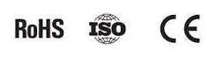

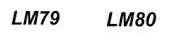

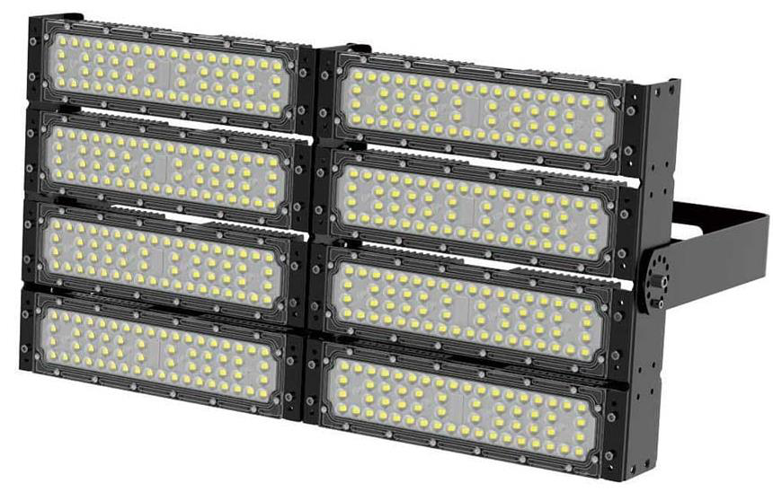

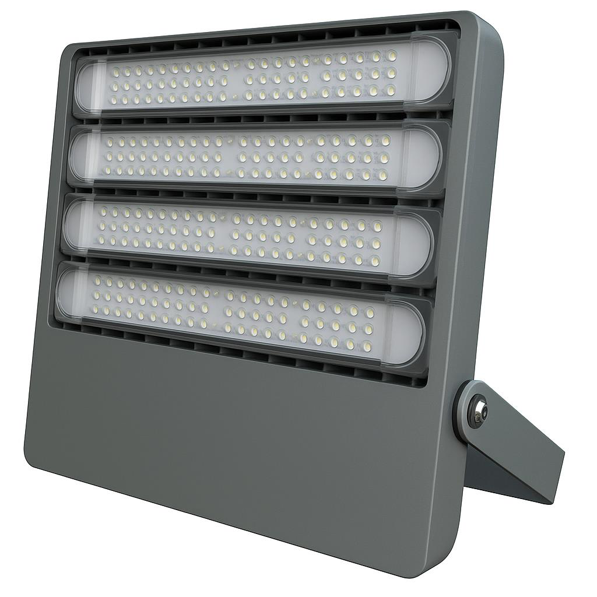

## Page 5

2.2 Body and Heat-Sink Description:
Table2: Body and Heat-Sink Description
Item Description
Body Anti-corrosion aluminum alloy heat sink (electrostatic painted)
Aluminum Purity 96-98 %
Lenses UV Poly-carbonate heat resistant lenses
Beam Angle 60°
Gasket silicone rubber insulation
Glands Waterproof cable glands (silicone insulated)
IP 65
Wattage 600 W

| Item | Description |
| --- | --- |
| Body | Anti-corrosion aluminum alloy heat sink (electrostatic painted) |
| Aluminum Purity | 96-98 % |
| Lenses | UV Poly-carbonate heat resistant lenses |
| Beam Angle | 60° |
| Gasket | silicone rubber insulation |
| Glands | Waterproof cable glands (silicone insulated) |
| IP | 65 |
| Wattage | 600 W |

## Page 6

3 LED Chips
Figure2: Philips Lumiled 3030
3.1 Chip Performance Characteristics
Table3: Chip Performance Characteristics
Pr oduct Nominal Minimum Typical Luminous Flux (lm) Part
CCT CRI Luminous Number
Minimum Typical
Efficacy (lm/W)
LUXEON 6500K 90 144 94 104 L130-
3030 2D 6590003000X21
(Squ are LES)
3.2 Electrical and Thermal Characteristics
Table4: Chip Electrical and Thermal Characteristics
Part Forward Voltage (Vf ) Typical Temperature Coefficient of
Number Forward Voltage [2] (mV/°C)
Minimum Typical Maximum
L130- 5.8 6 6.6 -2 to -4
6590003000X21
a. Absolute Maximum Ratings
Table5: Chip Absolute Maximum Ratings
Parameter Maximum Performance
DC Forward Current 240mA
Peak Pulsed Forward Current 300mA
LED Junction Temperature (DC & Pulse) 125°C
Operating Case Temperature -40°C to 105°C
LED Storage Temperature -40°C to 105°C

| Pr oduct | Nominal
CCT | Minimum
CRI | Typical
Luminous
Efficacy (lm/W) | Luminous Flux (lm) |  | Part
Number |
| --- | --- | --- | --- | --- | --- | --- |
|  |  |  |  | Minimum | Typical |  |
| LUXEON
3030 2D
(Squ are LES) | 6500K | 90 | 144 | 94 | 104 | L130-
6590003000X21 |

| Part
Number | Forward Voltage (Vf ) |  |  | Typical Temperature Coefficient of
Forward Voltage [2] (mV/°C) |
| --- | --- | --- | --- | --- |
|  | Minimum | Typical | Maximum |  |
| L130-
6590003000X21 | 5.8 | 6 | 6.6 | -2 to -4 |

| Parameter | Maximum Performance |
| --- | --- |
| DC Forward Current | 240mA |
| Peak Pulsed Forward Current | 300mA |
| LED Junction Temperature (DC & Pulse) | 125°C |
| Operating Case Temperature | -40°C to 105°C |
| LED Storage Temperature | -40°C to 105°C |

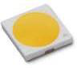

## Page 7

3.4 Characteristics Curves
3.4.1 Light Output Characteristics
Figure3.a: Chip Light Output Characteristics
Figure3.b: Chip Light Output Characteristics

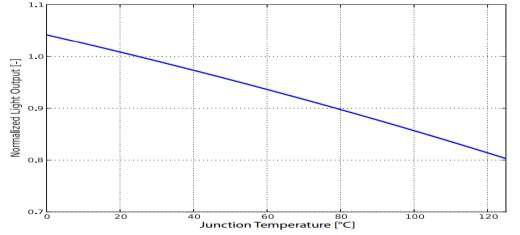

## Page 8

3.4.2 Forward Current Characteristics
Figure4: Chip Forward Current Characteristics
3.4.3 Polar Curve
Figure5: Chip Polar Curve

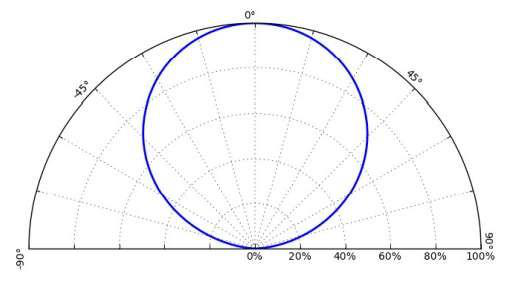

## Page 9

3.4.3 Polar Curve
4.Driver
Xitanium Outdoor Essential Programmable Low Voltage LED Drivers
Xi EP LV 200W 3.0-6.7A WL I195
9290 033 92980
XitaniumEssential Programmable (EP) LED drivers are designed for maximum reliabilit y and flexibility, making it a preferred choice for
outdoorapplications.Thekeyfeatureistoadjusttheoutputcurrentwiththenewe-settool,asimpleandfastwaytoconfigurethedriver
without the need to power on the driver and without the need for any software configuration. The WideLine family can operate on input
voltage 100-277Vac anywhere around the world and ensure 100% performance from 200-254Vac.
Features Application
Benefits
•Digital and simple Adjustable Output •Reliableandrepeatable •Roadandstreetlighting
Current (AOC) with e-set tool, based adjustmentofoutput •Areaandfloodlighting
o n N F C t e c h n o l o g y
current/voltage to save labor
•High-bay lighting
cost and time
•DWiadetLainesinhpuetevotltagerange:
•Easytodesign-inandreducesSKUs
100-277Vac • Lowmaintenancecostand
peaceofmindin extreme
•Surgeprotection:6/6kV(DM/CM)
conditions
•IP67with50,000hourslifetime
•Safetouseandprovidesluminaire
•SELVcertified designfreedom

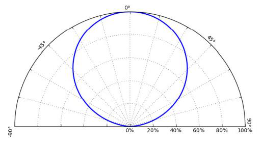

## Page 10

Electrical input data
Specification item Value Unit Condition
Rated input voltage range 200...254 Vac Performance range
Rated input voltage 230 Vac
Rated input frequency range 47...63 Hz Performance range
Rated input current 0.96 A @ rated output power @ rated input voltage
Max. input current 1.1 A @ rated output power @ minimum performance input voltage
Rated input power 220 W @ rated output power @ rated input voltage
Power factor 0.95 @ rated output power @ rated input voltage
Total harmonic distortion 10 % @ rated output power @ rated input voltage
Efficiency 93 % @ rated output power @ rated input voltage @max. Uout
Input voltage AC range 85...305 Vac Operational range
Input frequency AC range 45...66 Hz Operational range
Isolation input to output Double
Electrical output data
Specification item Value Unit Condition
Regulation method Constant Current
Output voltage 24...50 Vdc
Output voltage max. 60 V Maximum output voltage (rms)
Output current 3...6.7 A
Output current min programmable 3000 mA
Output current tolerance ± 5 % At max. output currentt, Ta=25°C
Output current ripple LF ≤ 5 % Ripple = peak / average, < 1kHz
Output current ripple HF ≤ 5 %
Output PstLM ≤ 0.1 In entire operating window
Output SVM ≤ 0.1 In entire operating window
Output power 72...200 W Rated output power is 200W
Electrical data controls input
Specification item Value Unit Condition
Control method Fixed

| 200...254 | Vac |
| --- | --- |
| 230 | Vac |
| 47...63 | Hz |
| 0.96 | A |
| 1.1 | A |
| 220 | W |
| 0.95 |  |
| 10 | % |
| 93 | % |
| 85...305 | Vac |
| 45...66 | Hz |

| Constant Current |  |
| --- | --- |
| 24...50 | Vdc |
| 60 | V |
| 3...6.7 | A |
| 3000 | mA |
| 5 | % |
| ≤ 5 | % |
| ≤ 5 | % |
| ≤ 0.1 |  |
| ≤ 0.1 |  |

## Page 11

Wiring and Connections
Specification item Value Unit Type
Input wire cross-section 1 mm2 3x 1.0mm2 stranded wires
Output wire cross-section 1 mm2 2x 1.0mm2 stranded wires
Maximum cable length 2 m Total length of wiring including LED module, one way
Insulation
Insulation per IEC61347-1 Input Output Ground
Input Double Basic
Output Double Basic
Ground Basic Basic
Dimensions and weight
Specification item Value Unit Tolerance (mm)
Length (A1) 195 mm ± 2
Mounting hole distance (A2) 184 mm ± 2
Length (A3) 172.5 mm ± 2
Width (B1) 67 mm ± 1
Width (B2) 52.5 mm ± 1
Width (B3) 34 mm ± 1
Height (C1) 40 mm ± 1
Mounting hole diameter (D1) 4 mm ± 0.3
Input cable length (E1) 450 mm ± 30
Output cable length (E2) 450 mm ± 30
Weight 820 gram

| 1 | mm2 |
| --- | --- |
| 1 | mm2 |

|  | Double |
| --- | --- |
| Double |  |

| 195 | mm |
| --- | --- |
| 184 | mm |
| 172.5 | mm |
| 67 | mm |
| 52.5 | mm |
| 34 | mm |
| 40 | mm |
| 4 | mm |
| 450 | mm |
| 450 | mm |

## Page 12

Logistical data
Specification item Value
Product name Xi EP LV 200W 3.0-6.7A WL I195
Logistic code 12NC 9290 033 92980
Pieces per box 12
Operational temperatures and humidity
Specification item Value Unit Condition
Ambient temperature -40...+55 ºC Higher ambient temperature allowed as long as Tcase-max is not
exceeded
Tcase-max 85 ºC Maximum temperature measured at Tcase-point
Tcase-life 75 ºC Measured at Tcase-point
Relative humidity 10...90 % Non-condensing
Lifetime
Specification item Value Unit Condition
Driver lifetime 50,000 hours Measured temperature at Tcase-point is Tcase-max. Maximum
failures = 10%
Storage temperature and humidity
Specification item Value Unit Condition
Ambient temperature -40...+80 ºC
Relative humidity 5...95 % Non-condensing
Programmable features
Specification item Available Default setting Condition
Set Adjustable Output Current (AOC) NFC 4000 mA

| -40...+55 | ºC |
| --- | --- |
| 85 | ºC |
| 75 | ºC |

| -40...+80 | ºC |
| --- | --- |

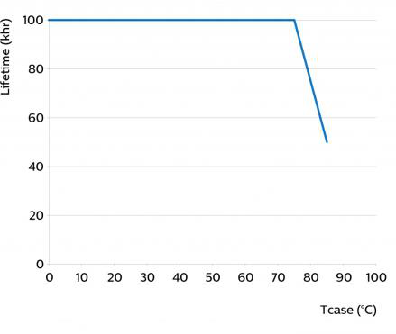

## Page 13

Features
Specification item Value Condition
Open load protection Yes Automatic recovering
Short circuit protection Yes Automatic recovering
Over power protection Yes Automatic recovering
Hot wiring No
Suitable for fixtures with protection class I per IEC60598
Overtemperature protection Yes Automatic recovering, refer to thermal guard curve
Inrush current
Specification item Value Unit Condition
Inrush current 72 A Input voltage 230V
Inrush peak width 276 µs Input voltage 230 V, measured at 50% height
Drivers / MCB 16A type B ≤ 4 pcs Indicative value at 230V
Please refer to the driver design in guide if you use other MCB-types
Driver touch current / protective conductor current
Specification item Value Unit Condition
Typical Protective Conductor Current (ins. Class I) 0.7 mA rms Acc. IEC60598-1. LED module contribution not included
Surge immunity
Specification item Value Unit Condition
Mains surge immunity (diff. mode) 6 kV Acc. IEC61000-4-5. 2 Ohm, 1.2/50us, 8/20us
Mains surge immunity (comm. mode) 6 kV Acc.IEC61000-4-5. 12 Ohm 1.2/50us,8/20us
Application Info
Specification item Value
Approval marks and Certifications CB / CCC / CE / ENEC / RCM / SELV / UKCA
Ingress Protection classification (IP) 67
Application Outdoor
Mounting Type Independent

| Value |  |
| --- | --- |
| Yes |  |
| Yes |  |
| Yes |  |
| No |  |
| I |  |

| 72 | A |
| --- | --- |
| 276 | µs |

| 6 | kV |
| --- | --- |

## Page 14

Graphs
Operating window
Thermal Guard
Mains Guard

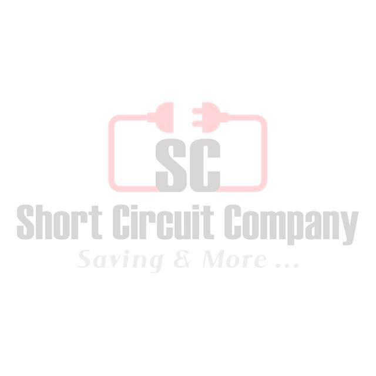

> ⚠️ Low text density on this page — check the image above manually, or re-run with `--vision`.

> ⚠️ Low text density on this page — check the image above manually, or re-run with `--vision`.

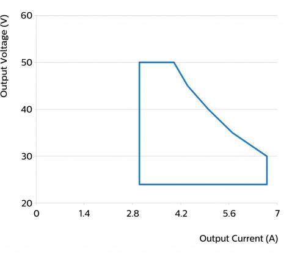

> ⚠️ Low text density on this page — check the image above manually, or re-run with `--vision`.

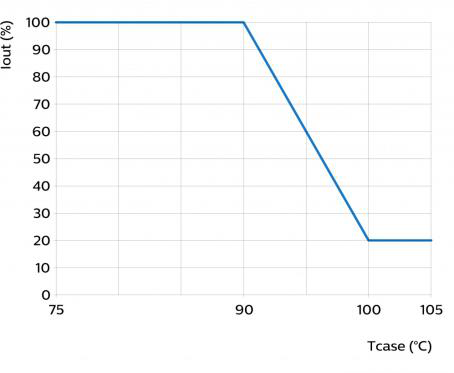

> ⚠️ Low text density on this page — check the image above manually, or re-run with `--vision`.

> ⚠️ Low text density on this page — check the image above manually, or re-run with `--vision`.

## Page 15

Power factor versus output power
Efficiency versus output power
THD versus output power

> ⚠️ Low text density on this page — check the image above manually, or re-run with `--vision`.

> ⚠️ Low text density on this page — check the image above manually, or re-run with `--vision`.

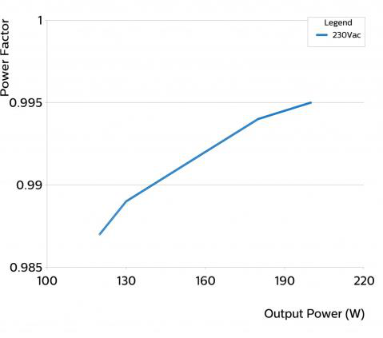

> ⚠️ Low text density on this page — check the image above manually, or re-run with `--vision`.

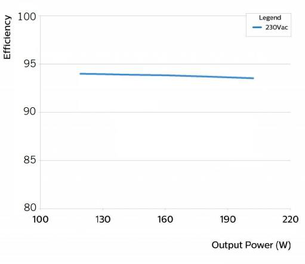

> ⚠️ Low text density on this page — check the image above manually, or re-run with `--vision`.

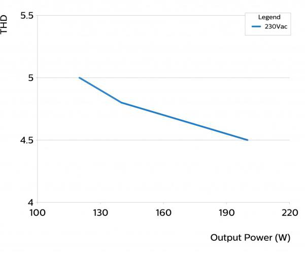

> ⚠️ Low text density on this page — check the image above manually, or re-run with `--vision`.
