# SC 1000w Arena Sport Flood Light

<!--
source_file: SC 1000w Arena Sport Flood Light.pdf
pages: 10
images_extracted: 36
needs_manual_review: False
-->

## Page 1

ABSTRACT
Short circuit Arena Sport Flood light.
High performance of 98% of led efficiency within
more than 50,000 operating hours.
Flood Light is protected against the electricity
instability with over voltage, current, and
temperature protection.
SHORT CIRCUIT Flood light consists of Philips chips and Philips
drivers with warranty of 5 years.
Flood LIGHT
High lux, High performance, High protection with
long life-span for industrial use.

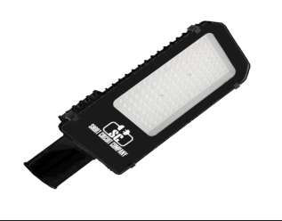

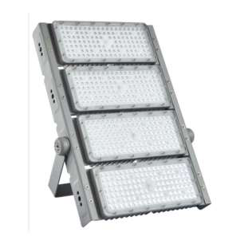

## Page 2

Table of Contents
1 General product information......................................................................................................................................
1.1 General Specifications ...............................................................................................................................................
1.2 Environmental Compliance
1.3 Compatibilities .......................................................................................................................................................
1.4 Product Main Parts ............................................................................................................................................
2 Body and Heat-Sink ....................................................................................................................................................
2.1 Heat-Sink Operation Theory.....................................................................................................................................
2.2 Body and Heat-Sink Description............................................................................................................................
3 LED Chips .....................................................................................................................................................................
3.1 Chip Performance Characteristics ...........................................................................................................................
3.2 Electrical and Thermal Characteristics ..................................................................................................................
3.3 Absolute Maximum Ratings................................................................................................................................
3.4 Characteristics Curves......................................................................................................................................
3.4.1 Light Output Characteristics ........................................................................................................................
3.4.2 Forward Current Characteristics ..............................................................................................................
3.4.3 Polar Curve ............................................................................................................................................
4 Driver ...........................................................................................................................................................................

## Page 3

1. Product General Information
1.1 General Specifications:
Table1: Product General Specifications
Item Specification Unit
LED Chip Philips 3030
Driver Philips
LED efficiency 145 Lm\W
Wattage 1000 W
Total Luminous 145,000 Lm
N.O.Driver s 4
Beamangle 60 Degree
Colortem perat ure 6000 K
CRI >90
Powerfa ctor >0 .95
Inputv oltage AC~ 220- 240 V
Frequency 50-60 Hz
Operating
-40To50 C
Temperature
Upto90%
Humidity
IP 6 6
Lifeti me 50,0 00 Hour
Wa rrant y 5 Year

| Item | Specification | Unit |
| --- | --- | --- |
| LED Chip | Philips 3030 |  |
| Driver | Philips |  |
| LED efficiency | 145 | Lm\W |
| Wattage | 1000 | W |
| Total Luminous | 145,000 | Lm |
| N.O.Drivers | 4 |  |
| Beamangle | 60 | Degree |
| Colortem perat ure | 6000 | K |
| CRI | >90 |  |
| Powerfa ctor | >0 .95 |  |
| Inputv oltage | AC~220-240 | V |
| Frequency | 50-60 | Hz |
| Operating
Temperature | -40To50 | C |
| Humidity | Upto90% |  |
| IP | 66 |  |
| Lifetime | 50,0 00 | Hour |
| Wa rrant y | 5 | Year |
|  |  |  |

## Page 4

1.2 Environmental Compliance:
Short Circuit is committed to providing environmentally friendly products to the solid-state lighting market.
Arena sport floodlight LED is compliant to the general environmental duty (GED). Short Circuit will not
intentionally add the following restricted materials to its products: lead, mercury, cadmium, hexavalent
chromium, polybrominated biphenyls (PBB) or polybrominated diphenyl ethers (PBDE).
1.3 Compatibilities
1.4 Product Main Parts:
Flood light LED is mainly consisted of three parts described as following:
Body and heat sink which is made of Aluminum alloy to dissipate the internal temperature of Chips and
Drivers.
Philips 3030 LED Chips with efficiency of 145Lm/W.
Philips Driver which is responsible for supplying the chip with required voltage and current. Also, the driver is
protected against over voltage and over current occurrence.
2. Body and Heat-Sink
2.1 Heat-Sink Operation Theory
Due to electronic circuits nature, there is over internal heat generated during the
operation period. That heat needs to be dissipated to protect driver components from
being damaged.
According to Heat Transfer Theory, materials with high thermal conductivity are
used to transfer heat from the hot region to the cold one, space in our case, so a
heat-sink made from Aluminum alloy is a suitable choice for this mission.
Figure1: Body and Heat-Sink

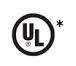

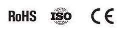

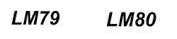

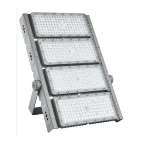

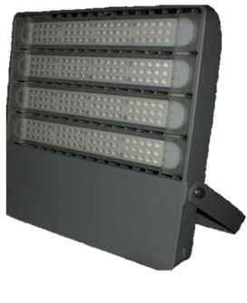

## Page 5

2.2 Body and Heat-Sink Description:
Table2: Body and Heat-Sink Description
Item Description
Body Anti-corrosion aluminum alloy heat sink (electrostatic painted)
Aluminum Purity 96-98 %
Lenses UV Poly-carbonate heat resistant lenses
Beam Angle 30°
Gasket silicone rubber insulation
Glands Waterproof cable glands (silicone insulated)
IP 66
Wattage 1000 W

| Item | Description |
| --- | --- |
| Body | Anti-corrosion aluminum alloy heat sink (electrostatic painted) |
| Aluminum Purity | 96-98 % |
| Lenses | UV Poly-carbonate heat resistant lenses |
| Beam Angle | 30° |
| Gasket | silicone rubber insulation |
| Glands | Waterproof cable glands (silicone insulated) |
| IP | 66 |
| Wattage | 1000 W |

## Page 6

3 LED Chips
Figure2: Philips Lumiled 3030
3.1 Chip Performance Characteristics
Table3: Chip Performance Characteristics
Pr oduct Nominal Minimum Typical Luminous Flux (lm) Part
CCT CRI Luminous Number
Minimum Typical
Efficacy (lm/W)
LUXEON 6500K 90 144 94 104 L130-
3030 2D 6590003000X21
(Squ are LES)
3.2 Electrical and Thermal Characteristics
Table4: Chip Electrical and Thermal Characteristics
Part Forward Voltage (Vf ) Typical Temperature Coefficient of
Number Forward Voltage [2] (mV/°C)
Minimum Typical Maximum
L130- 5.8 6 6.6 -2 to -4
6590003000X21
a. Absolute Maximum Ratings
Table5: Chip Absolute Maximum Ratings
Parameter Maximum Performance
DC Forward Current 240mA
Peak Pulsed Forward Current 300mA
LED Junction Temperature (DC & Pulse) 125°C
Operating Case Temperature -40°C to 105°C
LED Storage Temperature -40°C to 105°C

| Pr oduct | Nominal
CCT | Minimum
CRI | Typical
Luminous
Efficacy (lm/W) | Luminous Flux (lm) |  | Part
Number |
| --- | --- | --- | --- | --- | --- | --- |
|  |  |  |  | Minimum | Typical |  |
| LUXEON
3030 2D
(Squ are LES) | 6500K | 90 | 144 | 94 | 104 | L130-
6590003000X21 |

| Part
Number | Forward Voltage (Vf ) |  |  | Typical Temperature Coefficient of
Forward Voltage [2] (mV/°C) |
| --- | --- | --- | --- | --- |
|  | Minimum | Typical | Maximum |  |
| L130-
6590003000X21 | 5.8 | 6 | 6.6 | -2 to -4 |

| Parameter | Maximum Performance |
| --- | --- |
| DC Forward Current | 240mA |
| Peak Pulsed Forward Current | 300mA |
| LED Junction Temperature (DC & Pulse) | 125°C |
| Operating Case Temperature | -40°C to 105°C |
| LED Storage Temperature | -40°C to 105°C |

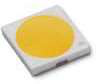

## Page 7

3.4 Characteristics Curves
3.4.1 Light Output Characteristics
Figure3.a: Chip Light Output Characteristics
Figure3.b: Chip Light Output Characteristics

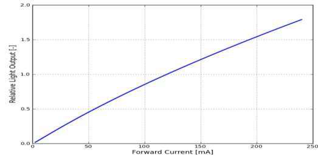

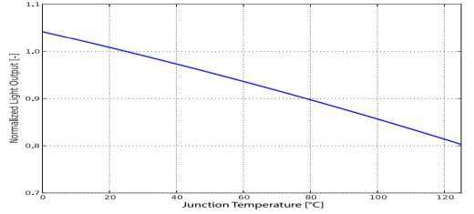

## Page 8

3.4.2 Forward Current Characteristics
Figure4: Chip Forward Current Characteristics
3.4.3 Polar Curve
Figure5: Chip Polar Curve

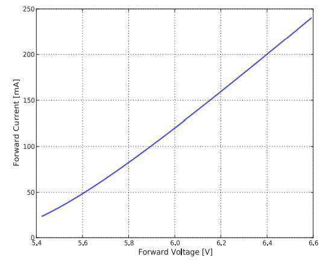

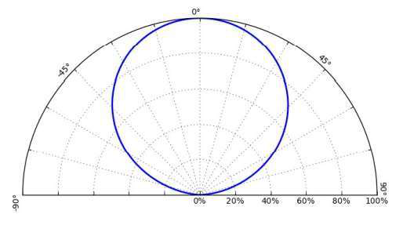

## Page 9

4.Driver
Philips XITANIUM Driver for LED up to 200W - 2800 mA
- 5 years Warranty
Product code:
Reference: XITANIUM-200W
Technical specifications:
Product short description:
REFERENCE: XITANIUM-200W
Rated Power : 200w The Philips Xitanium Driverfor
Nominal Voltage: 198- 200WLED luminaires comes ready for
264V 100,000 hours of operation. Surge
Construction Material: Aluminium
protection incorporated in the same
Certifications: CE - ENEC 05 - CCC - RoHS
driver.
IP : IP65-Outdoor
Dimensions (mm): 230*65*h45mm
Input: AC198-264V Output
Power Factor (PF): 0.99
Frequency (Hz): 50/60Hz
Temperature Range (ºC): -40ºC +50ºC DC71-21V Iout: 2.8-5.6Adc
Other Information: Inside: AC220-240V - Outside: DC71-21V --- 2.8A-
5.6Adc Warranty Years: PHILIPS XITANIUM 5 YEARS
(Amps DC)
Product description:
Philips XITANIUM Driver for LED Luminaires up to 200W - 2800mA - 5 years Warranty
The Philips Diver Xitanium is specifically designed for maximum reliability and flexibility in low-voltage outdoor applications.
Equipped with a surge protector, these Divers are very durable with a life span of 100,000 hoursproviding a consistently high
performance to the luminaires even after multiple indirect lightning strikes (special protection for outdoor use).

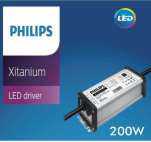

## Page 10

Benefits:
- The low voltage/high current output is adapted to the
application of the luminaire of LED chains connected in
parallel.
- The IP65 housing can be placed directly outside.
- Fast solution without redesigning the luminaires (perfect for tunnel lighting applications).
- AOC (adjustable output current) gives total flexibility to output different currents to specification in different projects.
- Easy adjustment of output current/voltage only by means of a simple screwdriver
- Robust specifications for humidity, vibration and extreme temperature protection.
- High quality of light during the life cycle of the driver.
Applications of Philips XITANIUM Driver for LED Luminaires up to 200W - 2800mA - 5 years Warranty
- Public and road lighting.
- Lighting of large areas.
- Tunnel lighting.
- High altitude lighting.
Additional images:

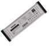

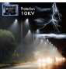

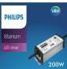
