# SC 1500w  3 modules Arena Sport flood light datasheets

<!--
source_file: SC 1500w  3 modules Arena Sport flood light datasheets.pdf
pages: 22
images_extracted: 68
needs_manual_review: True
-->

## Page 1

ABSTRACT
SHORT CIRCUIT
Short circuit Arena sport flood light for
industrial use. High performance of 98% of led
efficiency within more than 50,000 operating
ARENA SPORT
hours. F l o o d L i g h t i s protected
against the electricity instability with over
voltage, current, and temperature protection.
FLOOD LIGHT
Flood lighting consists of Philips chips and
Philips drivers with warranty of 3 years.
High lux, High performance, High protection with
long life-span for industrial use.

## Page 2

Table of Contents
1. General product information ......................................................................................................................................
1.1 General Specifications ...............................................................................................................................................
1.2 Environmental Compliance
1.3 Compatibilities .......................................................................................................................................................
1.4 Product Main Parts ............................................................................................................................................
2 Body and Heat-Sink ....................................................................................................................................................
2.1 Heat-Sink Operation Theory .....................................................................................................................................
2.2 Body and Heat-Sink Description ............................................................................................................................
3 LED Chips .....................................................................................................................................................................
3.1 Chip Performance Characteristics ...........................................................................................................................
3.2 Electrical and Thermal Characteristics ..................................................................................................................
3.3 Absolute Maximum Ratings................................................................................................................................
3.4 Characteristics Curves ......................................................................................................................................
3.4.1 Light Output Characteristics ........................................................................................................................
3.4.2 Forward Current Characteristics ..............................................................................................................
3.4.3 Polar Curve ............................................................................................................................................
4 Driver ...........................................................................................................................................................................
4.1 General Description .....................................................................................................................................................
4.2 Features ....................................................................................................................................................................
4.3 Protections ............................................................................................................................................................
4.4 Module Specification ..........................................................................................................................................
4.4.1 AC Input Specification ....................................................................................................................................
4.4.2 DC Output Characteristics ..........................................................................................................................
4.4.3 Protection Specifications ..........................................................................................................................
4.4.4 Mechanical Specification .......................................................................................................................

## Page 3

1. Product General Information
1.1 General Specifications:
Table1: Product General Specifications
Item Specification Unit
LED Chip Philips 3030
Driver Philips
LED efficiency 1 4 5 Lm\W
Wattage 1500 W
Chip luminous 217,500
Total Luminous 175,000 Lm
N.O.Drivers 3 drivers of 200w & 6
drivers of 150w Or 6
drivers of 250w
Beam angle 4 2*45 Degree
Color temperature 6 0 0 0 ± 1 0% K
CRI > 90
Power factor < 0 .95
Input voltage A C ~ 1 00-277 V
Frequency 50-60 Hz
Operating -40 To 50 C
Temperature
Humidity Up to 90 %
IP 65
Driver Protection O V , OC & OT
Surge protection 6 KV
Life time 50,000 Hour
Warranty 3 Year

| Item | Specification | Unit |
| --- | --- | --- |
| LED Chip | Philips 3030 |  |
| Driver | Philips |  |
| LED efficiency | 1 4 5 | Lm\W |
| Wattage | 1500 | W |
| Chip luminous | 217,500 |  |
| Total Luminous | 175,000 | Lm |
| N.O.Drivers | 3 drivers of 200w & 6
drivers of 150w Or 6
drivers of 250w |  |
| Beam angle | 4 2*45 | Degree |
| Color temperature | 6 0 0 0 ± 1 0% | K |
| CRI | > 90 |  |
| Power factor | < 0 .95 |  |
| Input voltage | A C ~ 1 00-277 | V |
| Frequency | 50-60 | Hz |
| Operating
Temperature | -40 To 50 | C |
| Humidity | Up to 90 % |  |
| IP | 65 |  |
| Driver Protection | O V , OC & OT |  |
| Surge protection | 6 | KV |
| Life time | 50,000 | Hour |
| Warranty | 3 | Year |

## Page 4

1.2 Environmental Compliance:
Short Circuit is committed to providing environmentally friendly products to the solid-state lighting market.
Flood Light LED is compliant to the general environmental duty (GED). Short Circuit will not intentionally add
the following restricted materials to its products: lead, mercury, cadmium, hexavalent chromium,
polybrominated biphenyls (PBB) or polybrominated diphenyl ethers (PBDE).
1.3 Compatibilities
1.4 Product Main Parts:
Flood Light LED is mainly consisted of three parts described as following:
Body and heat sink which is made of Aluminum alloy to dissipate the internal temperature of Chips and
Drivers.
Philips 3030 LED Chips with efficiency of 145Lm/W.
Philips Driver which is responsible for supplying the chip with required voltage and current.
Body and Heat-Sink
2.1 Heat-Sink Operation Theory
Due to electronic circuits nature, there is over internal heat generated during the
operation period. That heat needs to be dissipated to protect driver components
from being damaged.
According to Heat Transfer Theory, materials with high thermal conductivity are
used to transfer heat from the hot region to the cold one, space in our case, so a
heat-sink made from Aluminum alloy is a suitable choice for this mission. Figure 1:Body and Heat-Sink

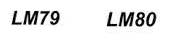

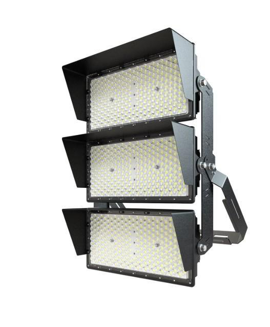

## Page 5

2.2 Body and Heat-Sink Description:
Table2: Body and Heat-Sink Description
Item Description
Body Anti-corrosion aluminum alloy heat sink (electrostatic painted)
Aluminum Purity 96-98 %
Lenses
UV Poly-carbonate heat resistance lenses
Beam Angle 42°*45°
Gasket silicone rubber insulation
Glands Waterproof cable glands (silicone insulated)
IP 65
Weight 34 Kg
Wattage 1500 W
2. LED Chips
Figure2: Philips Lumiled 3030
3.1Chip Performance Characteristics
Table3: Chip Performance Characteristics
Product Nominal Minimum Typical Luminous Flux (lm) Part
CCT CRI Luminous Number
Minimum Typical
Efficacy (lm/W)
LUXEON 6500K 90 144 94 104 L130-
3030 2D 6590003000X21
(Square LES)

| Item | Description |
| --- | --- |
| Body | Anti-corrosion aluminum alloy heat sink (electrostatic painted) |
| Aluminum Purity | 96-98 % |
| Lenses | UV Poly-carbonate heat resistance lenses |
| Beam Angle | 42°*45° |
| Gasket | silicone rubber insulation |
| Glands | Waterproof cable glands (silicone insulated) |
| IP | 65 |
| Weight | 34 Kg |
| Wattage | 1500 W |

| Product | Nominal
CCT | Minimum
CRI | Typical
Luminous
Efficacy (lm/W) | Luminous Flux (lm) |  | Part
Number |
| --- | --- | --- | --- | --- | --- | --- |
|  |  |  |  | Minimum | Typical |  |
| LUXEON
3030 2D
(Square LES) | 6500K | 90 | 144 | 94 | 104 | L130-
6590003000X21 |

## Page 6

3.2 Electrical and Thermal Characteristics
Table4: Chip Electrical and Thermal Characteristics
Part Forward Voltage (Vf ) Typical Temperature Coefficient of
Number Forward Voltage [2] (mV/°C)
Minimum Typical Maximum
L130- 5.8 6 6.6 -2 to -4
6590003000X21
2.3 Absolute Maximum Ratings
Table5: Chip Absolute Maximum Ratings
Parameter Maximum Performance
DC Forward Current 240mA
Peak Pulsed Forward Current 300mA
LED Junction Temperature (DC & Pulse) 125°C
Operating Case Temperature -40°C to 105°C
LED Storage Temperature -40°C to 105°C
3.4 Characteristics Curves
3.4.1 Light Output Characteristics
Figure3.a: Chip Light Output Characteristics

| Part
Number | Forward Voltage (Vf ) |  |  | Typical Temperature Coefficient of
Forward Voltage [2] (mV/°C) |
| --- | --- | --- | --- | --- |
|  | Minimum | Typical | Maximum |  |
| L130-
6590003000X21 | 5.8 | 6 | 6.6 | -2 to -4 |

| Parameter | Maximum Performance |
| --- | --- |
| DC Forward Current | 240mA |
| Peak Pulsed Forward Current | 300mA |
| LED Junction Temperature (DC & Pulse) | 125°C |
| Operating Case Temperature | -40°C to 105°C |
| LED Storage Temperature | -40°C to 105°C |

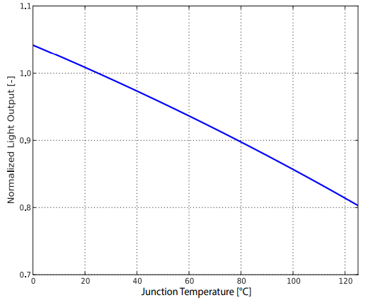

## Page 7

Figure3.b: Chip Light Output Characteristics
3.4.2 Forward Current Characteristics
Figure4: Chip Forward Current Characteristics

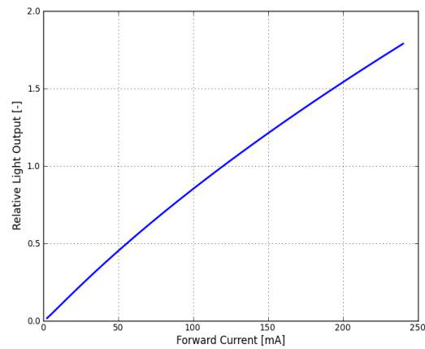

## Page 8

3.4.3 Polar Curve
Figure5: Chip Polar Curve
3. Driver
Xitanium Outdoor Essential Programmable Low Voltage LED Drivers
Xi EP LV 200W 3.0-6.7A WL I195
9290 033 92980
Xitanium Essential Programmable (EP) LED drivers are designed for maximum reliability and flexibility, making it a preferred choice for
outdoor applications. The key feature is to adjust the output current with the new e-set tool, a simple and fast way to configure the driver
without the need to power on the driver and without the need for any software configuration. The WideLine family can operate on input
voltage 100-277Vac anywhere around the world and ensure 100% performance from 200-254Vac.
Features Application
Benefits
• Digital and simple Adjustable Output • Reliable and repeatable • Road and street lighting
Current (AOC) with e-set tool, based adjustment of output • Area and flood lighting
current/voltage to save labor
on NFC technology • High-bay lighting
cost and time
•D WiadetLaines inhpuet evotlta ge range:
• Easy to design-in and reduces SKUs
100-277Vac • Low maintenance cost and
• Surge protection: 6/6kV (DM/CM)
peace of mind in extreme
conditions
• IP67 with 50,000 hours lifetime
• Safe to use and provides luminaire
• SELV certified design freedom

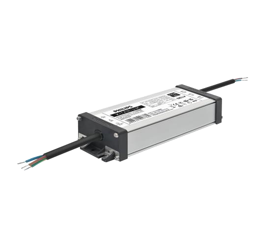

## Page 9

Electrical input data
Specification item Value Unit Condition
Rated input voltage range 200...254 Vac Performance range
Rated input voltage 230 Vac
Rated input frequency range 47...63 Hz Performance range
Rated input current 0.96 A @ rated output power @ rated input voltage
Max. input current 1.1 A @ rated output power @ minimum performance input voltage
Rated input power 220 W @ rated output power @ rated input voltage
Power factor 0.95 @ rated output power @ rated input voltage
Total harmonic distortion 10 % @ rated output power @ rated input voltage
Efficiency 93 % @ rated output power @ rated input voltage @max. Uout
Input voltage AC range 85...305 Vac Operational range
Input frequency AC range 45...66 Hz Operational range
Isolation input to output Double
Electrical output data
Specification item Value Unit Condition
Regulation method Constant Current
Output voltage 24...50 Vdc
Output voltage max. 60 V Maximum output voltage (rms)
Output current 3...6.7 A
Output current min programmable 3000 mA
Output current tolerance ± 5 % At max. output currentt, Ta=25°C
Output current ripple LF ≤ 5 % Ripple = peak / average, < 1kHz
Output current ripple HF ≤ 5 %
Output PstLM ≤ 0.1 In entire operating window
Output SVM ≤ 0.1 In entire operating window
Output power 72...200 W Rated output power is 200W
Electrical data controls input
Specification item Value Unit Condition
Control method Fixed

| 200...254 | Vac |
| --- | --- |
| 230 | Vac |
| 47...63 | Hz |
| 0.96 | A |
| 1.1 | A |
| 220 | W |
| 0.95 |  |
| 10 | % |
| 93 | % |
| 85...305 | Vac |
| 45...66 | Hz |

| Constant Current |  |
| --- | --- |
| 24...50 | Vdc |
| 60 | V |
| 3...6.7 | A |
| 3000 | mA |
| 5 | % |
| ≤ 5 | % |
| ≤ 5 | % |
| ≤ 0.1 |  |
| ≤ 0.1 |  |

## Page 10

Wiring and Connections
Specification item Value Unit Type
Input wire cross-section 1 mm2 3x 1.0mm2 stranded wires
Output wire cross-section 1 mm2 2x 1.0mm2 stranded wires
Maximum cable length 2 m Total length of wiring including LED module, one way
Insulation
Insulation per IEC61347-1 Input Output Ground
Input Double Basic
Output Double Basic
Ground Basic Basic
Dimensions and weight
Specification item Value Unit Tolerance (mm)
Length (A1) 195 mm ± 2
Mounting hole distance (A2) 184 mm ± 2
Length (A3) 172.5 mm ± 2
Width (B1) 67 mm ± 1
Width (B2) 52.5 mm ± 1
Width (B3) 34 mm ± 1
Height (C1) 40 mm ± 1
Mounting hole diameter (D1) 4 mm ± 0.3
Input cable length (E1) 450 mm ± 30
Output cable length (E2) 450 mm ± 30
Weight 820 gram

| 1 | mm2 |
| --- | --- |
| 1 | mm2 |

|  | Double |
| --- | --- |
| Double |  |

| 195 | mm |
| --- | --- |
| 184 | mm |
| 172.5 | mm |
| 67 | mm |
| 52.5 | mm |
| 34 | mm |
| 40 | mm |
| 4 | mm |
| 450 | mm |
| 450 | mm |

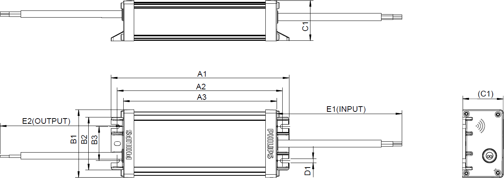

## Page 11

Logistical data
Specification item Value
Product name Xi EP LV 200W 3.0-6.7A WL I195
Logistic code 12NC 9290 033 92980
Pieces per box 12
Operational temperatures and humidity
Specification item Value Unit Condition
Ambient temperature -40...+55 ºC Higher ambient temperature allowed as long as Tcase-max is not
exceeded
Tcase-max 85 ºC Maximum temperature measured at Tcase-point
Tcase-life 75 ºC Measured at Tcase-point
Relative humidity 10...90 % Non-condensing
Lifetime
Specification item Value Unit Condition
Driver lifetime 50,000 hours Measured temperature at Tcase-point is Tcase-max. Maximum
failures = 10%
Storage temperature and humidity
Specification item Value Unit Condition
Ambient temperature -40...+80 ºC
Relative humidity 5...95 % Non-condensing
Programmable features
Specification item Available Default setting Condition
Set Adjustable Output Current (AOC) NFC 4000 mA

| -40...+55 | ºC |
| --- | --- |
| 85 | ºC |
| 75 | ºC |

| -40...+80 | ºC |
| --- | --- |

## Page 12

Features
Specification item Value Condition
Open load protection Yes Automatic recovering
Short circuit protection Yes Automatic recovering
Over power protection Yes Automatic recovering
Hot wiring No
Suitable for fixtures with protection class I per IEC60598
Overtemperature protection Yes Automatic recovering, refer to thermal guard curve
Inrush current
Specification item Value Unit Condition
Inrush current 72 A Input voltage 230V
Inrush peak width 276 µs Input voltage 230 V, measured at 50% height
Drivers / MCB 16A type B ≤ 4 pcs Indicative value at 230V
Please refer to the driver design in guide if you use other MCB-types
Driver touch current / protective conductor current
Specification item Value Unit Condition
Typical Protective Conductor Current (ins. Class I) 0.7 mA rms Acc. IEC60598-1. LED module contribution not included
Surge immunity
Specification item Value Unit Condition
Mains surge immunity (diff. mode) 6 kV Acc. IEC61000-4-5. 2 Ohm, 1.2/50us, 8/20us
Mains surge immunity (comm. mode) 6 kV Acc.IEC61000-4-5. 12 Ohm 1.2/50us,8/20us
Application Info
Specification item Value
Approval marks and Certifications CB / CCC / CE / ENEC / RCM / SELV / UKCA
Ingress Protection classification (IP) 67
Application Outdoor
Mounting Type Independent

| Value |  |
| --- | --- |
| Yes |  |
| Yes |  |
| Yes |  |
| No |  |
| I |  |

| 72 | A |
| --- | --- |
| 276 | µs |

| 6 | kV |
| --- | --- |

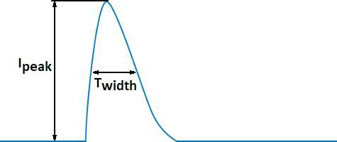

## Page 13

Graphs
Operating window
Thermal Guard
Mains Guard

> ⚠️ Low text density on this page — check the image above manually, or re-run with `--vision`.

> ⚠️ Low text density on this page — check the image above manually, or re-run with `--vision`.

> ⚠️ Low text density on this page — check the image above manually, or re-run with `--vision`.

> ⚠️ Low text density on this page — check the image above manually, or re-run with `--vision`.

> ⚠️ Low text density on this page — check the image above manually, or re-run with `--vision`.

## Page 14

Power factor versus output power
Efficiency versus output power
THD versus output power

> ⚠️ Low text density on this page — check the image above manually, or re-run with `--vision`.

> ⚠️ Low text density on this page — check the image above manually, or re-run with `--vision`.

> ⚠️ Low text density on this page — check the image above manually, or re-run with `--vision`.

> ⚠️ Low text density on this page — check the image above manually, or re-run with `--vision`.

> ⚠️ Low text density on this page — check the image above manually, or re-run with `--vision`.

## Page 15

Xitanium Outdoor Essential Programmable Low Voltage LED Drivers
Xi EP LV 150W 2.0-5.0A 1-10V WL I175
9290 033 93680
Xitanium Essential Programmable (EP) LED drivers are designed for maximum reliability and flexibility, making it a preferred choice for
different Outdoor applications. The key feature AOC (Adjustable Output Current ) can be programmed with the new e-set tool, a simple and
fast way to configure the driver without the need to power on the driver and without the need for any software configuration.
Xitanium EP Low Voltage (LV) drivers are specifically designed for low voltage outdoor applications. Having high surge immunity, these
durable, independently housed drivers deliver consistent, high performance to luminaires. It is an ideal solution for OEMs who need reliable,
adjustable output current in a rugged independent form factor.
Benefits Features Application
• Low voltage/high current output fits • 100-277V input voltage • Road and street lighting
• Area and flood lighting
low voltage outdoor applications • Low voltage/high current output
• Tunnel lighting
• AOC (Adjustable Output Current) gives • Adjustable Output Current (AOC) • High-bay lighting
full flexibility to output different • Compact housing dimensions
currents to spec-in different projects • Digital way to adjust output current called e-set tool
• Compact housing saves luminaire • Robust specifications for moisture, vibration, and
space temperature protection
• Easy adjustment of output • IP67
current/voltage saves time and labor • 1-10V dimming capability
cost
• Robust design offers peace of mind
and saves maintenance cost
• IP rated housing allows use in a
non-fully sealed gearbox

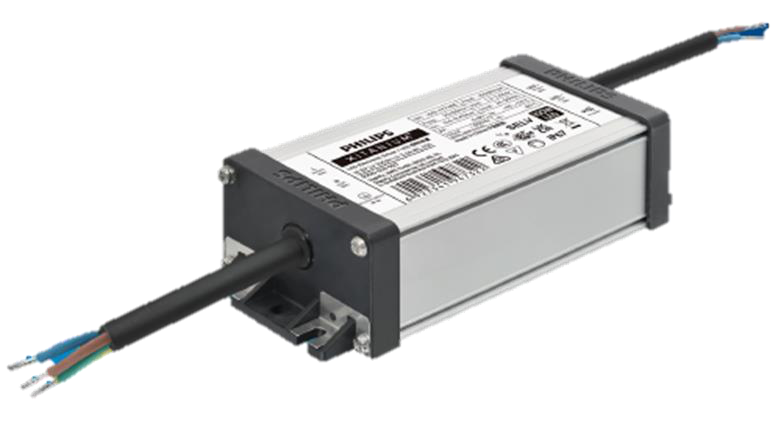

## Page 16

Electrical input data
Specification item Value Unit Condition
Rated input voltage range 200...254 Vac Performance range
Rated input voltage 230 Vac
Rated input frequency range 47...63 Hz Performance range
Rated input current 0.71 A @ rated output power @ rated input voltage
Max. input current 0.9 A @ rated output power @ minimum performance input voltage
Rated input power 163 W @ rated output power @ rated input voltage
Power factor 0.95 @ rated output power @ rated input voltage
Total harmonic distortion 10 % @ rated output power @ rated input voltage
Efficiency 91 % @ rated output power @ rated input voltage @max. Uout
Input voltage AC range 85...305 Vac Operational range
Input frequency AC range 45...66 Hz Operational range
Isolation input to output Double
Electrical output data
Specification item Value Unit Condition
Regulation method Constant Current
Output voltage 24...50 Vdc
Output voltage max. 60 V Maximum output voltage (rms)
Output current 2...5 A
Output current min programmable 2000 mA
Output current min dimming 300 mA
Output current tolerance ± 5 % At max. output currentt, Ta=25°C
Output current ripple LF ≤ 5 % Ripple = peak / average, < 1kHz
Output current ripple HF ≤ 5 %
Output Pst LM ≤ 0.1 In entire operating window
Output SVM ≤ 0.1 In entire operating window
Output power 7.2...150 W
Electrical data controls input
Specification item Value Unit Condition
Control method 1-10V
Dimming range 10...100 % Default range
Isolation controls input to output Basic acc. IEC61347-1

|  | Value | Unit |
| --- | --- | --- |
| Rated input voltage range | 200...254 | Vac |
| Rated input voltage | 230 | Vac |
| Rated input frequency range | 47...63 | Hz |
| Rated input current | 0.71 | A |
| Max. input current | 0.9 | A |
| Rated input power | 163 | W |
| Power factor | 0.95 |  |
| Total harmonic distortion | 10 | % |
| Efficiency | 91 | % |
| Input voltage AC range | 85...305 | Vac |
| Input frequency AC range | 45...66 | Hz |

| Constant Current |  |
| --- | --- |
| 24...50 | Vdc |
| 60 | V |
| 2...5 | A |
| 2000 | mA |
| 300 | mA |
| 5 | % |
| ≤ 5 | % |
| ≤ 5 | % |
| ≤ 0.1 |  |
| ≤ 0.1 |  |

| 1-10V |  |
| --- | --- |
| 10...100 | % |
| Basic |  |

## Page 17

Wiring and Connections
Specification item Value Unit Type
Input wire cross-section 1 / 17 mm2 / AWG 3x 1.0mm2 stranded wires, waterproof cable
Output wire cross-section 1 / 17 mm2 / AWG 2x 1.0mm2 stranded wires, waterproof cable
Control wire cross-section 0.33 / 22 mm2 / AWG 2-wire cable, AWG22
Maximum cable length 2 m Total length of wiring including LED module, one way
Insulation
Insulation per IEC61347-1 Input Output 1-10V
Input Double Reinforced
Output Double Basic
1-10V Reinforced Basic
Ground Basic Basic Basic
Dimensions and weight
Specification item Value Unit Tolerance (mm)
Length (A1) 175 mm ± 2
Mounting hole distance (A2) 164 mm ± 2
Length (A3) 152.5 mm ± 2
Width (B1) 67 mm ± 1
Width (B2) 52.5 mm ± 1
Width (B3) 34 mm ± 1
Height (C1) 40 mm ± 1
Mounting hole diameter (D1) 4 mm ± 0.3
Input cable length (E1) 450 mm ± 30
Output cable length (E2) 450 mm ± 30
Control cable length (E3) 300 mm ± 30
Weight 730 gram

| 1 / 17 | mm2 / AWG |
| --- | --- |
| 1 / 17 | mm2 / AWG |
| 0.33 / 22 | mm2 / AWG |

|  | Double |
| --- | --- |
| Double |  |
| Reinforced | Basic |

| 175 | mm |
| --- | --- |
| 164 | mm |
| 152.5 | mm |
| 67 | mm |
| 52.5 | mm |
| 34 | mm |
| 40 | mm |
| 4 | mm |
| 450 | mm |
| 450 | mm |
| 300 | mm |

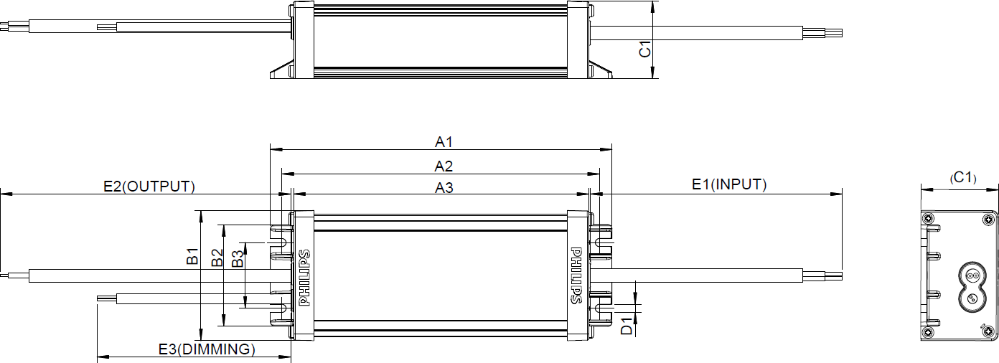

## Page 18

Logistical data
Specification item Value
Product name Xi EP LV 150W 2.0-5.0A 1-10V WL I175
Logistic code 12NC 9290 033 93680
Pieces per box 12
Operational temperatures and humidity
Specification item Value Unit Condition
Ambient temperature -40...+55 ºC Higher ambient temperature allowed as long as Tcase-max is not
exceeded
Tcase-max 85 ºC Maximum temperature measured at Tcase-point
Tcase-life 75 ºC Measured at Tcase-point
Relative humidity 10...90 % Non-condensing
Lifetime
Specification item Value Unit Condition
Driver lifetime 50,000 hours Measured temperature at Tcase-point is Tcase-max. Maximum
failures = 10%
Storage temperature and humidity
Specification item Value Unit Condition
Ambient temperature -40...+80 ºC
Relative humidity 5...95 % Non-condensing

| -40...+55 | ºC |
| --- | --- |
| 85 | ºC |
| 75 | ºC |
| 10...90 | % |

| -40...+80 | ºC |
| --- | --- |

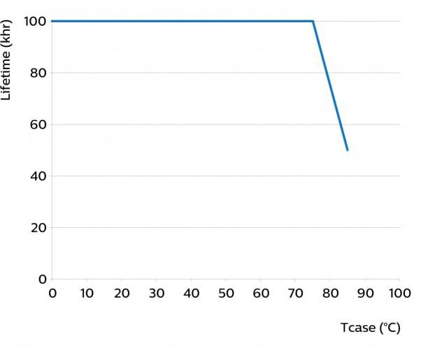

## Page 19

Programmable features
Specification item Available Default setting Condition
Set Adjustable Output Current (AOC) NFC 3000 mA
Features
Specification item Value Condition
Open load protection Yes Automatic recovering
Short circuit protection Yes Automatic recovering
Over power protection Yes Automatic recovering
Hot wiring No
Suitable for fixtures with protection class I per IEC60598
Overtemperature protection Yes Automatic recovering, refer to thermal guard curve
Inrush current
Specification item Value Unit Condition
Inrush current 71 A Input voltage 230V
Inrush peak width 212 µs Input voltage 230 V, measured at 50% height
Drivers / MCB 16A type B ≤ 5 pcs Indicative value at 230V
MCB Rating Relative number of LED drivers
B 4A 25%
B 6A 40%
B 10A 63%
B 13A 81%
B 16A 100% (stated in datasheet)
B 20A 125%
B 25A 156%
B 32A 200%
B 40A 250%
C 4A 42%
C 6A 63%
C 10A 104%
C 13A 135%
C 16A 170%
C 20A 208%
C 25A 260%
C 32A 340%
C 40A 415%
Driver touch current / protective conductor current
Specification item Value Unit Condition
Typical Protective Conductor Current (ins. Class I) 0.7 mA rms Acc. IEC60598-1. LED module contribution not included

| Yes |  |
| --- | --- |
| Yes |  |
| Yes |  |
| No |  |
| I |  |
| Yes |  |

| 71 | A |
| --- | --- |
| 212 | µs |

| 4A |
| --- |
| 6A |
| 10A |
| 13A |
| 16A |
| 20A |
| 25A |
| 32A |
| 40A |
| 4A |
| 6A |
| 10A |
| 13A |
| 16A |
| 20A |
| 25A |
| 32A |

## Page 20

Graphs
Surge immunity
Specification item Value Unit Condition
Mains surge immunity (diff. mode) 6 kV Acc. IEC61000-4-5. 2 Ohm, 1.2/50us, 8/20us
Mains surge immunity (comm. mode) 6 kV Acc.IEC61000-4-5. 12 Ohm 1.2/50us,8/20us
Application Info
Specification item Value
Approval marks and Certifications CB / CCC / CE / ENEC / RCM / SELV / UKCA
Ingress Protection classification (IP) 67
Application Outdoor
Mounting Type Independent
Graphs
Operating window
Thermal Guard

| 6 | kV | Acc. IEC61000-4-5. 2 Ohm, 1.2/50us, 8/20us |
| --- | --- | --- |

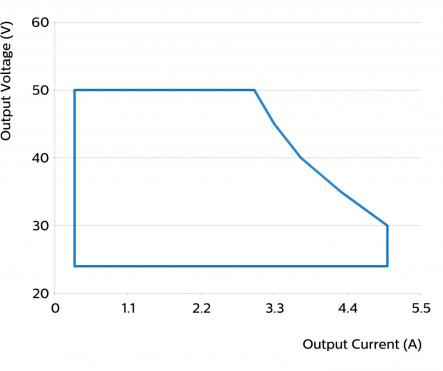

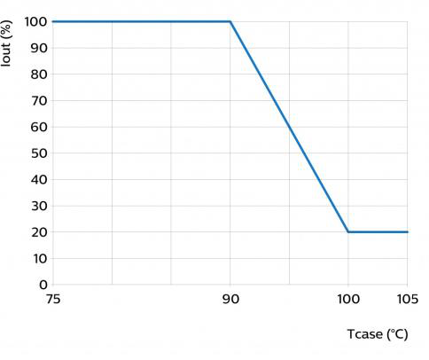

## Page 21

Graphs
Mains Guard
Power factor versus output power

> ⚠️ Low text density on this page — check the image above manually, or re-run with `--vision`.

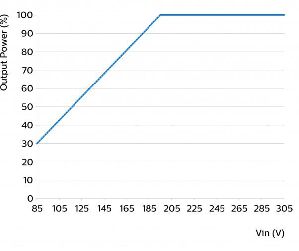

> ⚠️ Low text density on this page — check the image above manually, or re-run with `--vision`.

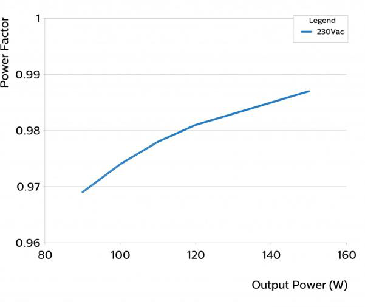

> ⚠️ Low text density on this page — check the image above manually, or re-run with `--vision`.

## Page 22

Graphs
Efficiency versus output power
THD versus output power

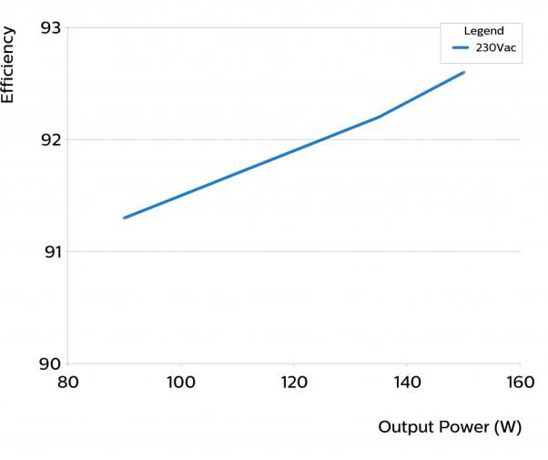

> ⚠️ Low text density on this page — check the image above manually, or re-run with `--vision`.

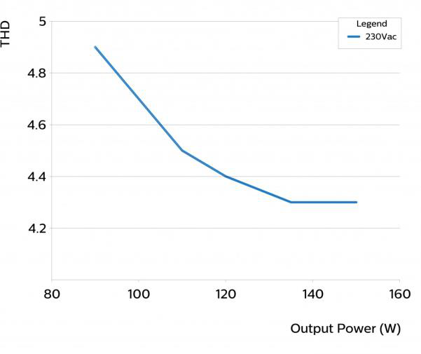

> ⚠️ Low text density on this page — check the image above manually, or re-run with `--vision`.

> ⚠️ Low text density on this page — check the image above manually, or re-run with `--vision`.
