# Battery datasheet

<!--
source_file: Battery datasheet.pdf
pages: 5
images_extracted: 25
needs_manual_review: False
-->

## Page 1

SpecificationSheet
SPECIFICATION FOR EMERGENCY POWER KIT
HY-04C
Integrated type
RevisionHistory
Revised Symbol Revised Description Version Revised By Revised Date
Powersupply160-265Vor220-
240v
ANNAJIANG 2018.3
Ta-25℃…+45℃
Page 1

|  |  |  |  |  |  |  |  |  |  |  |  |
| --- | --- | --- | --- | --- | --- | --- | --- | --- | --- | --- | --- |
|  |  |  | Revision | History |  |  |  |  |  |  |  |
|  |  |  |  |  |  |  |  |  |  |  |  |
| Revised Symbol Revised Description Version Revised By Revised Dat
Powersupply160-265Vor220-
240v
ANNAJIANG 2018.3
Ta-25℃…+45℃ |  | Revised Symbol |  |  | Revised Description |  | Version Revised By |  | Revised Dat | e |  |
|  |  |  |  |  | Powersupply160-265Vor220-
240v
Ta-25℃…+45℃ |  |  | ANNAJIANG | 2018.3 |  |  |
|  |  |  |  |  |  |  |  |  |  |  |  |

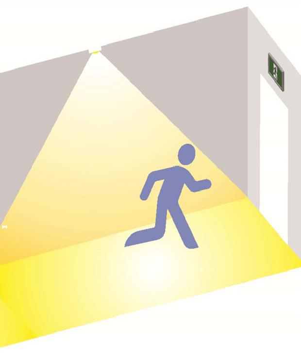

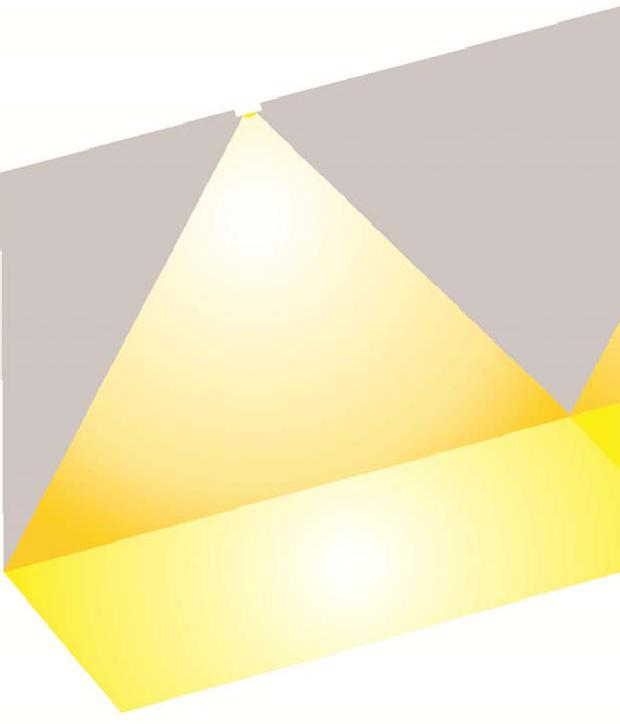

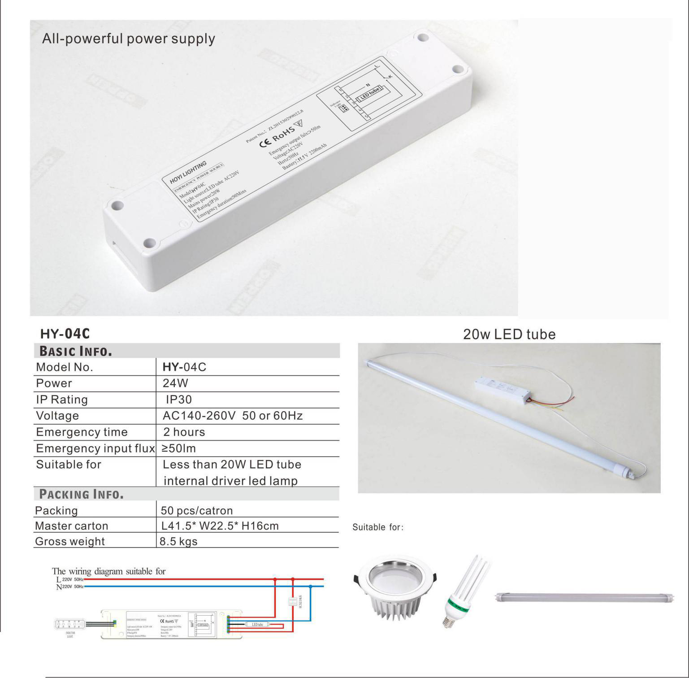

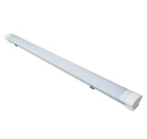

## Page 2

SpecificationSheet
Feature
• Compactanddecorative design.
• ConnectLEDluminairewith manual testandAUTOtest optional.
• Lithium battery optional.
•Suitableforlessthan50Wexternaldriverlampandinternaldriverlamp
• Outputpower :100%bright
• Highluminancemodel optional.
• Lowoperationcost vialowpower consumption.
• Materialcompliantathightemperature
• CEROHScompliance.
Technical Specification
RatedPowerSupply 220‐240VAC50/60Hz
Centralbatterysystem(CBS)versionavailable DC176‐254Vinput
Powerconsumption Max.50W
Chargetime 24hours
Dischargeduration 1/2/3hours
Changeovervoltage 144‐187VA
TestfacilityViewing ManualtestandAUTOtest
Page 2

|  |  | Feature |  |  |
| --- | --- | --- | --- | --- |

| Technical Specification |  |
| --- | --- |

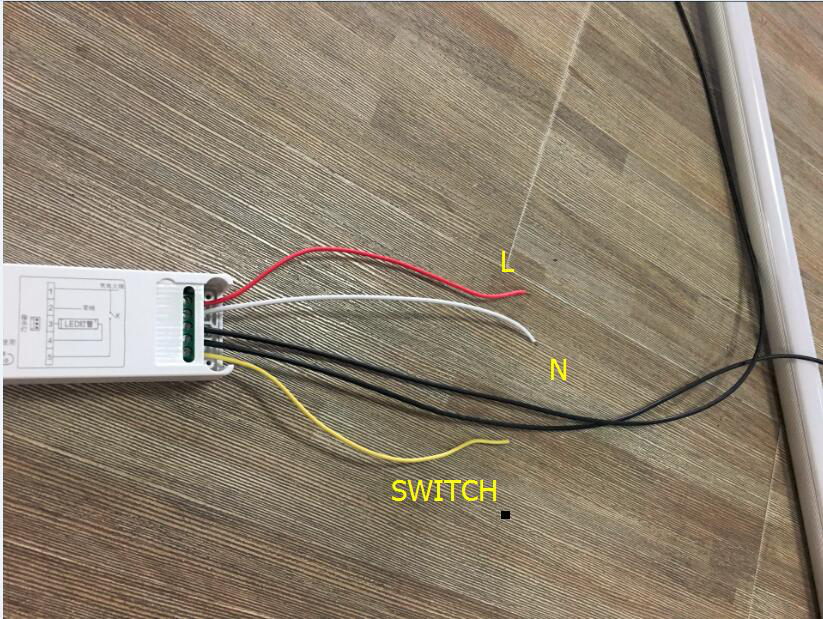

## Page 3

Certificate Of Compliance
CertificateNo. : TST20221080078-3RC
Applicant : ZHON：GSHANHONGYILIGHTINGCO.,LTD
Manufacturer : ZHON：GSHANHONGYILIGHTINGCO.,LTD
TradeMark : HONGYI
SampleName : Emergencylight
MainModel : LM1081
HY-D1,HY-03J,HY-03F,HY-1099,HY-1098,HY-1038,HY-1068,HY-109,H
Y-108S,HY-108R,HY-03H,HY-A6,HY-A7,HY-A1,HY-A2,HY-A3,HY-A4,
AdditionalModel : HY-A5,HY-A10,HY-01K,HY-B2,HY-B3,HY-B2S,HY-04B,HY-04C,HY-04
A,
HY-04M,HY-04N,HY-03K,LM1086,LM2128
IEC62321-1:2013
IEC62321-3-1:2013
IEC62321-4:2013/AMD1:2017
IEC62321-5:2013
TestStandard :
IEC62321-6:2015
IEC62321-7-1:2015
IEC62321-7-2:2017
IEC62321-8:2017
Asshowninthe
: TST20221080078-3RR
TestReportNo.
TheEUTdescribedabovehasbeenconsolidatedbyusandfoundincompliancewiththecouncilRoHS
2.0Directive(EU)2015/863and(EU)2017/2102amendingAnnexIItoDirective2011/65/EU.
Thecertificateappliestothetestedsampleabovementionedonlyandshallnotimplyanassessmentof
thewholeproduction.Itisonlyvalidinconnectionwiththetestreportnumber.TST20221080078-3RR
Certification Manager
Date:Oct.15, 2022
DongguanTrueSafetyTestingCo.,Ltd.
Room201,No.20,EastofHoujieAvenue,Houjie,Dongguan,Guangdong,China
Tel:86-0769-85088050 4001086960 E-mail:tst@tst-test.com http://www.tst-test.com

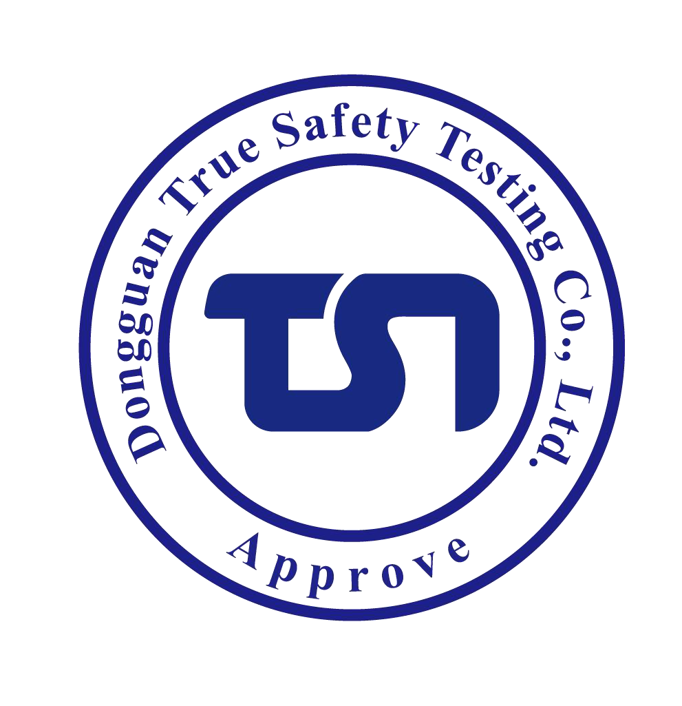

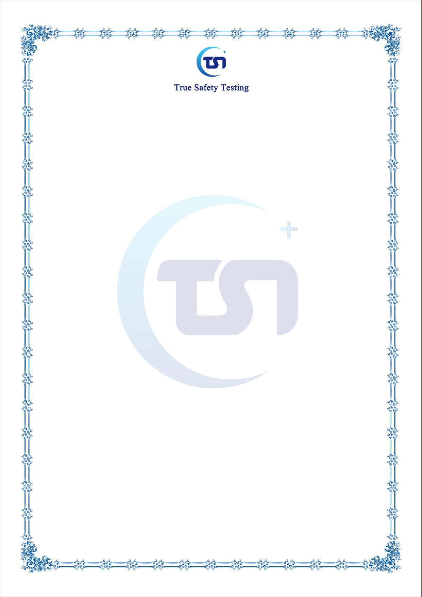

## Page 4

Certificate Of Compliance
CertificateNo. : TST20221080078-2EC
Applicant : ：
ZHONGSHANHONGYILIGHTINGCO.,LTD
Manufacturer : ZHONGSHANHONGYILIGHTINGCO.,LTD
ProductName : Emergenc：ylight
TradeMark : HONGYI
MainModel : LM1081
Rating : 110-240V~50/60Hz3-50W
SeriesModels : HY-03J,HY-03F,HY-1099,HY-1098,HY-1038,HY-1068,HY-109,HY-108S,
HY-108R,HY-03H,HY-A6,HY-A7,HY-A1,HY-A2,HY-A3,HY-A4,HY-A5,
HY-A10,HY-01K,HY-B2,HY-B3,HY-B2S,HY-04B,HY-04C,HY-04A,
HY-04M,HY-04N,HY-03K,LM1086,LM2128
TestStandard : ENIEC55015:2019+A11:2020
EN61547:2009
ENIEC61000-3-2:2019+A1:2021
EN61000-3-3:2013+A1:2019+A2:2021
Asshowninthe : TST20221080078-2ER
TestReportNo.
The EUTdescribed above has been tested byus withthelisted standards andfound in
compliance with thecouncil EMC directive 2014/30/EU. It ispossibleto useCE marking to
demonstrate thecompliance with thisEMC Directive.
The certificateapplies tothetested sampleabove mentioned only andshall not imply an
assessment ofthewhole production.It isonlyvalid in connection withthe testreport number.
TST20221080078-2ER
Certification Manager
Date:Oct. 15, 2022
DongguanTrueSafetyTestingCo.,Ltd.
Room201,No.20,EastofHoujieAvenue,Houjie,Dongguan,Guangdong,China
Tel:86-0769-85088050 4001086960 E-mail:tst@tst-test.com http://www.tst-test.com

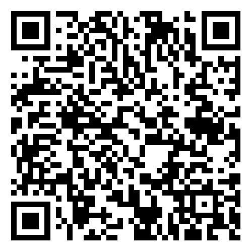

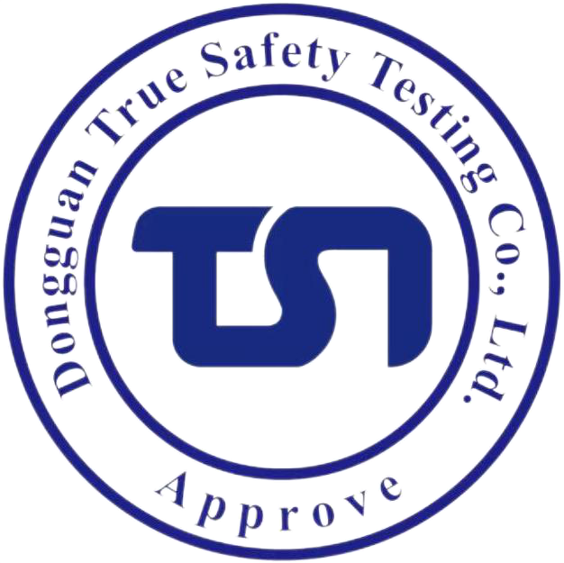

## Page 5

Certificate Of Compliance
CertificateNo. : TST20221080078-1SC
Applicant : ：
ZHONGSHANHONGYILIGHTINGCO.,LTD
Manufacturer : ZHONGSHANHONGYILIGHTINGCO.,LTD
ProductName : Emergenc：ylight
TradeMark : HONGYI
MainModel : LM1081
Rating : 110-240V~50/60Hz3-50W
SeriesModels : HY-03J,HY-03F,HY-1099,HY-1098,HY-1038,HY-1068,HY-109,HY-108S,
HY-108R,HY-03H,HY-A6,HY-A7,HY-A1,HY-A2,HY-A3,HY-A4,HY-A5,
HY-A10,HY-01K,HY-B2,HY-B3,HY-B2S,HY-04B,HY-04C,HY-04A,
HY-04M,HY-04N,HY-03K,LM1086,LM2128
TestStandard : ENIEC60598-1:2021
ENIEC60598-2-1:2021
Asshowninthe : TST20221080078-1SR
TestReportNo.
The EUT described above has been tested by us with the listed standards and found in compliance
with the council LVD directive 2014/35/EU. It is possible to use CE marking to demonstrate the
compliance with thisLVDDirective.
The certificate applies to the tested sample above mentioned only and shall not imply an
assessment of the whole production. It is only valid in connection with the test report number.
TST20221080078-1SR
Certification Manager
Date:Oct. 15, 2022
DongguanTrueSafetyTestingCo.,Ltd.
Room201,No.20,EastofHoujieAvenue,Houjie,Dongguan,Guangdong,China
Tel:86-0769-85088050 4001086960 E-mail:tst@tst-test.com http://www.tst-test.com

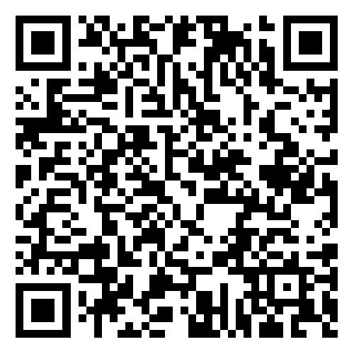

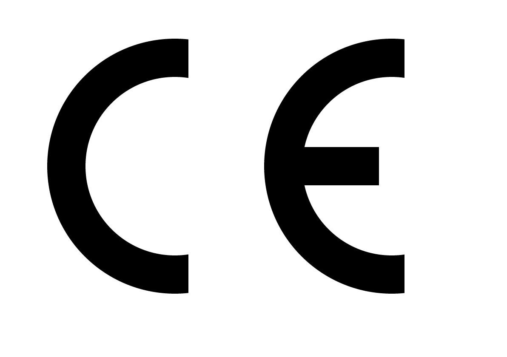

