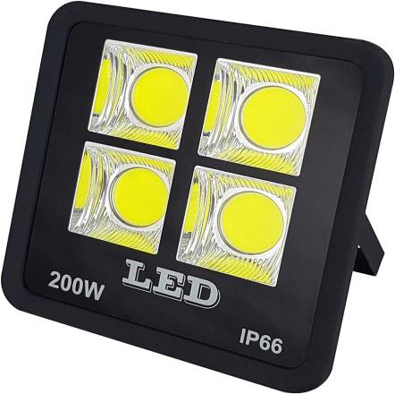
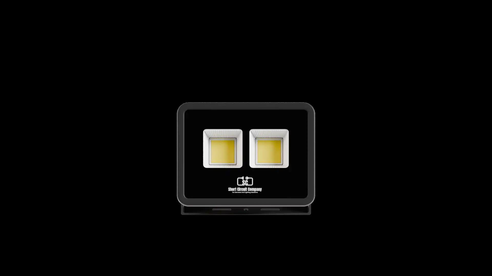
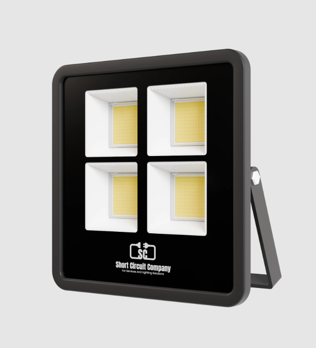
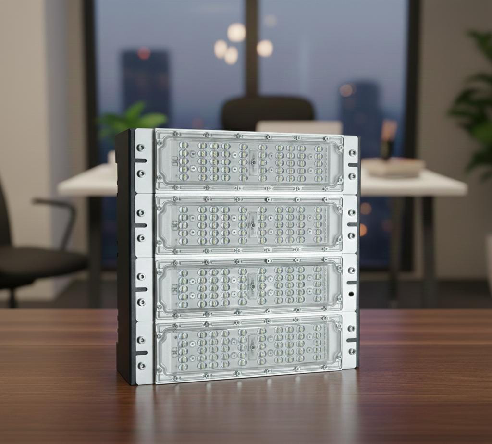

# 3Y - 200w Flood Light Meduler datasheet

<!--
source_file: 3Y - 200w Flood Light Meduler datasheet.pdf
pages: 2
images_extracted: 6
needs_manual_review: False
-->

## Page 1

PRODUCT DATASHEET
Flood Light
LED Light
AREAS OF APPLICATION
• Sports court
• Factory
• Shops
PRODUCT BENEFITS
PRODUCT FEATURES
• Easy installation with fast connection
• Operating Voltage range: 85-300 V AC
• Housing Material : Aluminum
• LED Lights consume significantly less energy
compared to traditional lighting sources
• Energy saving up to 60%
TECHNICAL DATA
ELECTRICAL DATA
Driver SC
Nominal Wattage 200W
Nominal Voltage 85-300 V AC
Main frequency 50 /60 Hz
PHOTOMETRIC DATA
Chip Philips
LED Efficacy 110 lm /W
Total Luminous 22,000 Lm
Color temperature 6000K
Other varieties are available upon request

|  |
| --- |
| AREAS OF APPLICATION
• Sports court
• Factory
• Shops |
|  |

| PRODUCT FEATURES
• Operating Voltage range: 85-300 V AC
• Housing Material : Aluminum |  |
| --- | --- |

|  | Driver |  | SC |  |
| --- | --- | --- | --- | --- |

|  | Nominal Voltage |  | 85-300 V AC |  |
| --- | --- | --- | --- | --- |

|  | PHOTOMETRIC DATA |  |  |  |
| --- | --- | --- | --- | --- |
|  | Chip |  | Philips |  |
|  | LED Efficacy |  | 110 lm /W |  |

|  | Color temperature |  | 6000K |  |
| --- | --- | --- | --- | --- |

## Page 2

PRODUCT DATASHEET
LED Flood Light
COLORS & MATERIALS
Body Color Black
Body Material Aluminum
LIFESPAN
Lifespan 30,000
Warranty 3
PROTECTION
Ingress protection IP 65
Electrical protection OVP-OCP-OTP
MOUNTING
Mounting Type Surface
Mounting Location Poles/walls
Other varieties are available upon request

|  | COLORS & MATERIALS |  |  |  |
| --- | --- | --- | --- | --- |
|  | Body Color |  | Black |  |

|  | LIFESPAN |  |  |  |
| --- | --- | --- | --- | --- |
|  | Lifespan |  | 30,000 |  |

|  | PROTECTION |  |  |  |
| --- | --- | --- | --- | --- |
|  | Ingress protection |  | IP 65 |  |
|  | Electrical protection OVP-OCP-OTP |  |  |  |
|  | MOUNTING |  |  |  |
|  | Mounting Type |  | Surface |  |

