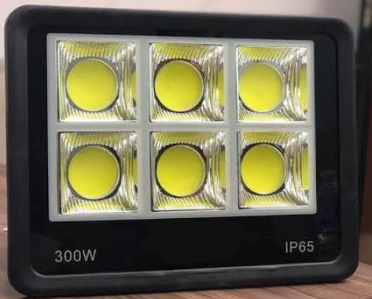
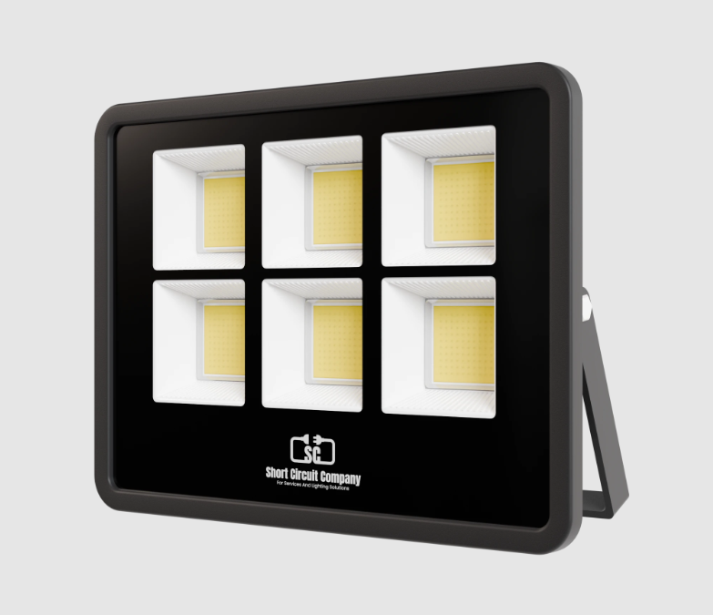

# Flood Light 300w COB datasheet

<!--
source_file: Flood Light 300w COB datasheet.pdf
pages: 2
images_extracted: 4
needs_manual_review: False
-->

## Page 1

PRODUCT DATASHEET
Flood LIGHT
LED COB Flood light
AREAS OF APPLICATION
• Stadium & sports field
• Industrial & commercial areas
• Façade & monment lighting
• Construction sites
• Event and stage lighting
PRODUCT BENEFITS
PRODUCT FEATURES
• Easy installation with fast connection
• Operating Voltage range: 85-265V AC
• Housing Material : Aluminum
• LED Lights consume significantly less energy
compared to traditional lighting sources
• Energy saving up to 60%
TECHNICAL DATA
ELECTRICAL DATA
Driver TLG
Nominal Wattage 300 w
Nominal Voltage 85-265V AC
Main frequency 50 /60 Hz
PHOTOMETRIC DATA
Chip Sanan
LED efficacy 110 lm/w
Total Luminous 33,000 Lm
Color temperature 3000 K
Other varieties are available upon request

| AREAS OF APPLICATION
• Stadium & sports field
• Industrial & commercial areas
• Façade & monment lighting
• Construction sites
• Event and stage lighting |
| --- |
| PRODUCT BENEFITS
• Easy installation with fast connection
• LED Lights consume significantly less energy
compared to traditional lighting sources
• Energy saving up to 60% |

| PRODUCT FEATURES
• Operating Voltage range: 85-265V AC
• Housing Material : Aluminum |  |
| --- | --- |

|  | Driver |  | TLG |  |
| --- | --- | --- | --- | --- |

|  | Nominal Voltage |  | 85-265V AC |  |
| --- | --- | --- | --- | --- |

|  | PHOTOMETRIC DATA |  |  |
| --- | --- | --- | --- |

|  | LED efficacy |  | 110 lm/w |  |
| --- | --- | --- | --- | --- |

|  | Color temperature |  | 3000 K |  |
| --- | --- | --- | --- | --- |

## Page 2

PRODUCT DATASHEET
LED COB Flood light
COLORS & MATERIALS
Body Color Black
Body Material Aluminum
LIFESPAN
Lifespan 20,000
Warranty 2
PROTECTION
Electrical protection IP 65
Other varieties are available upon request

|  | COLORS & MATERIALS |  |  |
| --- | --- | --- | --- |
|  | Body Color | Black |  |

|  | LIFESPAN |  |  |
| --- | --- | --- | --- |
|  | Lifespan | 20,000 |  |

|  | PROTECTION |  |  |  |
| --- | --- | --- | --- | --- |
|  | Electrical protection |  | IP 65 |  |

