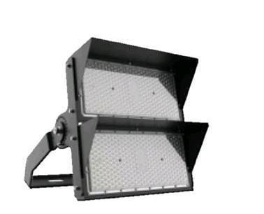
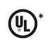
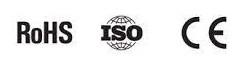
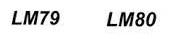
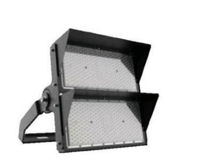
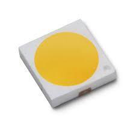
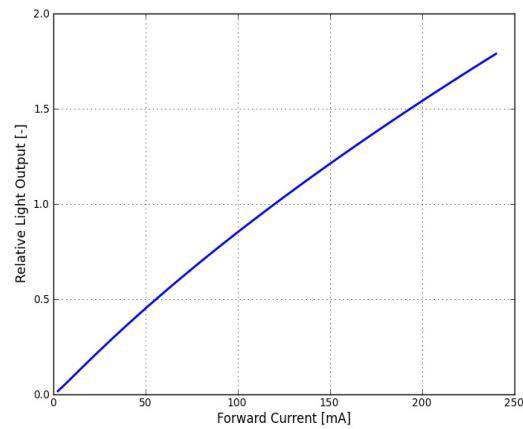
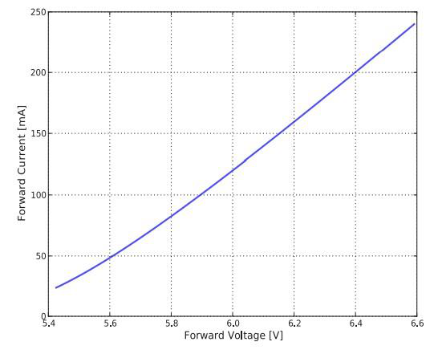
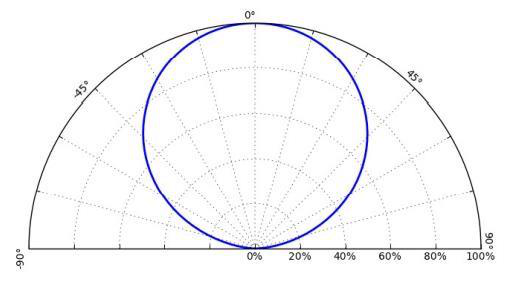

# SC 1000 W Modular Flood Light Datasheet

<!--
source_file: SC 1000 W Modular Flood Light Datasheet.pdf
pages: 8
images_extracted: 29
needs_manual_review: True
-->

## Page 1

ABSTRACT
SHORT CIRCUIT Short circuit Modular flood light for
industrial use. High performance of 98% of
led efficiency within more than 50,000
Modular
operating hours. Modular Flood Light is
protected against the electricity instability
FLOOD LIGHT with over voltage, current, and temperature
protection.
Modular Flood lighting consists of Philips
High lux, High performance, High protection with
chips and Philips drivers with warranty of 5
long life-span for industrial use.
years.

## Page 2

Table of Contents
1 General product information......................................................................................................................................
1.1 General Specifications ...............................................................................................................................................
1.2 Environmental Compliance
1.3 Compatibilities .......................................................................................................................................................
1.4 Product Main Parts ............................................................................................................................................
2 Body and Heat-Sink ....................................................................................................................................................
2.1 Heat-Sink Operation Theory.....................................................................................................................................
2.2 Body and Heat-Sink Description ............................................................................................................................
3 LED Chips .....................................................................................................................................................................
3.1 Chip Performance Characteristics ...........................................................................................................................
3.2 Electrical and Thermal Characteristics ..................................................................................................................
3.3 Absolute Maximum Ratings................................................................................................................................
3.4 Characteristics Curves......................................................................................................................................
3.4.1 Light Output Characteristics ........................................................................................................................
3.4.2 Forward Current Characteristics ..............................................................................................................
3.4.3 Polar Curve ............................................................................................................................................
4 Driver ...........................................................................................................................................................................
4.1 General Description.....................................................................................................................................................
4.2 Features....................................................................................................................................................................
4.3 Protections ............................................................................................................................................................
4.4 Module Specification ..........................................................................................................................................
4.4.1 AC Input Specification ....................................................................................................................................
4.4.2 DC Output Characteristics ..........................................................................................................................
4.4.3 Protection Specifications..........................................................................................................................
4.4.4 Mechanical Specification.......................................................................................................................

## Page 3

1. Product General Information
1.1 General Specifications:
Table1: Product General Specifications
Item Specification Unit
LED Chip Philips 3030
Driver Philips
LED efficiency 145 Lm\W
Wattage 1000 W
Modules No.
2
Total Luminous
145,000 Lm
Beam angle 30 Degree
Color temperature 6500 K
CRI > 90
Power factor > 0.95
Input voltage AC~100-277 V
Frequency 50-60 Hz
Operating -40 To 85 C
Temperature
Humidity Up to 90 %
IP 65
Driver Protection OV, OC & OT
Life time 50,000 Hour
Warranty 5 Year

| Item | Specification | Unit |
| --- | --- | --- |
| LED Chip | Philips 3030 |  |
| Driver | Philips |  |
| LED efficiency | 145 | Lm\W |
| Wattage | 1000 | W |
| Modules No. | 2 |  |
| Total Luminous | 145,000 | Lm |
| Beam angle | 30 | Degree |
| Color temperature | 6500 | K |
| CRI | > 90 |  |
| Power factor | > 0.95 |  |
| Input voltage | AC~100-277 | V |
| Frequency | 50-60 | Hz |
| Operating
Temperature | -40 To 85 | C |
| Humidity | Up to 90 % |  |
| IP | 65 |  |
| Driver Protection | OV, OC & OT |  |
| Life time | 50,000 | Hour |
| Warranty | 5 | Year |

## Page 4

1.2 Environmental Compliance:
Short Circuit is committed to providing environmentally friendly products to the solid-state lighting market.
Modular Flood Light LED is compliant to the general environmental duty (GED). Short Circuit will not
intentionally add the following restricted materials to its products: lead, mercury, cadmium, hexavalent
chromium, polybrominated biphenyls (PBB) or polybrominated diphenyl ethers (PBDE).
1.3 Compatibilities
1.4 Product Main Parts:
Modular Flood Light LED is mainly consisted of three parts described as following:
Body and heat sink which is made of Aluminum alloy to dissipate the internal temperature of Chips and
Drivers.
Philips 3030 LED Chips with efficiency of 145 Lm/W.
Philips Driver which is responsible for supplying the chip with required voltage and current. Also, the driver is
protected against over voltage and over current occurrence.
2. Body and Heat-Sink
2.1 Heat-Sink Operation Theory
Due to electronic circuits nature, there is over internal heat generated during the
operation period. That heat needs to be dissipated to protect driver components from
being damaged.
According to Heat Transfer Theory, materials with high thermal conductivity are
used to transfer heat from the hot region to the cold one, space in our case, so a
heat-sink made from Aluminum alloy is a suitable choice for this mission.
Figure1: Body and Heat-Sink

## Page 5

2.2 Body and Heat-Sink Description:
Table2: Body and Heat-Sink Description
Item Description
Body Anti-corrosion aluminum alloy heat sink (electrostatic painted)
Aluminum Purity 96-98 %
Thickness Of Fin Inner Outer
5 mm 1.5 mm
QTY of Modular 2
Lens Material
Polycarbonate
Beam Angle 30°
Gasket silicone rubber insulation
Glands Waterproof cable glands (silicone insulated)
IP 65
Weight 45 Kg
Wattage 1000 W
Body Color Black
3. LED Chips
Figure2: Philips Lumiled 3030
3.1 Chip Performance Characteristics
Table3: Chip Performance Characteristics
Product Nominal Minimum Typical Luminous Flux (lm) Part
CCT CRI Luminous Number
Minimum Typical
Efficacy (lm/W)
LUXEON 6500K 90 144 94 104 L130-
3030 2D 6590003000X21
(Square LES)

| Item | Description |  |
| --- | --- | --- |
| Body | Anti-corrosion aluminum alloy heat sink (electrostatic painted) |  |
| Aluminum Purity | 96-98 % |  |
| Thickness Of Fin | Inner | Outer |
|  | 5 mm | 1.5 mm |
| QTY of Modular | 2 |  |
| Lens Material | Polycarbonate |  |
| Beam Angle | 30° |  |
| Gasket | silicone rubber insulation |  |
| Glands | Waterproof cable glands (silicone insulated) |  |
| IP | 65 |  |
| Weight | 45 Kg |  |
| Wattage | 1000 W |  |
| Body Color | Black |  |

| Product | Nominal
CCT | Minimum
CRI | Typical
Luminous
Efficacy (lm/W) | Luminous Flux (lm) |  | Part
Number |
| --- | --- | --- | --- | --- | --- | --- |
|  |  |  |  | Minimum | Typical |  |
| LUXEON
3030 2D
(Square LES) | 6500K | 90 | 144 | 94 | 104 | L130-
6590003000X21 |

## Page 6

3.2 Electrical and Thermal Characteristics
Table4: Chip Electrical and Thermal Characteristics
Part Forward Voltage (Vf ) Typical Temperature Coefficient of
Number Forward Voltage [2] (mV/°C)
Minimum Typical Maximum
L130- 5.8 6 6.6 -2 to -4
6590003000X21
3.3 Absolute Maximum Ratings
Table5: Chip Absolute Maximum Ratings
Parameter Maximum Performance
DC Forward Current 240mA
Peak Pulsed Forward Current 300mA
LED Junction Temperature (DC & Pulse) 125°C
Operating Case Temperature -40°C to 105°C
LED Storage Temperature -40°C to 105°C
Characteristics Curves
3.4.1 Light Output Characteristics
Figure3.a: Chip Light Output Characteristics

| Part
Number | Forward Voltage (Vf ) |  |  | Typical Temperature Coefficient of
Forward Voltage [2] (mV/°C) |
| --- | --- | --- | --- | --- |
|  | Minimum | Typical | Maximum |  |
| L130-
6590003000X21 | 5.8 | 6 | 6.6 | -2 to -4 |

| Parameter | Maximum Performance |
| --- | --- |
| DC Forward Current | 240mA |
| Peak Pulsed Forward Current | 300mA |
| LED Junction Temperature (DC & Pulse) | 125°C |
| Operating Case Temperature | -40°C to 105°C |
| LED Storage Temperature | -40°C to 105°C |

## Page 7

Figure3.b: Chip Light Output Characteristics
3.4.2 Forward Current Characteristics
Figure4: Chip Forward Current Characteristics

## Page 8

3.4.3 Polar Curve
Figure5: Chip Polar Curve

> ⚠️ Low text density on this page — check the image above manually, or re-run with `--vision`.

> ⚠️ Low text density on this page — check the image above manually, or re-run with `--vision`.

> ⚠️ Low text density on this page — check the image above manually, or re-run with `--vision`.
