# SC 500 W Flood Light Datasheet

<!--
source_file: SC 500 W Flood Light Datasheet.pdf
pages: 11
images_extracted: 37
needs_manual_review: True
-->

## Page 1

ABSTRACT
Short circuit flood light for industrial use.
High performance of 98% of led efficiency within
more than 50,000 operating hours.
Flood Light is protected against the electricity
instability with over voltage, current, and
temperature protection.
SHORT CIRCUIT
Flood lighting consists of Philips chips and short-
circuit drivers with warranty of 5 years.
FLOOD LIGHT
High lux, High performance, High protection with
long life-span for industrial use.

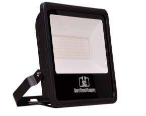

## Page 2

Table of Contents
1 General product information ......................................................................................................................................
1.1 General Specifications ...............................................................................................................................................
1.2 Environmental Compliance
1.3 Compatibilities .......................................................................................................................................................
1.4 Product Main Parts ............................................................................................................................................
2 Body and Heat-Sink ....................................................................................................................................................
2.1 Heat-Sink Operation Theory .....................................................................................................................................
2.2 Body and Heat-Sink Description ............................................................................................................................
3 LED Chips .....................................................................................................................................................................
3.1 Chip Performance Characteristics ...........................................................................................................................
3.2 Electrical and Thermal Characteristics ..................................................................................................................
3.3 Absolute Maximum Ratings................................................................................................................................
3.4 Characteristics Curves ......................................................................................................................................
3.4.1 Light Output Characteristics ........................................................................................................................
3.4.2 Forward Current Characteristics ..............................................................................................................
3.4.3 Polar Curve ............................................................................................................................................
4 Driver ...........................................................................................................................................................................
4.1 General Description .....................................................................................................................................................
4.2 Features ....................................................................................................................................................................
4.3 Protections ............................................................................................................................................................
4.4 Module Specification ..........................................................................................................................................
4.4.1 AC Input Specification ....................................................................................................................................
4.4.2 DC Output Characteristics ..........................................................................................................................
4.4.3 Protection Specifications ..........................................................................................................................
4.4.4 Mechanical Specification .......................................................................................................................

## Page 3

1. Product General Information
1.1 General Specifications:
Table1: Product General Specifications
Item Specification Unit
LED Chip Philips 3030
Driver S.C
LED efficiency 1 4 5 Lm\W
Wattage 500 W
Total Luminous 72,500 Lm
N.O.Chips 480
N.O.Drivers 10
Beam angle 120 Degree
Color temperature 3 0 0 0 t o 6 500 K
CRI > 90
Power factor < 0 .95
Input voltage A C ~ 65-300 V
Frequency 50-60 Hz
Operating -40 To 85 C
Temperature
Humidity Up to 90 %
IP 65
Driver Protection O V , OC & OT
Life time 50,000 Hour
Warranty 5 Year

| Item | Specification | Unit |
| --- | --- | --- |
| LED Chip | Philips 3030 |  |
| Driver | S.C |  |
| LED efficiency | 1 4 5 | Lm\W |
| Wattage | 500 | W |
| Total Luminous | 72,500 | Lm |
| N.O.Chips | 480 |  |
| N.O.Drivers | 10 |  |
| Beam angle | 120 | Degree |
| Color temperature | 3 0 0 0 t o 6 500 | K |
| CRI | > 90 |  |
| Power factor | < 0 .95 |  |
| Input voltage | A C ~ 65-300 | V |
| Frequency | 50-60 | Hz |
| Operating
Temperature | -40 To 85 | C |
| Humidity | Up to 90 % |  |
| IP | 65 |  |
| Driver Protection | O V , OC & OT |  |
| Life time | 50,000 | Hour |
| Warranty | 5 | Year |

## Page 4

1.2 Environmental Compliance:
Short Circuit is committed to providing environmentally friendly products to the solid-state lighting market.
Flood Light LED is compliant to the general environmental duty (GED). Short Circuit will not intentionally add
the following restricted materials to its products: lead, mercury, cadmium, hexavalent chromium,
polybrominated biphenyls (PBB) or polybrominated diphenyl ethers (PBDE).
1.3 Compatibilities
1.4 Product Main Parts:
Flood Light LED is mainly consisted of three parts described as following:
Body and heat sink which is made of Aluminum alloy to dissipate the internal temperature of Chips and
Drivers.
Philips 3030 LED Chips with efficiency of 145Lm/W.
Short Circuit Driver which is responsible for supplying the chip with required voltage and current. Also, the
driver is protected against over voltage and over current occurrence.
2. Body and Heat-Sink
2.1 Heat-Sink Operation Theory
Due to electronic circuits nature, there is over internal heat generated during the
operation period. That heat needs to be dissipated to protect driver components from
being damaged.
According to Heat Transfer Theory, materials with high thermal conductivity are
used to transfer heat from the hot region to the cold one, space in our case, so a
heat-sink made from Aluminum alloy is a suitable choice for this mission.
Figure1: Body and Heat-Sink
2.2 Body and Heat-Sink Description:

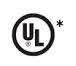

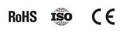

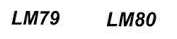

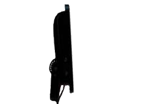

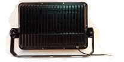

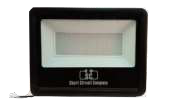

## Page 5

Table2: Body and Heat-Sink Description
Item Description
Body Anti-corrosion aluminum alloy heat sink (electrostatic painted)
Aluminum Purity 96-98 %
Thickness Of Fin Inner Outer
5 mm 1.5 mm
Front Glass Thickness 5 mm
Front Glass Max.temperature
750° C
Beam Angle 120°
Gasket silicone rubber insulation
Glands Waterproof cable glands (silicone insulated)
IP 65
Weight 10 Kg
Wattage 500 W
Installation Angle 30 , 45 , 60 Degree ( Depends on application)
3. LED Chips
Figure2: Philips Lumiled 3030
3.1Chip Performance Characteristics
Table3: Chip Performance Characteristics
Product Nominal Minimum Typical Luminous Flux (lm) Part
CCT CRI Luminous Number
Minimum Typical
Efficacy (lm/W)
LUXEON 6500K 90 144 94 104 L130-
3030 2D 6590003000X21
(Square LES)
3.2 Electrical and Thermal Characteristics
Table4: Chip Electrical and Thermal Characteristics

| Item | Description |  |
| --- | --- | --- |
| Body | Anti-corrosion aluminum alloy heat sink (electrostatic painted) |  |
| Aluminum Purity | 96-98 % |  |
| Thickness Of Fin | Inner | Outer |
|  | 5 mm | 1.5 mm |
| Front Glass Thickness | 5 mm |  |
| Front Glass Max.temperature | 750° C |  |
| Beam Angle | 120° |  |
| Gasket | silicone rubber insulation |  |
| Glands | Waterproof cable glands (silicone insulated) |  |
| IP | 65 |  |
| Weight | 10 Kg |  |
| Wattage | 500 W |  |
| Installation Angle | 30 , 45 , 60 Degree ( Depends on application) |  |

| Product | Nominal
CCT | Minimum
CRI | Typical
Luminous
Efficacy (lm/W) | Luminous Flux (lm) |  | Part
Number |
| --- | --- | --- | --- | --- | --- | --- |
|  |  |  |  | Minimum | Typical |  |
| LUXEON
3030 2D
(Square LES) | 6500K | 90 | 144 | 94 | 104 | L130-
6590003000X21 |

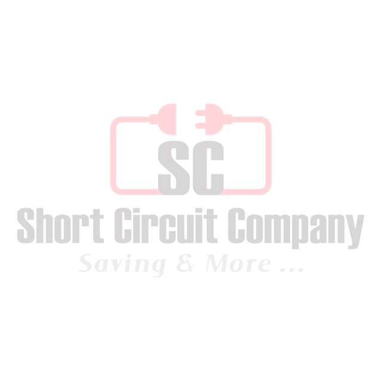

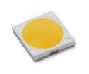

## Page 6

Part Forward Voltage (Vf ) Typical Temperature Coefficient of
Number Forward Voltage [2] (mV/°C)
Minimum Typical Maximum
L130- 5.8 6 6.6 -2 to -4
6590003000X21
3.3 Absolute Maximum Ratings
Table5: Chip Absolute Maximum Ratings
Parameter Maximum Performance
DC Forward Current 240mA
Peak Pulsed Forward Current 300mA
LED Junction Temperature (DC & Pulse) 125°C
Operating Case Temperature -40°C to 105°C
LED Storage Temperature -40°C to 105°C
3.4 Characteristics Curves
3.4.1 Light Output Characteristics
Figure3.a: Chip Light Output Characteristics

| Part
Number | Forward Voltage (Vf ) |  |  | Typical Temperature Coefficient of
Forward Voltage [2] (mV/°C) |
| --- | --- | --- | --- | --- |
|  | Minimum | Typical | Maximum |  |
| L130-
6590003000X21 | 5.8 | 6 | 6.6 | -2 to -4 |

| Parameter | Maximum Performance |
| --- | --- |
| DC Forward Current | 240mA |
| Peak Pulsed Forward Current | 300mA |
| LED Junction Temperature (DC & Pulse) | 125°C |
| Operating Case Temperature | -40°C to 105°C |
| LED Storage Temperature | -40°C to 105°C |

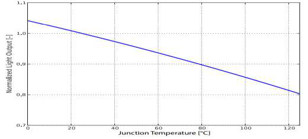

## Page 7

Figure3.b: Chip Light Output Characteristics
3.4.2 Forward Current Characteristics
Figure4: Chip Forward Current Characteristics

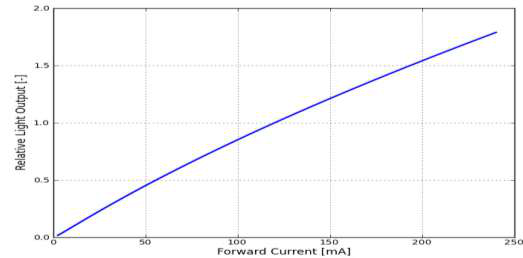

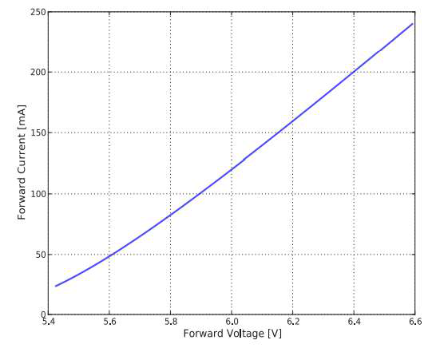

## Page 8

3.4.3 Polar Curve
Figure5: Chip Polar Curve
4. Driver
M o d e l n u m b e r S C - L D F-35V1450mA
Type Universal isolated LED driver
Figure6: Short Circuit Driver
4.1 General Description 4.2 Features
LDF series is an offline LED lighting controller clamping frequency improve the system efficiency.
with high power factor, low THD and high The advanced start-up technology is used to meet
constant current (CC) precision. It can achieve low the start- up time requirement (<0.5s). The
system cost for an isolated lighting application by constant output current is compensated for
primary side control in a single stage converter. It tolerance of transformer inductance variation.
significantly simplifies the LED lighting system Besides, the line compensation and load
design by eliminating the secondary side feedback compensation are built in for high precisely
components and the opto-coupler. constant output current control.
The proprietary CC control is used, and the system This series offers comprehensive protection
can achieve high power factor with constant on- coverage with auto-recovery features including
time control. Quasi-resonant (QR) operation and programmable VIN foldback, programmable VIN

| M o d e l n u m b e r | S C - L D F-35V1450mA |
| --- | --- |
| Type | Universal isolated LED driver |

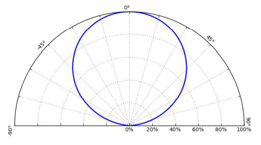

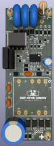

## Page 9

OVP, programmable thermal foldback, LED open  Primary-side control with single stage
loop protection, LED short circuit protection, PFC LED driver for low system cost,
cycle-by-cycle current limiting, built-in leading-  High PF (>0.95),
edge blanking, VDD under voltage lockout  Low THD (<10%),
(UVLO).  High efficiency (>85%),
 Life time up to 50,000 hours
 Pre-programmed VIN foldback,
 Pre-programmed VIN OVP,
 Pre-programmed thermal foldback,
 Pre-programmed CC regulation,
 High precision constant current,
 Fast start-up time (<0.5s),
 Built-in line/load compensation,
 No visible flicker, and audible noise free
4.3 Protection
 LED short circuit protection,
 LED open circuit protection,
 VDD over/under voltage protection,
 Lightning surge voltage up to 10 kV,
 AC input overvoltage protection,
 AC input overcurrent protection.
The LED driver recovers automatically and back to
normal operation after all fault causes are
removed.
4.4 Module Specification
This section presents the specification of the LED driver, normal operating range, and the driver
performance.

## Page 10

4.4 .1 AC Input Specification
Table6: AC input specification
LED driver max. apparent power 56W at full load 95Vac<Vin<275Vac
AC input voltage rating 30Vac ~ 300Vac
AC input voltage range for normal operation 90Vac ~ 275Vac
AC input voltage range for foldback operation 30Vac ~ 90Vac
AC input frequency range 47Hz ~ 63Hz
Power factor >0.95 at 220Vac full load
AC input current THD <10% at 220Vac full load
AC max. input current <0.8A at 95Vac full load
Efficiency >85% at 220Vac full load
4.4.2 DC Output Characteristics
Table7: DC output characteristics
DC output voltage 20 ~ 35 Vdc
Output voltage ripples <2.5 V peak-peak at max. load
DC output constant-current 1450 mA, ±5%
Output current ripples <45%
Maximum output power 50 W
Line regulation ±5%
Load regulation ±5%
Start-up time < 600 ms at 220Vac full load
4.4.3 Protection Specifications
Table8: Protection specifications
AC input overvoltage 275Vac ~ 300Vac
AC input foldback voltage 85Vac ~ 95Vac
DC output open circuit overvoltage 41 ~ 45 Vdc
Thermal foldback temperature 100℃
Lightning surge Up to 10 kV
Controller IC VDD undervoltage protection 9 Vdc,
Controller IC VDD overvoltage protection 24 Vdc

| LED driver max. apparent power | 56W at full load 95Vac<Vin<275Vac |
| --- | --- |
| AC input voltage rating | 30Vac ~ 300Vac |
| AC input voltage range for normal operation | 90Vac ~ 275Vac |
| AC input voltage range for foldback operation | 30Vac ~ 90Vac |
| AC input frequency range | 47Hz ~ 63Hz |
| Power factor | >0.95 at 220Vac full load |
| AC input current THD | <10% at 220Vac full load |
| AC max. input current | <0.8A at 95Vac full load |
| Efficiency | >85% at 220Vac full load |

| DC output voltage | 20 ~ 35 Vdc |
| --- | --- |
| Output voltage ripples | <2.5 V peak-peak at max. load |
| DC output constant-current | 1450 mA, ±5% |
| Output current ripples | <45% |
| Maximum output power | 50 W |
| Line regulation | ±5% |
| Load regulation | ±5% |
| Start-up time | < 600 ms at 220Vac full load |

| AC input overvoltage | 275Vac ~ 300Vac |
| --- | --- |
| AC input foldback voltage | 85Vac ~ 95Vac |
| DC output open circuit overvoltage | 41 ~ 45 Vdc |
| Thermal foldback temperature | 100℃ |
| Lightning surge | Up to 10 kV |
| Controller IC VDD undervoltage protection | 9 Vdc, |
| Controller IC VDD overvoltage protection | 24 Vdc |

## Page 11

4.4.4 Mechanical Specification
Figure 7: Driver mechanical dimensions in water-proof case IP65

|  |
| --- |
|  |
| Figure 7: Driver mechanical dimensions in water-proof case IP65 |

> ⚠️ Low text density on this page — check the image above manually, or re-run with `--vision`.

> ⚠️ Low text density on this page — check the image above manually, or re-run with `--vision`.

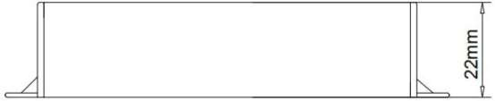

> ⚠️ Low text density on this page — check the image above manually, or re-run with `--vision`.

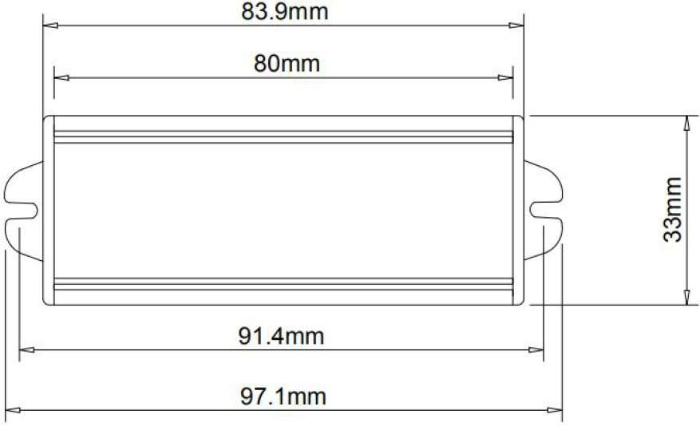

> ⚠️ Low text density on this page — check the image above manually, or re-run with `--vision`.
