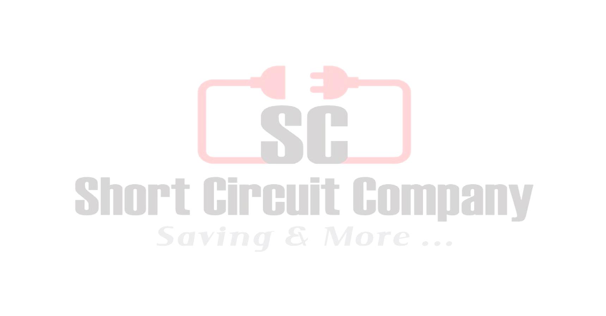
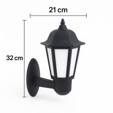

# ABS Applique datasheet

<!--
source_file: ABS Applique datasheet.pdf
pages: 1
images_extracted: 3
needs_manual_review: False
-->

## Page 1

Applique
Main Data
Power 9 W
Input Voltage 220V AC
Frequency 50 /60 Hz
Housing Material ABS
Color Black
Life time 20,000 hours.
Warranty 2 years
Photometric data
LED Efficacy 100 lm /W
Color temperature Warm 3000 k
Ingress Protection IP IP54
Technical Specification
• Lamp Supplied: Yes, replaceable LED
• Chip Lumen Output: 110 Lm
• Ingress Protection: IP54
• Diffuser: polycarbonate
Power chip luminous Flux Total luminous Flux System efficacy
9 w 990 lm 900 Lm 100 lm /W
Other varieties are available upon request

|  | Applique |  |
| --- | --- | --- |

| Power | 9 W |
| --- | --- |
| Input Voltage | 220V AC |
| Frequency | 50 /60 Hz |
| Housing Material | ABS |
| Color | Black |
| Life time | 20,000 hours. |
| Warranty | 2 years |

| LED Efficacy | 100 lm /W |
| --- | --- |
| Color temperature | Warm 3000 k |
| Ingress Protection IP | IP54 |

| Power |  |  | chip luminous Flux | Total luminous Flux | System efficacy |
| --- | --- | --- | --- | --- | --- |
|  | 9 w |  | 990 lm | 900 Lm | 100 lm /W |

