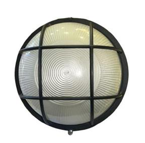

# Aluminum Round Bulkhead

<!--
source_file: Aluminum Round Bulkhead.pdf
pages: 2
images_extracted: 3
needs_manual_review: False
-->

## Page 1

PRODUCT DATASHEET
Bulkhead
LED Bulkhead Light
AREAS OF APPLICATION
• Outdoor wall lighting for buildings
• Lighting for parking garages
• Tunnel and corridor lighting
• Staircase and emergency lighting in residential or
commercial buildings
• Ideal for wet or humid areas such as bathrooms and
utility rooms
P RODUCT FEATURES PRODUCT BENEFITS
• Housing material:Aluminum • Easy installation with fast connection
• LED Lights consume significantly less energy
compared to traditional lighting sources
• Energy saving up to 60%
TECHNICAL DATA
ELECTRICAL DATA
Nominal Wattage 7 W
Nominal Voltage 220V AC
Main frequency 50 – 60 Hz
PHOTOMETRIC DATA
LED Efficacy 100 lm /W
Total Luminous 700
Color temperature 6000 K
Other varieties are available upon request

|  | AREAS OF APPLICATION
• Outdoor wall lighting for buildings
• Lighting for parking garages
• Tunnel and corridor lighting
• Staircase and emergency lighting in residential or
commercial buildings
• Ideal for wet or humid areas such as bathrooms and
utility rooms |  |
| --- | --- | --- |
| P RODUCT FEATURES
• Housing material:Aluminum |  |  |
|  |  | PRODUCT BENEFITS
• Easy installation with fast connection
• LED Lights consume significantly less energy
compared to traditional lighting sources
• Energy saving up to 60% |

|  | Nominal Wattage |  | 7 W |  |
| --- | --- | --- | --- | --- |

|  | Main frequency |  | 50 – 60 Hz |  |
| --- | --- | --- | --- | --- |
|  | PHOTOMETRIC DATA |  |  |  |
|  | LED Efficacy |  | 100 lm /W |  |

|  | Color temperature |  | 6000 K |  |
| --- | --- | --- | --- | --- |

## Page 2

PRODUCT DATASHEET
Bulkhead
LED Bulkhead Light
COLORS & MATERIALS
Body Color Black grill
Housing material Aluminum
L IFESPAN
Lifespan 20,000
Warranty 2
PROTECTION
Ingress protection IP 65
MOUNTING
Mounting Type Surface
Mounting Location Ceiling / Wall
Other varieties are available upon request

|  | COLORS & MATERIALS |  |  |  |
| --- | --- | --- | --- | --- |
|  | Body Color |  | Black grill |  |

|  | L IFESPAN |  |  |  |
| --- | --- | --- | --- | --- |
|  | Lifespan |  | 20,000 |  |

|  | PROTECTION |  |  |
| --- | --- | --- | --- |
|  | Ingress protection | IP 65 |  |
|  |  |  |  |
|  | MOUNTING |  |  |
|  | Mounting Type | Surface |  |

