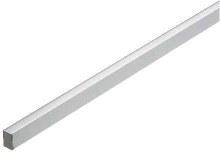

# Aluminum profile Datasheet

<!--
source_file: Aluminum profile Datasheet.pdf
pages: 2
images_extracted: 3
needs_manual_review: False
-->

## Page 1

PRODUCT DATASHEET
Aluminum Profile
LED Profile
AREAS OF APPLICATION
• Outdoor Pathways and Corridors
• Underground and Covered Parking Lots
• Industrial Facilities and Warehouses
• Tunnels and Underpasses
• Fuel Stations and Service Areas
• Building Exteriors and Perimeters
• Marine and Coastal Installations
PRODUCT FEATURES
PRODUCT BENEFITS
• 17 inside deep with diffuser
• Easy installation with fast connection
• Width of aluminum profile: 1.4
• LED Lights consume significantly less energy
• Housing Material : Aluminum
compared to traditional lighting sources
• Power supply for each 3 meter
• Energy saving up to 60%
•
TECHNICAL DATA
•
ELECTRICAL DATA
Nominal Wattage 14.4w/m
Power supply meanwell
Power 50w
PHOTOMETRIC DATA
LED Efficacy 100 lm /W
Color temperature 4000 K
Other varieties are available upon request

|  | AREAS OF APPLICATION
• Outdoor Pathways and Corridors
• Underground and Covered Parking Lots
• Industrial Facilities and Warehouses
• Tunnels and Underpasses
• Fuel Stations and Service Areas
• Building Exteriors and Perimeters
• Marine and Coastal Installations |  |
| --- | --- | --- |
| PRODUCT FEATURES
• 17 inside deep with diffuser
• Width of aluminum profile: 1.4
• Housing Material : Aluminum
• Power supply for each 3 meter |  |  |
|  |  |  |
|  |  |  |

|  | Nominal Wattage |  | 14.4w/m |  |
| --- | --- | --- | --- | --- |

|  | Power |  | 50w |  |
| --- | --- | --- | --- | --- |
|  | PHOTOMETRIC DATA |  |  |  |
|  | LED Efficacy |  | 100 lm /W |  |

## Page 2

PRODUCT DATASHEET
LED Aluminum profile
MATERIALS
Body Material Aluminum
Length 1m
LIFESPAN
Lifespan 30,000
Warranty 3
PROTECTION
Electrical protection IP 65
MOUNTING
Mounting Type Suspended
Mounting Location Ceiling
Other varieties are available upon request

|  | MATERIALS |  |  |
| --- | --- | --- | --- |
|  | Body Material | Aluminum |  |

|  | LIFESPAN |  |  |
| --- | --- | --- | --- |

|  | Warranty | 3 |  |
| --- | --- | --- | --- |

|  | PROTECTION |  |  |  |
| --- | --- | --- | --- | --- |
|  | Electrical protection |  | IP 65 |  |
|  | MOUNTING |  |  |  |
|  | Mounting Type |  | Suspended |  |

