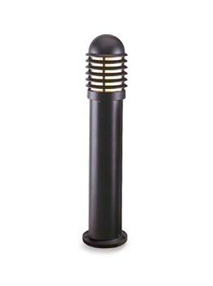

# Bollard 12w Datasheet medical center

<!--
source_file: Bollard 12w Datasheet medical center.pdf
pages: 2
images_extracted: 3
needs_manual_review: False
-->

## Page 1

PRODUCT DATASHEET
Bollard
LED Bulb Bollard
AREAS OF APPLICATION
• Pathway and walkway
• Hospitality and commercial properties
• Parks and public Spaces
• Resdinetial
• Gardens
PRODUCT BENEFITS
PRODUCT FEATURES
• Easy installation with fast connection
• Operating Voltage range: 220V AC
• Housing Material : Aluminum
• LED Lights consume significantly less energy
compared to traditional lighting sources
• Energy saving up to 60%
TECHNICAL DATA
ELECTRICAL DATA
Nominal Wattage 12W
Nominal Voltage 220V AC
Main frequency 50 /60 Hz
PHOTOMETRIC DATA
Luminous 100 Lm/w
Total Luminous 1,200 Lm
Color temperature 5000:6500 K
Other varieties are available upon request

| AREAS OF APPLICATION
• Pathway and walkway
• Hospitality and commercial properties
• Parks and public Spaces
• Resdinetial
• Gardens |
| --- |
| PRODUCT BENEFITS
• Easy installation with fast connection
• LED Lights consume significantly less energy
compared to traditional lighting sources
• Energy saving up to 60% |

| PRODUCT FEATURES
• Operating Voltage range: 220V AC
• Housing Material : Aluminum |  |
| --- | --- |

|  | Nominal Wattage |  |  | 12W |  |
| --- | --- | --- | --- | --- | --- |

|  | Main frequency |  |  | 50 /60 Hz |  |
| --- | --- | --- | --- | --- | --- |
|  | PHOTOMETRIC DATA |  |  |  |  |
|  | Luminous |  |  | 100 Lm/w |  |

|  | Color temperature |  |  | 5000:6500 K |  |
| --- | --- | --- | --- | --- | --- |

## Page 2

PRODUCT DATASHEET
LED Bollard
COLORS & MATERIALS
Body Material Aluminum
Height 75cm
LIFESPAN
Lifespan 30,000
Warranty 3
PROTECTION
Electrical protection IP 65
MOUNTING
Mounting Type Surface
Mounting Location Ground
Other varieties are available upon request

|  | COLORS & MATERIALS |  |  |
| --- | --- | --- | --- |
|  | Body Material | Aluminum |  |

|  | LIFESPAN |  |  |
| --- | --- | --- | --- |
|  | Lifespan | 30,000 |  |

|  | PROTECTION |  |  |  |
| --- | --- | --- | --- | --- |
|  | Electrical protection |  | IP 65 |  |
|  | MOUNTING |  |  |  |
|  | Mounting Type |  | Surface |  |

