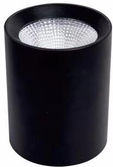

# Downlight cylinder 15w Datasheet

<!--
source_file: Downlight cylinder 15w Datasheet.pdf
pages: 2
images_extracted: 3
needs_manual_review: False
-->

## Page 1

PRODUCT DATASHEET
DOWN LIGHT
LED COB cylinder DOWNLIGHT
AREAS OF APPLICATION
• Offices
• Conference rooms
• Shopping malls
• Hotels and hospitality areas
• Living rooms
• Educational institutions (schools, universities)
• Libraries
PRODUCT BENEFITS
PRODUCT FEATURES
• Easy installation with fast connection
• Operating Voltage range: 220V AC
• Housing Material : Aluminum
• LED Lights consume significantly less energy
compared to traditional lighting sources
• Energy saving up to 60%
TECHNICAL DATA
ELECTRICAL DATA
Nominal Wattage 15 W
Nominal Voltage 220V AC
Main frequency 50 /60 Hz
PHOTOMETRIC DATA
Chip Philips
Luminous 120 Lm/w
Total Luminous 1,800 Lm
Color temperature Warm 4000 K
Other varieties are available upon request

| AREAS OF APPLICATION
• Offices
• Conference rooms
• Shopping malls
• Hotels and hospitality areas
• Living rooms
• Educational institutions (schools, universities)
• Libraries |
| --- |
| PRODUCT BENEFITS
• Easy installation with fast connection
• LED Lights consume significantly less energy
compared to traditional lighting sources
• Energy saving up to 60% |

| PRODUCT FEATURES
• Operating Voltage range: 220V AC
• Housing Material : Aluminum |  |
| --- | --- |

|  | Nominal Wattage |  | 15 W |  |
| --- | --- | --- | --- | --- |

|  | Main frequency |  | 50 /60 Hz |  |
| --- | --- | --- | --- | --- |
|  | PHOTOMETRIC DATA |  |  |  |
|  | Chip |  | Philips |  |

|  | Total Luminous |  | 1,800 Lm |  |
| --- | --- | --- | --- | --- |

## Page 2

PRODUCT DATASHEET
LED COB Cylinder DOWNLIGHT
COLORS & MATERIALS
Body Color White
Body Material Aluminum
Dimension 140*160
LIFESPAN
Lifespan 30,000
Warranty 3
PROTECTION
Electrical protection IP 44
MOUNTING
Mounting Type Surface
Mounting Location Celling
Other varieties are available upon request

|  | COLORS & MATERIALS |  |  |
| --- | --- | --- | --- |
|  | Body Color | White |  |

|  | Dimension | 140*160 |  |
| --- | --- | --- | --- |

|  | LIFESPAN |  |  |
| --- | --- | --- | --- |
|  | Lifespan | 30,000 |  |

|  | PROTECTION |  |  |  |
| --- | --- | --- | --- | --- |
|  | Electrical protection |  | IP 44 |  |
|  | MOUNTING |  |  |  |
|  | Mounting Type |  | Surface |  |

