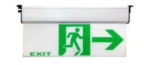

# EXIT Sign Quality 2

<!--
source_file: EXIT Sign Quality 2.pdf
pages: 2
images_extracted: 3
needs_manual_review: False
-->

## Page 1

PRODUCT DATASHEET
EXIT Sign
LED EXIT SIGN
AREAS OF APPLICATION
• Interior Architectural Lighting
• Offices and Workspaces.
• Retail Stores and Showrooms
• Hospitality and Hotels
• Residential Spaces.
• Museums and Galleries
• Restaurants and Cafés
• Theaters and Cinemas
• P ROUDseUdC fTo Br EaNisEleF IlTigSh ting, floor guidance, and decorative
PRODUCT FEATURES
trims.
• Operating Voltage range: 220V DC •
• Easy installation with fast connection
• Housing Material : ABS
• LED Lights consume significantly less energy
compared to traditional lighting sources
• Energy saving up to 60%
TECHNICAL DATA
ELECTRICAL DATA
Nominal Wattage 3W
Nominal Voltage 220V DC
Main frequency 50 /60 Hz
Power Factor > 0.8
PHOTOMETRIC DATA
LED Efficacy 100 lm /W
Total Luminous 300 Lm
Color temperature 3000 K
Other varieties are available upon request

|  | AREAS OF APPLICATION
• Interior Architectural Lighting
• Offices and Workspaces.
• Retail Stores and Showrooms
• Hospitality and Hotels
• Residential Spaces.
• Museums and Galleries
• Restaurants and Cafés
• Theaters and Cinemas |
| --- | --- |
|  |  |
| PRODUCT FEATURES
• Operating Voltage range: 220V DC
• Housing Material : ABS |  |

|  | Nominal Wattage |  | 3W |  |
| --- | --- | --- | --- | --- |

|  | Main frequency |  | 50 /60 Hz |  |
| --- | --- | --- | --- | --- |

|  | PHOTOMETRIC DATA |  |  |
| --- | --- | --- | --- |

|  | Total Luminous |  | 300 Lm |  |
| --- | --- | --- | --- | --- |

## Page 2

PRODUCT DATASHEET
LED EXIT SIGN
COLORS & MATERIALS
Body Color White
Body Material ABS
Battery
Battery type Ni-Cd
NO of batteries 3
Batteries data 03.)7 v-1000mAH
Charging time 24h
Discharging time 3 hours
Battery protection Overcharging and deep discharging protection
Warranty 1 year
LIFESPAN
Lifespan 30,000
Warranty 3
PROTECTION
Electrical protection IP 40
MOUNTING
Mounting Type Surface
Mounting Location Ceiling / Wall
Other varieties are available upon request

|  | COLORS & MATERIALS |  |  |
| --- | --- | --- | --- |
|  | Body Color | White |  |

|  | Battery |  |  |
| --- | --- | --- | --- |
|  | Battery type | Ni-Cd |  |
|  | NO of batteries | 3 |  |

|  | Charging time | 24h |  |
| --- | --- | --- | --- |

|  | Battery protection | Overcharging and deep discharging protection |  |
| --- | --- | --- | --- |

|  | LIFESPAN |  |  |
| --- | --- | --- | --- |
|  | Lifespan | 30,000 |  |

|  | PROTECTION |  |  |
| --- | --- | --- | --- |
|  | Electrical protection | IP 40 |  |
|  | MOUNTING |  |  |
|  | Mounting Type | Surface |  |

