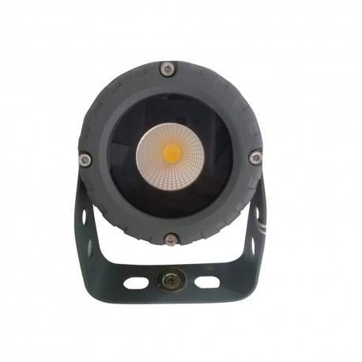

# Earthspike 18W Datasheet

<!--
source_file: Earthspike 18W Datasheet.pdf
pages: 2
images_extracted: 3
needs_manual_review: False
-->

## Page 1

PRODUCT DATASHEET
Earthspike
LED COB Earthspike
AREAS OF APPLICATION
• Garden & Landscape lighting
• Residential outdoor areas
• Hotels, Resorts & Hospitality
• Commercial and Public Spaces
• Oathways & Trails
PRODUCT BENEFITS
PRODUCT FEATURES
• Easy installation with fast connection
• Operating Voltage range: 220V AC
• Housing Material : Aluminum
• LED Lights consume significantly less energy
compared to traditional lighting sources
• Energy saving up to 60%
TECHNICAL DATA
ELECTRICAL DATA
Nominal Wattage 18 W
Nominal Voltage 220V AC
Main frequency 50 /60 Hz
PHOTOMETRIC DATA
LED Efficacy 100 lm /W
Total Luminous 1,800 Lm
Color temperature 3000K
Other varieties are available upon request

| AREAS OF APPLICATION
• Garden & Landscape lighting
• Residential outdoor areas
• Hotels, Resorts & Hospitality
• Commercial and Public Spaces
• Oathways & Trails |
| --- |
| PRODUCT BENEFITS
• Easy installation with fast connection
• LED Lights consume significantly less energy
compared to traditional lighting sources
• Energy saving up to 60% |

| PRODUCT FEATURES
• Operating Voltage range: 220V AC
• Housing Material : Aluminum |  |
| --- | --- |

|  | Nominal Wattage |  | 18 W |  |
| --- | --- | --- | --- | --- |

|  | Main frequency |  | 50 /60 Hz |  |
| --- | --- | --- | --- | --- |
|  | PHOTOMETRIC DATA |  |  |  |
|  | LED Efficacy |  | 100 lm /W |  |

|  | Color temperature |  | 3000K |  |
| --- | --- | --- | --- | --- |

## Page 2

PRODUCT DATASHEET
LED COB Earthspike
COLORS & MATERIALS
Body Color Grey
Body Material Aluminum
LIFESPAN
Lifespan 20,000
Warranty 2
PROTECTION
Electrical protection IP 65
MOUNTING
Mounting Type Inground
Mounting Location Ground
Other varieties are available upon request

|  | COLORS & MATERIALS |  |  |
| --- | --- | --- | --- |
|  | Body Color | Grey |  |

|  | LIFESPAN |  |  |
| --- | --- | --- | --- |
|  | Lifespan | 20,000 |  |

|  | PROTECTION |  |  |  |
| --- | --- | --- | --- | --- |
|  | Electrical protection |  | IP 65 |  |
|  | MOUNTING |  |  |  |
|  | Mounting Type |  | Inground |  |

