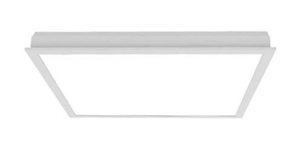

# Emergency Backlight SC 36W

<!--
source_file: Emergency Backlight SC 36W.pdf
pages: 2
images_extracted: 3
needs_manual_review: False
-->

## Page 1

PRODUCT DATASHEET
Emergency Backlight 60*60 cm
Emergency LED Backlight 60*60 cm
AARREEAASS OOFF AAPPPPLLIICCAATTIIOONN
•• IOnftfeicreio ar nAdr cchoimtemcteurrcaila Ll ilgighhtitningg
•• OHoffsicpeitsa al nadn dW colinrkicssp aces.
•• REdeutacial tSitoonraels i nasntdit uShtioownsr ooms
•• HReotsapiilt satloitrye as nadn dH oshteolws rooms
•• RReessiiddeennttiiaall uSpsea c es.
•• MInduusesturmiasl and Galleries
• R estaurants and Cafés
• Theaters and Cinemas
• Used for aisle lighting, floor guidance, and decorative
PRODUCT BENEFITS
PRODUCT FEATURES trims.
• • Easy installation with fast connection
• Operating Voltage range: 85-300V AC
• LED Lights consume significantly less energy
• Housing Material : Polycarbonate
compared to traditional lighting sources
• Energy saving up to 60%
ELECTRICAL DATA
Driver SC
Nominal wattage 36w
Nominal Voltage 85-300V AC
Main frequency 50 /60 Hz
Power Factor > 0.95
PHOTOMETRIC DATA
Chip Philips
LED Efficacy 110 Lm/w
Total Luminous 3,960 Lm
Color temperature 4000K
Other varieties are available upon request

| AARREEAASS OOFF AAPPPPLLIICCAATTIIOONN
•• IOnftfeicreio ar nAdr cchoimtemcteurrcaila Ll ilgighhtitningg
•• OHoffsicpeitsa al nadn dW colinrkicssp aces.
•• REdeutacial tSitoonraels i nasntdit uShtioownsr ooms
•• HReotsapiilt satloitrye as nadn dH oshteolws rooms
•• RReessiiddeennttiiaall uSpsea c es.
•• MInduusesturmiasl and Galleries
• R estaurants and Cafés
• Theaters and Cinemas |
| --- |
|  |

|  | Driver | SC |  |
| --- | --- | --- | --- |

|  | Nominal Voltage | 85-300V AC |  |
| --- | --- | --- | --- |

|  | Power Factor | > 0.95 |  |
| --- | --- | --- | --- |
|  | PHOTOMETRIC DATA |  |  |
|  | Chip | Philips |  |

|  | Total Luminous | 3,960 Lm |  |
| --- | --- | --- | --- |

## Page 2

PRODUCT DATASHEET
TECHNICAL DATA
Emergency LED Backlight 60*60 cm
COLORS & MATERIALS
Body Color Grey
Body Material Polycorbante
Fixture Lifespan
Life span 30,000
Warranty 3
Battery
Lifespan 20,000 (1.5-3 hours backup)
Warranty 2 years
0)
PROTECTION
Ingess protection IP 44
Electrical protection Over (voltage – current – temperature)
MOUNTING
Mounting Type Surface/Recessed
Mounting Location Celling
Other varieties are available upon request

|  | COLORS & MATERIALS |  |  |
| --- | --- | --- | --- |
|  | Body Color | Grey |  |

|  | Fixture Lifespan |  |  |
| --- | --- | --- | --- |

|  | Warranty | 3 |  |
| --- | --- | --- | --- |

|  | Battery |  |  |
| --- | --- | --- | --- |
|  | Lifespan | 20,000 (1.5-3 hours backup) |  |

|  | PROTECTION |  |  |
| --- | --- | --- | --- |
|  | Ingess protection | IP 44 |  |

|  | MOUNTING |  |
| --- | --- | --- |

|  | Mounting Location | Celling |  |
| --- | --- | --- | --- |

