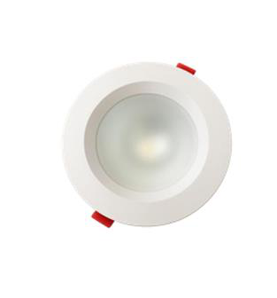
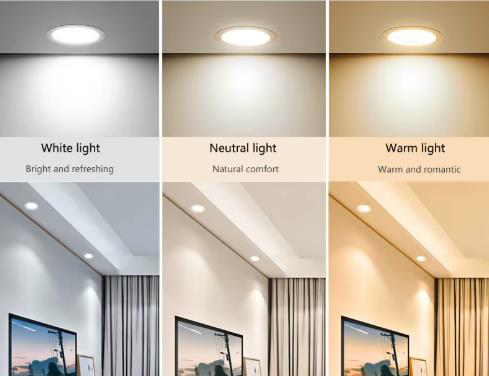
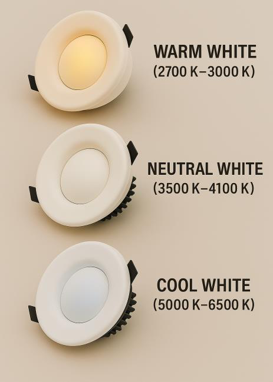

# Emergency Recessed downlight

<!--
source_file: Emergency Recessed downlight.pdf
pages: 2
images_extracted: 5
needs_manual_review: False
-->

## Page 1

PRODUCT DATASHEET
Emergency DOWN LIGHT
Emergency LED COB ROUND DOWNLIGHT
AREAS OF APPLICATION
• Offices
• Conference rooms
• Shopping malls
• Hotels and hospitality areas
• Living rooms
• Educational institutions (schools, universities)
• Libraries
PRODUCT BENEFITS
PRODUCT FEATURES
• Easy installation with fast connection
• Operating Voltage range: 220-240V AC
• LED Lights consume significantly less energy
• Housing Material : Aluminum
compared to traditional lighting sources
• Energy saving up to 60%
TECHNICAL DATA
ELECTRICAL DATA
Nominal Wattage 15W
Driver Lifud
Nominal Voltage 220-240V AC
Main frequency 50 /60 Hz
Power Factor > 0.8
PHOTOMETRIC DATA
Chip Ledvance COB
LED Efficacy 120 lm /W
Total Luminous 1,800 Lm
Color temperature 3000 K
Color Rendering index Ra >90
Other varieties are available upon request

| AREAS OF APPLICATION
• Offices
• Conference rooms
• Shopping malls
• Hotels and hospitality areas
• Living rooms
• Educational institutions (schools, universities)
• Libraries |
| --- |
| PRODUCT BENEFITS
• Easy installation with fast connection
• LED Lights consume significantly less energy
compared to traditional lighting sources
• Energy saving up to 60% |

| PRODUCT FEATURES
• Operating Voltage range: 220-240V AC
• Housing Material : Aluminum |  |
| --- | --- |

|  | Nominal Wattage |  | 15W |  |
| --- | --- | --- | --- | --- |

|  | Nominal Voltage |  | 220-240V AC |  |
| --- | --- | --- | --- | --- |

|  | Power Factor |  | > 0.8 |  |
| --- | --- | --- | --- | --- |
|  | PHOTOMETRIC DATA |  |  |  |
|  | Chip |  | Ledvance COB |  |

|  | Total Luminous |  | 1,800 Lm |  |
| --- | --- | --- | --- | --- |

|  | Color Rendering index |  | Ra >90 |  |
| --- | --- | --- | --- | --- |

## Page 2

PRODUCT DATASHEET
Emergency LED COB ROUND DOWNLIGHT
COLORS & MATERIALS
Body Color White
Body Material Aluminum
LIFESPAN
Lifespan 30,000
Warranty 3
BATTREY
Lifespan 20,000 (1.5-3 hours backup)
Warranty 2
PROTECTION
Electrical protection IP 54
MOUNTING
Mounting Type Resseced
Mounting Location Celling
Color temperature range
Other varieties are available upon request

|  | COLORS & MATERIALS |  |  |
| --- | --- | --- | --- |
|  | Body Color | White |  |

|  | LIFESPAN |  |  |
| --- | --- | --- | --- |

|  | Warranty | 3 |  |
| --- | --- | --- | --- |
|  | BATTREY |  |  |
|  | Lifespan | 20,000 (1.5-3 hours backup) |  |

|  | PROTECTION |  |  |  |
| --- | --- | --- | --- | --- |
|  | Electrical protection |  | IP 54 |  |
|  | MOUNTING |  |  |  |
|  | Mounting Type |  | Resseced |  |

