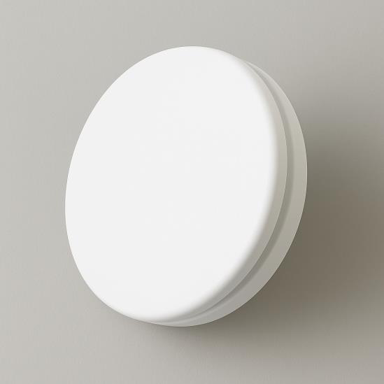
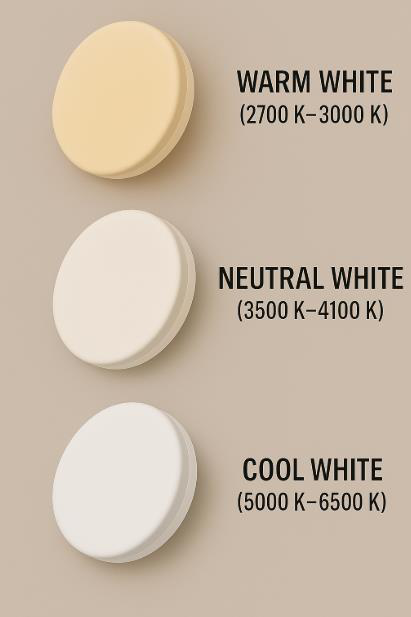
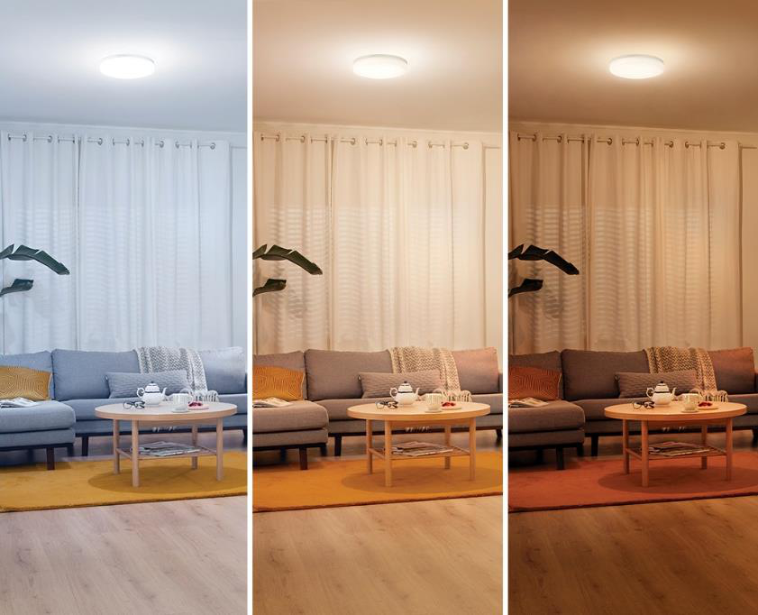

# Emergency Surface Panel light

<!--
source_file: Emergency Surface Panel light.pdf
pages: 2
images_extracted: 5
needs_manual_review: False
-->

## Page 1

PRODUCT DATASHEET
Emergency Panel LIGHT
Emergency LED COB ROUND PANEL LIGHT
AREAS OF APPLICATION
• Offices
• Conference rooms
• Shopping malls
• Hotels and hospitality areas
• Living rooms
• Educational institutions (schools, universities)
• Libraries
PRODUCT BENEFITS
PRODUCT FEATURES
• Easy installation with fast connection
• Operating Voltage range: 220-240V AC
• Housing Material : ABS
• LED Lights consume significantly less energy
compared to traditional lighting sources
• Energy saving up to 60%
TECHNICAL DATA
ELECTRICAL DATA
Nominal Wattage 24 W
Nominal Voltage 220-240V AC
Main frequency 50 /60 Hz
PHOTOMETRIC DATA
LED Efficacy 100 lm /W
Total Luminous 2,400 Lm
Color temperature 6000 K
Color Rendering index Ra >90
Other varieties are available upon request

| AREAS OF APPLICATION
• Offices
• Conference rooms
• Shopping malls
• Hotels and hospitality areas
• Living rooms
• Educational institutions (schools, universities)
• Libraries |
| --- |
| PRODUCT BENEFITS
• Easy installation with fast connection
• LED Lights consume significantly less energy
compared to traditional lighting sources
• Energy saving up to 60% |

| PRODUCT FEATURES
• Operating Voltage range: 220-240V AC
• Housing Material : ABS |  |
| --- | --- |

|  | Nominal Wattage |  | 24 W |  |
| --- | --- | --- | --- | --- |

|  | Main frequency |  | 50 /60 Hz |  |
| --- | --- | --- | --- | --- |
|  | PHOTOMETRIC DATA |  |  |  |
|  | LED Efficacy |  | 100 lm /W |  |

|  | Color temperature |  | 6000 K |  |
| --- | --- | --- | --- | --- |

## Page 2

PRODUCT DATASHEET
Emergency LED COB ROUND PANEL LIGHT
COLORS & MATERIALS
Body Color White
Body Material ABS
Battery LIFESPAN
Lifespan 20,000( 1.5-3 hours)
Warranty 2
LIFESPAN
Lifespan 20,000
Warranty 2
PROTECTION
Electrical protection IP 44
MOUNTING
Mounting Type Surface
Mounting Location Celling
Color temperature range
Other varieties are available upon request

|  | COLORS & MATERIALS |  |  |
| --- | --- | --- | --- |
|  | Body Color | White |  |

|  | Battery LIFESPAN |  |  |
| --- | --- | --- | --- |
|  | Lifespan | 20,000( 1.5-3 hours) |  |

|  | LIFESPAN |  |  |
| --- | --- | --- | --- |
|  | Lifespan | 20,000 |  |

|  | PROTECTION |  |  |
| --- | --- | --- | --- |
|  | Electrical protection | IP 44 |  |
|  | MOUNTING |  |  |
|  | Mounting Type | Surface |  |

