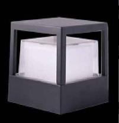
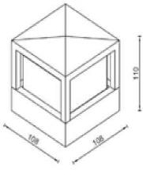

# Fence

<!--
source_file: Fence.pdf
pages: 2
images_extracted: 4
needs_manual_review: False
-->

## Page 1

PRODUCT DATASHEET
Mini Bollard
LED Mini Bollard
AREAS OF APPLICATION
• Pathway and walkway
• Hospitality and commercial properties
• Parks and public Spaces
• Resdinetial
• Gardens
• Gates
PRODUCT BENEFITS
PRODUCT FEATURES
• Easy installation with fast connection
• Operating Voltage range: 220-240V AC
• Housing Material : Aluminum
• LED Lights consume significantly less energy
compared to traditional lighting sources
• Energy saving up to 60%
TECHNICAL DATA
ELECTRICAL DATA
Nominal Wattage 6W
Nominal Voltage 220-240V AC
Main frequency 50 /60 Hz
PHOTOMETRIC DATA
Luminous 100 Lm/w
Total Luminous 600 Lm
Color temperature Warm 4000 K
Other varieties are available upon request

| AREAS OF APPLICATION
• Pathway and walkway
• Hospitality and commercial properties
• Parks and public Spaces
• Resdinetial
• Gardens
• Gates |
| --- |
| PRODUCT BENEFITS
• Easy installation with fast connection
• LED Lights consume significantly less energy
compared to traditional lighting sources
• Energy saving up to 60% |

| PRODUCT FEATURES
• Operating Voltage range: 220-240V AC
• Housing Material : Aluminum |  |
| --- | --- |

|  | Nominal Wattage |  |  | 6W |  |
| --- | --- | --- | --- | --- | --- |

|  | Main frequency |  |  | 50 /60 Hz |  |
| --- | --- | --- | --- | --- | --- |
|  | PHOTOMETRIC DATA |  |  |  |  |
|  | Luminous |  |  | 100 Lm/w |  |

|  | Color temperature |  |  | Warm 4000 K |  |
| --- | --- | --- | --- | --- | --- |

## Page 2

PRODUCT DATASHEET
COLORS & MATERIALS
Body Color Black
Body Material Aluminum
LIFESPAN
Lifespan 50,000
3
Warranty
PROTECTION
Electrical protection IP 67
MOUNTING
Mounting Type Surface
Mounting Location Gate wall
Other varieties are available upon request

|  | COLORS & MATERIALS |  |  |
| --- | --- | --- | --- |
|  | Body Color | Black |  |

|  | LIFESPAN |  |  |
| --- | --- | --- | --- |
|  | Lifespan | 50,000 |  |

|  | PROTECTION |  |  |
| --- | --- | --- | --- |
|  | Electrical protection | IP 67 |  |
|  | MOUNTING |  |  |
|  | Mounting Type | Surface |  |

