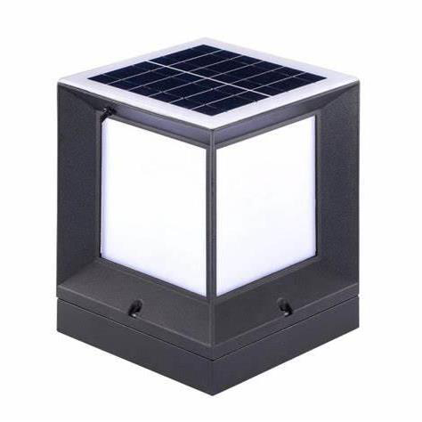

# Gate Light datasheet

<!--
source_file: Gate Light datasheet.pdf
pages: 2
images_extracted: 3
needs_manual_review: False
-->

## Page 1

PRODUCT DATASHEET
Gate Light
LED Gate Light
AREAS OF APPLICATION
• Outdoor Pathways and Corridors
• Underground and Covered Parking Lots
• Industrial Facilities and Warehouses
• Tunnels and Underpasses
• Fuel Stations and Service Areas
• Building Exteriors and Perimeters
• Marine and Coastal Installations
PRODUCT BENEFITS
PRODUCT FEATURES
• Easy installation with fast connection
• Housing Material : Aluminum
• LED Lights consume significantly less energy
compared to traditional lighting sources
• Energy saving up to 60%
TECHNICAL DATA
ELECTRICAL DATA
Nominal Wattage 10 W
PHOTOMETRIC DATA
Chip Phillips
Color temperature 4000K
Other varieties are available upon request

|  | AREAS OF APPLICATION
• Outdoor Pathways and Corridors
• Underground and Covered Parking Lots
• Industrial Facilities and Warehouses
• Tunnels and Underpasses
• Fuel Stations and Service Areas
• Building Exteriors and Perimeters
• Marine and Coastal Installations |
| --- | --- |
|  |  |
| PRODUCT FEATURES
• Housing Material : Aluminum | PRODUCT BENEFITS
• Easy installation with fast connection
• LED Lights consume significantly less energy
compared to traditional lighting sources
• Energy saving up to 60% |

|  | Nominal Wattage | 10 W |  |
| --- | --- | --- | --- |
|  | PHOTOMETRIC DATA |  |  |
|  | Chip | Phillips |  |

## Page 2

PRODUCT DATASHEET
COLORS & MATERIALS
Body Color RAL 7043
Body Material Aluminum
DSoimlaern Psaionne l Data 32.5*32.5*H39cm
Solar Panel Monocrystal silicon
Solar Panel Power 6V-10w
Controlable Data
Controller Remote control
No.of batteries 5
Life time
Life time 20,000 hours
Warranty 2 years
PROTECTION
Electrical protection IP 65
MOUNTING
Mounting Type Surface
Mounting Location Gate wall
Other varieties are available upon request

|  | COLORS & MATERIALS |  |  |  |
| --- | --- | --- | --- | --- |
|  | Body Color |  | RAL 7043 |  |

|  | DSoimlaern Psaionne l Data | 32.5*32.5*H39cm |  |  |
| --- | --- | --- | --- | --- |
|  | Solar Panel |  | Monocrystal silicon |  |

|  | Controlable Data |  |
| --- | --- | --- |

|  | No.of batteries |  | 5 |  |
| --- | --- | --- | --- | --- |

|  | Life time |  |  |  |
| --- | --- | --- | --- | --- |
|  | Life time |  | 20,000 hours |  |

|  | PROTECTION |  |  |  |
| --- | --- | --- | --- | --- |
|  | Electrical protection |  | IP 65 |  |
|  | MOUNTING |  |  |  |
|  | Mounting Type |  | Surface |  |

