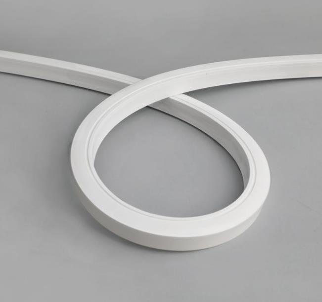

# LED Strip sillicon 14.4w Datasheet

<!--
source_file: LED Strip sillicon 14.4w Datasheet.pdf
pages: 2
images_extracted: 5
needs_manual_review: False
-->

## Page 1

PRODUCT DATASHEET
LED Strip
LED STRIP LIGHT
AREAS OF APPLICATION
• Interior Architectural Lighting
• Offices and Workspaces.
• Retail Stores and Showrooms
• Hospitality and Hotels
• Residential Spaces.
• Museums and Galleries
• Restaurants and Cafés
• Theaters and Cinemas
• P ROUDseUdC fTo Br EaNisEleF IlTigSh ting, floor guidance, and decorative
PRODUCT FEATURES
trims.
• Easy installation with fast connection
• Operating Voltage range: DC 12V •
• Housing Material : Silicon tube
• LED Lights consume significantly less energy
compared to traditional lighting sources
• Energy saving up to 60%
TECHNICAL DATA
ELECTRICAL DATA
Nominal Wattage 14.4 W/m
Nominal Voltage DC 12V
PHOTOMETRIC DATA
LED Efficacy 100 lm /W
Total Luminous 1,440 Lm/m
Color temperature 3000 K
Other varieties are available upon request

|  | AREAS OF APPLICATION
• Interior Architectural Lighting
• Offices and Workspaces.
• Retail Stores and Showrooms
• Hospitality and Hotels
• Residential Spaces.
• Museums and Galleries
• Restaurants and Cafés
• Theaters and Cinemas |
| --- | --- |
|  |  |
| PRODUCT FEATURES
• Operating Voltage range: DC 12V
• Housing Material : Silicon tube | • P ROUDseUdC fTo Br EaNisEleF IlTigSh ting, floor guidance, and decora
trims.
• Easy installation with fast connection
•
• LED Lights consume significantly less energy
compared to traditional lighting sources
• Energy saving up to 60% |

|  | Nominal Wattage | 14.4 W/m |  |
| --- | --- | --- | --- |

|  | PHOTOMETRIC DATA |  |
| --- | --- | --- |

|  | Total Luminous | 1,440 Lm/m |  |
| --- | --- | --- | --- |

## Page 2

PRODUCT DATASHEET
LED PROFILE LIGHT
COLORS & MATERIALS
Body Color white
Body Material Silicon tube
LIFESPAN
Lifespan 20,000
Warranty 2
PROTECTION
Electrical protection IP 68
MOUNTING
Mounting Type Surface / recessed
Mounting Location Celling /Wall
Color temperature range
Other varieties are available upon request

|  | COLORS & MATERIALS |  |  |  |
| --- | --- | --- | --- | --- |
|  | Body Color |  | white |  |

|  | LIFESPAN |  |  |  |
| --- | --- | --- | --- | --- |
|  | Lifespan |  | 20,000 |  |

|  | PROTECTION |  |  |
| --- | --- | --- | --- |
|  | Electrical protection | IP 68 |  |
|  | MOUNTING |  |  |
|  | Mounting Type | Surface / recessed |  |

