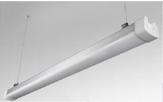

# Linear Highbay

<!--
source_file: Linear Highbay.pdf
pages: 2
images_extracted: 3
needs_manual_review: False
-->

## Page 1

PRODUCT DATASHEET
Linear Highbay
LED Linear Highbay
AREAS OF APPLICATION
• Outdoor Pathways and Corridors
• Underground and Covered Parking Lots
• Industrial Facilities and Warehouses
• Tunnels and Underpasses
• Fuel Stations and Service Areas
• Building Exteriors and Perimeters
• Marine and Coastal Installations
PRODUCT BENEFITS
PRODUCT FEATURES
• Easy installation with fast connection
• Operating Voltage range: 85-265V AC
• Housing Material : Aluminum
• LED Lights consume significantly less energy
compared to traditional lighting sources
• Diffuser: Polycarbonate
• Energy saving up to 60%
TECHNICAL DATA
ELECTRICAL DATA
Nominal Wattage 40 W
Nominal Voltage 85-265V AC
Main frequency 50 /60 Hz
PHOTOMETRIC DATA
Chip Phillips
LED Efficacy 110 lm /W
Total Luminous 4,400 Lm
Color temperature 4000 K
Other varieties are available upon request

|  | AREAS OF APPLICATION
• Outdoor Pathways and Corridors
• Underground and Covered Parking Lots
• Industrial Facilities and Warehouses
• Tunnels and Underpasses
• Fuel Stations and Service Areas
• Building Exteriors and Perimeters
• Marine and Coastal Installations |
| --- | --- |
|  |  |
| PRODUCT FEATURES
• Operating Voltage range: 85-265V AC
• Housing Material : Aluminum
• Diffuser: Polycarbonate |  |

|  | Nominal Wattage |  | 40 W |  |
| --- | --- | --- | --- | --- |

|  | Main frequency |  | 50 /60 Hz |  |
| --- | --- | --- | --- | --- |
|  | PHOTOMETRIC DATA |  |  |  |
|  | Chip |  | Phillips |  |

|  | Total Luminous |  | 4,400 Lm |  |
| --- | --- | --- | --- | --- |

## Page 2

PRODUCT DATASHEET
LED Linear Highbay
COLORS & MATERIALS
Body Color Grey
Body Material Aluminum
LIFESPAN
Lifespan 50,000
Warranty 5
PROTECTION
Electrical protection IP 65
MOUNTING
Mounting Type Surface
Mounting Location Celling / Wall
Other varieties are available upon request

|  | COLORS & MATERIALS |  |  |
| --- | --- | --- | --- |
|  | Body Color | Grey |  |

|  | LIFESPAN |  |  |
| --- | --- | --- | --- |
|  | Lifespan | 50,000 |  |

|  | PROTECTION |  |  |  |
| --- | --- | --- | --- | --- |
|  | Electrical protection |  | IP 65 |  |
|  | MOUNTING |  |  |  |
|  | Mounting Type |  | Surface |  |

