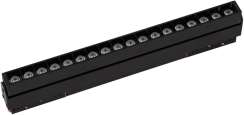

# Linear magnetic track

<!--
source_file: Linear magnetic track.pdf
pages: 2
images_extracted: 3
needs_manual_review: False
-->

## Page 1

PRODUCT DATASHEET
Linear magnetic track
LED Linear magnetic track
AREAS OF APPLICATION
• Outdoor Pathways and Corridors
• Underground and Covered Parking Lots
• Industrial Facilities and Warehouses
• Tunnels and Underpasses
• Fuel Stations and Service Areas
• Building Exteriors and Perimeters
• Marine and Coastal Installations
PRODUCT BENEFITS
PRODUCT FEATURES
• Easy installation with fast connection
• Operating Voltage range : 220V AC
• Housing Material : Aluminum
• LED Lights consume significantly less energy
compared to traditional lighting sources
• Energy saving up to 60%
TECHNICAL DATA
ELECTRICAL DATA
Nominal Wattage 72w
Nominal Voltage 220V AC
Main frequency 50 /60 Hz
PHOTOMETRIC DATA
LED Efficacy 100lm /W
Total Luminous 7200 Lm
Color temperature 3000 K
Other varieties are available upon request

|  | AREAS OF APPLICATION
• Outdoor Pathways and Corridors
• Underground and Covered Parking Lots
• Industrial Facilities and Warehouses
• Tunnels and Underpasses
• Fuel Stations and Service Areas
• Building Exteriors and Perimeters
• Marine and Coastal Installations |
| --- | --- |
|  |  |
| PRODUCT FEATURES
• Operating Voltage range : 220V AC
• Housing Material : Aluminum |  |

|  | Nominal Wattage |  | 72w |  |
| --- | --- | --- | --- | --- |

|  | Main frequency |  | 50 /60 Hz |  |
| --- | --- | --- | --- | --- |
|  | PHOTOMETRIC DATA |  |  |  |
|  | LED Efficacy |  | 100lm /W |  |

|  | Color temperature |  | 3000 K |  |
| --- | --- | --- | --- | --- |

## Page 2

PRODUCT DATASHEET
LED Linear magnetic track
COLORS & MATERIALS
Body Color Black
Body Material Aluminum
Dimension 1500mm
LIFESPAN
Lifespan 20,000
Warranty 2
PROTECTION
Electrical protection IP 44
MOUNTING
Mounting Type Recessed
Mounting Location Celling
Other varieties are available upon request

|  | COLORS & MATERIALS |  |  |  |
| --- | --- | --- | --- | --- |
|  | Body Color |  | Black |  |

|  | Dimension |  | 1500mm |  |
| --- | --- | --- | --- | --- |
|  | LIFESPAN |  |  |  |
|  | Lifespan |  | 20,000 |  |

|  | PROTECTION |  |  |  |
| --- | --- | --- | --- | --- |
|  | Electrical protection |  | IP 44 |  |
|  | MOUNTING |  |  |  |
|  | Mounting Type |  | Recessed |  |

