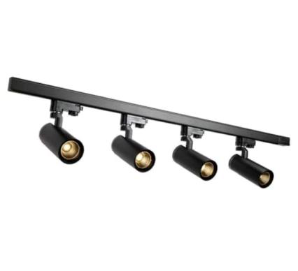

# Magnetic Track 4 spots datasheet

<!--
source_file: Magnetic Track 4 spots datasheet.pdf
pages: 2
images_extracted: 3
needs_manual_review: False
-->

## Page 1

PRODUCT DATASHEET
Magnetic Track
LED Magnetic Track with spots
AREAS OF APPLICATION
• Outdoor Pathways and Corridors
• Underground and Covered Parking Lots
• Industrial Facilities and Warehouses
• Tunnels and Underpasses
• Fuel Stations and Service Areas
• Building Exteriors and Perimeters
• Marine and Coastal Installations
PRODUCT BENEFITS
• Easy installation with fast connection
• LED Lights consume significantly less energy
compared to traditional lighting sources
• Energy saving up to 60%
TECHNICAL DATA
ELECTRICAL DATA
Nominal Wattage 48w
Main frequency 50 /60 Hz
PHOTOMETRIC DATA
Chip Osram
LED Efficacy 100 lm /W
Total Luminous 4800Lm
Color temperature 3000 K
Other varieties are available upon request

| AREAS OF APPLICATION
• Outdoor Pathways and Corridors
• Underground and Covered Parking Lots
• Industrial Facilities and Warehouses
• Tunnels and Underpasses
• Fuel Stations and Service Areas
• Building Exteriors and Perimeters
• Marine and Coastal Installations |
| --- |
|  |
| PRODUCT BENEFITS
• Easy installation with fast connection
• LED Lights consume significantly less energy
compared to traditional lighting sources
• Energy saving up to 60% |

|  | Nominal Wattage |  | 48w |  |
| --- | --- | --- | --- | --- |

|  | PHOTOMETRIC DATA |  |  |  |
| --- | --- | --- | --- | --- |
|  | Chip |  | Osram |  |
|  | LED Efficacy |  | 100 lm /W |  |

|  | Color temperature |  | 3000 K |  |
| --- | --- | --- | --- | --- |

## Page 2

PRODUCT DATASHEET
LED Magnetic Track with spots
Dimension
Length 1m
Number of Spots 4
Power Supply
Power 60w
LIFESPAN
Lifespan 30,000
Warranty 3
PROTECTION
Ingress protection IP 44
MOUNTING
Mounting Type Surface
Mounting Location Ceiling
Other varieties are available upon request

|  | Dimension |  |  |
| --- | --- | --- | --- |
|  | Length | 1m |  |

|  |  |  |  |
| --- | --- | --- | --- |
|  | Power Supply |  |  |
|  | Power | 60w |  |

|  | LIFESPAN |  |  |
| --- | --- | --- | --- |
|  | Lifespan | 30,000 |  |

|  | PROTECTION |  |  |  |
| --- | --- | --- | --- | --- |
|  | Ingress protection |  | IP 44 |  |
|  | MOUNTING |  |  |  |
|  | Mounting Type |  | Surface |  |

