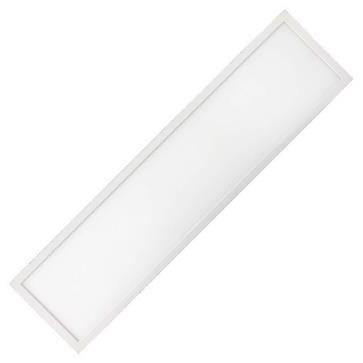

# Panel 120cm 30cm 40W Datasheet

<!--
source_file: Panel 120cm 30cm 40W Datasheet.pdf
pages: 2
images_extracted: 3
needs_manual_review: False
-->

## Page 1

PRODUCT DATASHEET
Panel 120*30cm
LED Panel 120*30cm
AREAS OF APPLICATION
• Outdoor Pathways and Corridors
• Underground and Covered Parking Lots
• Industrial Facilities and Warehouses
• Tunnels and Underpasses
• Fuel Stations and Service Areas
• Building Exteriors and Perimeters
• Marine and Coastal Installations
PRODUCT BENEFITS
PRODUCT FEATURES
• Easy installation with fast connection
• Operating Voltage range: 220V AC
• Housing Material : Polycarbonate
• LED Lights consume significantly less energy
compared to traditional lighting sources
• Energy saving up to 60%
TECHNICAL DATA
ELECTRICAL DATA
Nominal wattage 40w
Nominal Voltage 220V AC
Main frequency 50 /60 Hz
PHOTOMETRIC DATA
Chip Phillips
LED Efficacy 110 lm /W
Total Luminous 4,400 Lm
Color temperature 4000 K
Other varieties are available upon request

|  | AREAS OF APPLICATION
• Outdoor Pathways and Corridors
• Underground and Covered Parking Lots
• Industrial Facilities and Warehouses
• Tunnels and Underpasses
• Fuel Stations and Service Areas
• Building Exteriors and Perimeters
• Marine and Coastal Installations |
| --- | --- |
|  |  |
| PRODUCT FEATURES
• Operating Voltage range: 220V AC
• Housing Material : Polycarbonate |  |

|  | Nominal wattage |  | 40w |  |
| --- | --- | --- | --- | --- |

|  | Main frequency |  | 50 /60 Hz |  |
| --- | --- | --- | --- | --- |
|  | PHOTOMETRIC DATA |  |  |  |
|  | Chip |  | Phillips |  |

|  | Total Luminous |  | 4,400 Lm |  |
| --- | --- | --- | --- | --- |

## Page 2

PRODUCT DATASHEET
LED Panel 120*30 cm
MATERIALS
Body Material Polycarbonate
LIFESPAN
Lifespan 30,000
Warranty 3
PROTECTION
Electrical protection IP 44
MOUNTING
Mounting Type Recessed
Mounting Location Ceiling
Other varieties are available upon request

|  | MATERIALS |  |  |
| --- | --- | --- | --- |
|  | Body Material | Polycarbonate |  |

|  | LIFESPAN |  |  |
| --- | --- | --- | --- |
|  | Lifespan | 30,000 |  |

|  | PROTECTION |  |  |  |
| --- | --- | --- | --- | --- |
|  | Electrical protection |  | IP 44 |  |
|  | MOUNTING |  |  |  |
|  | Mounting Type |  | Recessed |  |

