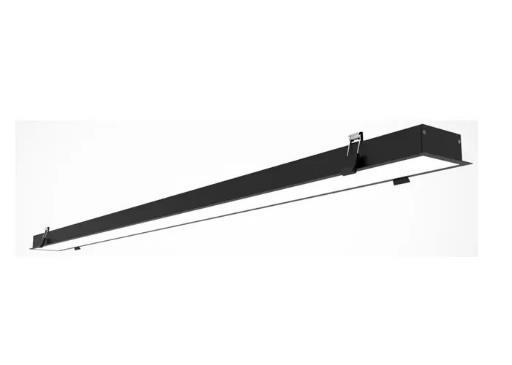

# Recessed Linear profile 90w

<!--
source_file: Recessed Linear profile 90w.pdf
pages: 2
images_extracted: 3
needs_manual_review: False
-->

## Page 1

PRODUCT DATASHEET
Linear Profile
LED Linear Profile
AREAS OF APPLICATION
• Outdoor Pathways and Corridors
• Underground and Covered Parking Lots
• Industrial Facilities and Warehouses
• Tunnels and Underpasses
• Fuel Stations and Service Areas
• Building Exteriors and Perimeters
• Marine and Coastal Installations
PRODUCT BENEFITS
PRODUCT FEATURES
• Easy installation with fast connection
• Operating Voltage range : 220V AC
• Housing Material : Aluminum
• LED Lights consume significantly less energy
compared to traditional lighting sources
• Energy saving up to 60%
TECHNICAL DATA
ELECTRICAL DATA
Nominal Wattage 90W
Nominal Voltage 220V AC
Main frequency 50 /60 Hz
PHOTOMETRIC DATA
LED Efficacy 110 lm /W
Total Luminous 9900 Lm
Color temperature 4000 K
Other varieties are available upon request

|  | AREAS OF APPLICATION
• Outdoor Pathways and Corridors
• Underground and Covered Parking Lots
• Industrial Facilities and Warehouses
• Tunnels and Underpasses
• Fuel Stations and Service Areas
• Building Exteriors and Perimeters
• Marine and Coastal Installations |
| --- | --- |
|  |  |
| PRODUCT FEATURES
• Operating Voltage range : 220V AC
• Housing Material : Aluminum |  |

|  | Nominal Wattage |  | 90W |  |
| --- | --- | --- | --- | --- |

|  | Main frequency |  | 50 /60 Hz |  |
| --- | --- | --- | --- | --- |
|  | PHOTOMETRIC DATA |  |  |  |
|  | LED Efficacy |  | 110 lm /W |  |

|  | Color temperature |  | 4000 K |  |
| --- | --- | --- | --- | --- |

## Page 2

PRODUCT DATASHEET
LED Linear Profile
COLORS & MATERIALS
Body Color White
Body Material Aluminum
Dimension 3000*35*47mm
LIFESPAN
Lifespan 50,000
Warranty 3
PROTECTION
Electrical protection IP 40
MOUNTING
Mounting Type Recessed
Mounting Location Celling
Other varieties are available upon request

|  | COLORS & MATERIALS |  |  |
| --- | --- | --- | --- |
|  | Body Color | White |  |

|  | Dimension | 3000*35*47mm |  |
| --- | --- | --- | --- |
|  | LIFESPAN |  |  |
|  | Lifespan | 50,000 |  |

|  | PROTECTION |  |  |  |
| --- | --- | --- | --- | --- |
|  | Electrical protection |  | IP 40 |  |
|  | MOUNTING |  |  |  |
|  | Mounting Type |  | Recessed |  |

