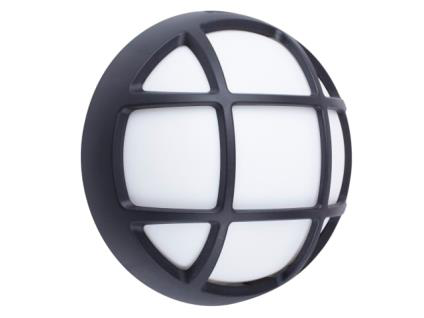

# Round Bulkhead ABS

<!--
source_file: Round Bulkhead ABS.pdf
pages: 2
images_extracted: 3
needs_manual_review: False
-->

## Page 1

PRODUCT DATASHEET
BULKHEAD LIGHT
LED LAMP Round BULKHEAD
AREAS OF APPLICATION
• Exterior Building Entrances
• Corridors and Stairwells
• Parking Garages and Carports
• Industrial Workshops and Warehouses
• Marine and Coastal Facilities
• Tunnels and Underpasses
• Residential Gardens and Patios
• Schools and Public Buildings
PRODUCT FEATURES
PRODUCT BENEFITS
• Operating Voltage range: 220-240V AC
• Easy installation with fast connection
• Housing Material : ABS
• LED Lights consume significantly less energy
compared to traditional lighting sources
TECHNICAL DATA • Energy saving up to 60%
ELECTRICAL DATA
Nominal Wattage 16 W
Nominal Voltage 220V AC
Main frequency 50 /60 Hz
PHOTOMETRIC DATA
LED Efficacy 100 lm /W
Total Luminous 1,600 Lm
Color temperature 4000 K
Other varieties are available upon request

|  | AREAS OF APPLICATION
• Exterior Building Entrances
• Corridors and Stairwells
• Parking Garages and Carports
• Industrial Workshops and Warehouses
• Marine and Coastal Facilities
• Tunnels and Underpasses
• Residential Gardens and Patios
• Schools and Public Buildings
PRODUCT BENEFITS |  |  |
| --- | --- | --- | --- |
| PRODUCT FEATURES
• Operating Voltage range: 220-240V AC
• Housing Material : ABS |  |  |  |
|  |  |  | PRODUCT BENEFITS |
|  |  |  |  |

|  | Nominal Wattage |  | 16 W |  |
| --- | --- | --- | --- | --- |

|  | Main frequency |  | 50 /60 Hz |  |
| --- | --- | --- | --- | --- |
|  | PHOTOMETRIC DATA |  |  |  |
|  | LED Efficacy |  | 100 lm /W |  |

|  | Color temperature |  | 4000 K |  |
| --- | --- | --- | --- | --- |

## Page 2

PRODUCT DATASHEET
LED LAMP OVAL BULKHEAD
COLORS & MATERIALS
Body Color Black Grill
Body Material ABS
LIFESPAN
Lifespan 20,000
Warranty 2
PROTECTION
Electrical protection IP 54
MOUNTING
Mounting Type Surface
Mounting Location Wall
Other varieties are available upon request

|  | COLORS & MATERIALS |  |  |
| --- | --- | --- | --- |
|  | Body Color | Black Grill |  |

|  | LIFESPAN |  |  |
| --- | --- | --- | --- |
|  | Lifespan | 20,000 |  |

|  | PROTECTION |  |  |  |
| --- | --- | --- | --- | --- |
|  | Electrical protection |  | IP 54 |  |
|  | MOUNTING |  |  |  |
|  | Mounting Type |  | Surface |  |

