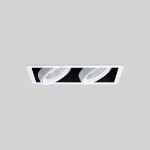

# Square Downlight 12w datasheet

<!--
source_file: Square Downlight 12w datasheet.pdf
pages: 2
images_extracted: 3
needs_manual_review: False
-->

## Page 1

PRODUCT DATASHEET
Square Downlight
LED Square Spotlight
AREAS OF APPLICATION
• Outdoor Pathways and Corridors
• Underground and Covered Parking Lots
• Industrial Facilities and Warehouses
• Tunnels and Underpasses
• Fuel Stations and Service Areas
• Building Exteriors and Perimeters
• Marine and Coastal Installations
PRODUCT BENEFITS
PRODUCT FEATURES
• Easy installation with fast connection
• Operating Voltage range: 220V AC
• LED Lights consume significantly less energy
compared to traditional lighting sources
• Energy saving up to 60%
TECHNICAL DATA
ELECTRICAL DATA
Nominal Wattage 12W
Nominal Voltage 220V AC
Main frequency 50 /60 Hz
PHOTOMETRIC DATA
LED Efficacy 100lm /W
Total Luminous 1200Lm
Color temperature 6000 K
Other varieties are available upon request

|  | AREAS OF APPLICATION
• Outdoor Pathways and Corridors
• Underground and Covered Parking Lots
• Industrial Facilities and Warehouses
• Tunnels and Underpasses
• Fuel Stations and Service Areas
• Building Exteriors and Perimeters
• Marine and Coastal Installations |
| --- | --- |
|  |  |
| PRODUCT FEATURES
• Operating Voltage range: 220V AC |  |

|  | Nominal Wattage |  | 12W |  |
| --- | --- | --- | --- | --- |

|  | Main frequency |  | 50 /60 Hz |  |
| --- | --- | --- | --- | --- |
|  | PHOTOMETRIC DATA |  |  |  |
|  | LED Efficacy |  | 100lm /W |  |

|  | Color temperature |  | 6000 K |  |
| --- | --- | --- | --- | --- |

## Page 2

PRODUCT DATASHEET
LED Square downlight
LIFESPAN
Lifespan 30,000
Warranty 3
PROTECTION
Ingress protection IP 54
MOUNTING
Mounting Type Recessed
Mounting Location Ceiling
Other varieties are available upon request

| PRODUCT DATASHEET |
| --- |
| LED Square downlight |

|  | LIFESPAN |  |  |  |
| --- | --- | --- | --- | --- |
|  | Lifespan |  | 30,000 |  |

|  | PROTECTION |  |  |  |
| --- | --- | --- | --- | --- |
|  | Ingress protection |  | IP 54 |  |
|  | MOUNTING |  |  |  |
|  | Mounting Type |  | Recessed |  |

