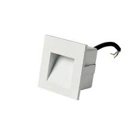

# Step light

<!--
source_file: Step light.pdf
pages: 2
images_extracted: 3
needs_manual_review: False
-->

## Page 1

PRODUCT DATASHEET
Steplight
LED Steplight
AREAS OF APPLICATION
• Safety lighting for stairs
• Pathway and walkway
• Commercial and public spaces
• Lanscape and garden steps
• Cinemas and Theaters
• Residential Interiors
PRODUCT BENEFITS
PRODUCT FEATURES
• Easy installation with fast connection
• Operating Voltage range: 220-240V AC
• Housing Material : Aluminum
• LED Lights consume significantly less energy
compared to traditional lighting sources
• Energy saving up to 60%
TECHNICAL DATA
ELECTRICAL DATA
Nominal Wattage 3w
Nominal Voltage 220-240V AC
Main frequency 50 /60 Hz
PHOTOMETRIC DATA
Luminous 100 Lm/w
Total Luminous 300 Lm
Color temperature 5000K
Other varieties are available upon request

| AREAS OF APPLICATION
• Safety lighting for stairs
• Pathway and walkway
• Commercial and public spaces
• Lanscape and garden steps
• Cinemas and Theaters
• Residential Interiors |
| --- |
| PRODUCT BENEFITS
• Easy installation with fast connection
• LED Lights consume significantly less energy
compared to traditional lighting sources
• Energy saving up to 60% |

| PRODUCT FEATURES
• Operating Voltage range: 220-240V AC
• Housing Material : Aluminum |  |
| --- | --- |

|  | Nominal Wattage |  |  | 3w |  |
| --- | --- | --- | --- | --- | --- |

|  | Main frequency |  |  | 50 /60 Hz |  |
| --- | --- | --- | --- | --- | --- |
|  | PHOTOMETRIC DATA |  |  |  |  |
|  | Luminous |  |  | 100 Lm/w |  |

|  | Color temperature |  |  | 5000K |  |
| --- | --- | --- | --- | --- | --- |

## Page 2

PRODUCT DATASHEET
LED Steplight
COLORS & MATERIALS
Body Color White
Body Material Aluminum
LIFESPAN
Lifespan 50,000
Warranty 3
PROTECTION
Electrical protection IP 65
MOUNTING
Mounting Type Recessed
Mounting Location Wall
Other varieties are available upon request

|  | COLORS & MATERIALS |  |  |
| --- | --- | --- | --- |
|  | Body Color | White |  |

|  | LIFESPAN |  |  |
| --- | --- | --- | --- |
|  | Lifespan | 50,000 |  |

|  | PROTECTION |  |  |  |
| --- | --- | --- | --- | --- |
|  | Electrical protection |  | IP 65 |  |
|  | MOUNTING |  |  |  |
|  | Mounting Type |  | Recessed |  |

