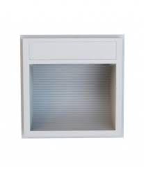

# Step light 5 5 5w datasheet

<!--
source_file: Step light 5 5 5w datasheet.pdf
pages: 2
images_extracted: 3
needs_manual_review: False
-->

## Page 1

PRODUCT DATASHEET
Steplight
LED Square steplight
AREAS OF APPLICATION
• Resdential
• Hospitals & commercial
• Malls
• Stairs
PRODUCT BENEFITS
PRODUCT FEATURES
• Easy installation with fast connection
• Operating Voltage range: 220V AC
• LED Lights consume significantly less energy
compared to traditional lighting sources
• Energy saving up to 60%
TECHNICAL DATA
ELECTRICAL DATA
Nominal Wattage 5W
Nominal Voltage 220V AC
Main frequency 50 /60 Hz
PHOTOMETRIC DATA
Luminous 100 Lm/w
Total Luminous 500 Lm
Color temperature 3000 K
Other varieties are available upon request

| AREAS OF APPLICATION
• Resdential
• Hospitals & commercial
• Malls
• Stairs |
| --- |
| PRODUCT BENEFITS
• Easy installation with fast connection
• LED Lights consume significantly less energy
compared to traditional lighting sources
• Energy saving up to 60% |

| PRODUCT FEATURES
• Operating Voltage range: 220V AC |  |
| --- | --- |

|  | Nominal Wattage |  |  | 5W |  |
| --- | --- | --- | --- | --- | --- |

|  | Main frequency |  |  | 50 /60 Hz |  |
| --- | --- | --- | --- | --- | --- |
|  | PHOTOMETRIC DATA |  |  |  |  |
|  | Luminous |  |  | 100 Lm/w |  |

|  | Color temperature |  |  | 3000 K |  |
| --- | --- | --- | --- | --- | --- |

## Page 2

PRODUCT DATASHEET
LED Square steplight
COLORS & MATERIALS
Body Color Black body with stainless ring
Dimension 5*5cm
LIFESPAN
Lifespan 20,000
Warranty 2
PROTECTION
Electrical protection IP 65
MOUNTING
Mounting Type Recessed
Mounting Location wall
Other varieties are available upon request

|  | COLORS & MATERIALS |  |  |
| --- | --- | --- | --- |
|  | Body Color | Black body with stainless ring |  |

|  | LIFESPAN |  |  |
| --- | --- | --- | --- |
|  | Lifespan | 20,000 |  |

|  | PROTECTION |  |  |  |
| --- | --- | --- | --- | --- |
|  | Electrical protection |  | IP 65 |  |
|  | MOUNTING |  |  |  |
|  | Mounting Type |  | Recessed |  |

