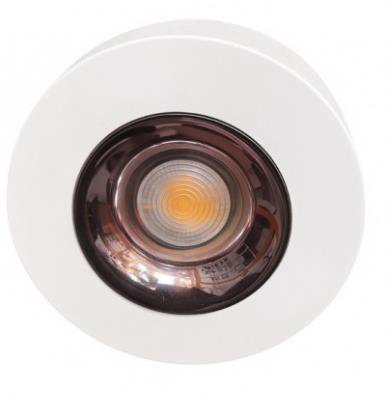

# Surface Downlight

<!--
source_file: Surface Downlight.pdf
pages: 2
images_extracted: 3
needs_manual_review: False
-->

## Page 1

PRODUCT DATASHEET
DOWN LIGHT
LED COB ROUND DOWNLIGHT
AREAS OF APPLICATION
• Offices
• Conference rooms
• Shopping malls
• Hotels and hospitality areas
• Living rooms
• Educational institutions (schools, universities)
• Libraries
PRODUCT BENEFITS
PRODUCT FEATURES
• Easy installation with fast connection
• Operating Voltage range: 220V AC
• Housing Material : Aluminum
• LED Lights consume significantly less energy
compared to traditional lighting sources
• Energy saving up to 60%
TECHNICAL DATA
ELECTRICAL DATA
Nominal Wattage 15 W
Nominal Voltage 220V AC
Main frequency 50 /60 Hz
PHOTOMETRIC DATA
LED Efficacy 100 lm /W
Total Luminous 1500 Lm
Color temperature 6500 K
Other varieties are available upon request

| AREAS OF APPLICATION
• Offices
• Conference rooms
• Shopping malls
• Hotels and hospitality areas
• Living rooms
• Educational institutions (schools, universities)
• Libraries |
| --- |
| PRODUCT BENEFITS
• Easy installation with fast connection
• LED Lights consume significantly less energy
compared to traditional lighting sources
• Energy saving up to 60% |

| PRODUCT FEATURES
• Operating Voltage range: 220V AC
• Housing Material : Aluminum |  |
| --- | --- |

|  | Nominal Wattage |  | 15 W |  |
| --- | --- | --- | --- | --- |

|  | Main frequency |  | 50 /60 Hz |  |
| --- | --- | --- | --- | --- |
|  | PHOTOMETRIC DATA |  |  |  |
|  | LED Efficacy |  | 100 lm /W |  |

|  | Color temperature |  | 6500 K |  |
| --- | --- | --- | --- | --- |

## Page 2

PRODUCT DATASHEET
LED COB ROUND DOWNLIGHT
COLORS & MATERIALS
Body Color White
Body Material Aluminum
LIFESPAN
Lifespan 20,000
Warranty 2
PROTECTION
Electrical protection IP 54
MOUNTING
Mounting Type Surface
Mounting Location Ceiling
Other varieties are available upon request

|  | COLORS & MATERIALS |  |  |
| --- | --- | --- | --- |
|  | Body Color | White |  |

|  | LIFESPAN |  |  |
| --- | --- | --- | --- |
|  | Lifespan | 20,000 |  |

|  | PROTECTION |  |  |  |
| --- | --- | --- | --- | --- |
|  | Electrical protection |  | IP 54 |  |
|  | MOUNTING |  |  |  |
|  | Mounting Type |  | Surface |  |

