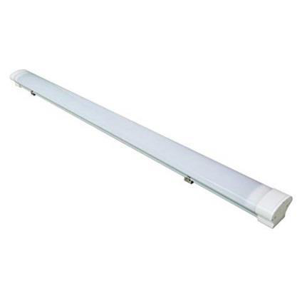

# Triproof

<!--
source_file: Triproof.pdf
pages: 2
images_extracted: 3
needs_manual_review: False
-->

## Page 1

PRODUCT DATASHEET
Triproof 120cm
LED Triproof 120CM
AREAS OF APPLICATION
• Outdoor Pathways and Corridors
• Underground and Covered Parking Lots
• Industrial Facilities and Warehouses
• Tunnels and Underpasses
• Fuel Stations and Service Areas
• Building Exteriors and Perimeters
• Marine and Coastal Installations
PRODUCT BENEFITS
PRODUCT FEATURES
• Easy installation with fast connection
• Housing Material : Polycarbonate
• LED Lights consume significantly less energy
compared to traditional lighting sources
• Energy saving up to 60%
TECHNICAL DATA
ELECTRICAL DATA
Driver On Board
Nominal wattage 36w
Nominal Voltage 220V AC
Main frequency 50 /60 Hz
PHOTOMETRIC DATA
Chip Phillips
LED Efficacy 110 lm /W
Total Luminous 3,960 Lm
Color temperature 4000K
Other varieties are available upon request

|  | Driver | On Board |  |
| --- | --- | --- | --- |

|  | Nominal Voltage | 220V AC |  |
| --- | --- | --- | --- |

|  | PHOTOMETRIC DATA |  |
| --- | --- | --- |

|  | LED Efficacy | 110 lm /W |  |
| --- | --- | --- | --- |

|  | Color temperature | 4000K |  |
| --- | --- | --- | --- |

## Page 2

PRODUCT DATASHEET
LED Triproof 120CM
COLORS & MATERIALS
Body Color White
Body Material Polycarbonate
LIFESPAN
Lifespan 30,000
Warranty 3
PROTECTION
Electrical protection IP 65
MOUNTING
Mounting Type Surface
Mounting Location Ceiling / Wall
Other varieties are available upon request

|  |  | LED Triproof 120CM |  |  |
| --- | --- | --- | --- | --- |
|  | L
COLORS & MATERIALS | L | ED Triproof 120CM |  |
|  |  |  |  |  |
|  | Body Color |  | White |  |

|  | LIFESPAN |  |  |
| --- | --- | --- | --- |
|  | Lifespan | 30,000 |  |

|  | PROTECTION |  |  |  |
| --- | --- | --- | --- | --- |
|  | Electrical protection |  | IP 65 |  |
|  | MOUNTING |  |  |  |
|  | Mounting Type |  | Surface |  |

