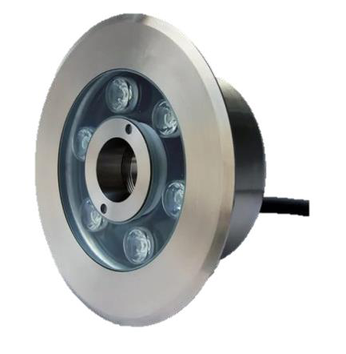

# Underwater with Nozzle 9w Datasheet

<!--
source_file: Underwater with Nozzle 9w Datasheet.pdf
pages: 2
images_extracted: 3
needs_manual_review: False
-->

## Page 1

PRODUCT DATASHEET
Underwater with Nozzle
LED Underwater
AREAS OF APPLICATION
• Decorative water fountains
• Swimming pools
• Aquariums and marine display
• Garden water Features
• Theme Parls and Resorts
• Commercial and architectural
PRODUCT BENEFITS
PRODUCT FEATURES
• Easy installation with fast connection
• Operating Voltage range: 24V DC
• Housing Material : Aluminum
• LED Lights consume significantly less energy
compared to traditional lighting sources
• Energy saving up to 60%
TECHNICAL DATA
ELECTRICAL DATA
Nominal Wattage 9W
Nominal Voltage 24V DC
Main frequency 50 /60 Hz
PHOTOMETRIC DATA
Luminous 100 Lm/w
Total Luminous 900 Lm
Color temperature Warm 3000 K
Other varieties are available upon request

| AREAS OF APPLICATION
• Decorative water fountains
• Swimming pools
• Aquariums and marine display
• Garden water Features
• Theme Parls and Resorts
• Commercial and architectural |
| --- |
| PRODUCT BENEFITS
• Easy installation with fast connection
• LED Lights consume significantly less energy
compared to traditional lighting sources
• Energy saving up to 60% |

| PRODUCT FEATURES
• Operating Voltage range: 24V DC
• Housing Material : Aluminum |  |
| --- | --- |

|  | Nominal Wattage |  |  | 9W |  |
| --- | --- | --- | --- | --- | --- |

|  | Main frequency |  |  | 50 /60 Hz |  |
| --- | --- | --- | --- | --- | --- |
|  | PHOTOMETRIC DATA |  |  |  |  |
|  | Luminous |  |  | 100 Lm/w |  |

|  | Color temperature |  |  | Warm 3000 K |  |
| --- | --- | --- | --- | --- | --- |

## Page 2

PRODUCT DATASHEET
LED underwater with nozzle
COLORS & MATERIALS
Material Aluminum
Dimension 170*76mm
Hole 36mm
LIFESPAN
Lifespan 20,000
Warranty 2
PROTECTION
Electrical protection IP 68
MOUNTING
Mounting Type Surface
Mounting Location Ground
Other varieties are available upon request

|  | COLORS & MATERIALS |  |  |
| --- | --- | --- | --- |
|  | Material | Aluminum |  |

|  | Hole | 36mm |  |
| --- | --- | --- | --- |

|  | LIFESPAN |  |  |
| --- | --- | --- | --- |
|  | Lifespan | 20,000 |  |

|  | PROTECTION |  |  |  |
| --- | --- | --- | --- | --- |
|  | Electrical protection |  | IP 68 |  |
|  | MOUNTING |  |  |  |
|  | Mounting Type |  | Surface |  |

