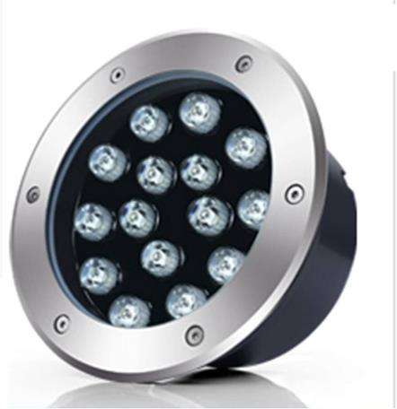

# Uplight High quality

<!--
source_file: Uplight High quality.pdf
pages: 2
images_extracted: 3
needs_manual_review: False
-->

## Page 1

PRODUCT DATASHEET
Uplight
LED Uplight
AREAS OF APPLICATION
• Garden and landscape
• Residential Exterior
• Hospitality and commercial properties
• Parks and public Spaces
PRODUCT BENEFITS
PRODUCT FEATURES
• Easy installation with fast connection
• Operating Voltage range: 220V AC
• LED Lights consume significantly less energy
compared to traditional lighting sources
• Energy saving up to 60%
TECHNICAL DATA
ELECTRICAL DATA
Nominal Wattage 10W
Nominal Voltage 220V AC
Main frequency 50 /60 Hz
PHOTOMETRIC DATA
Chip Philips
Luminous 100 Lm/w
Total Luminous 1,000 Lm
Color temperature 4000 K
Other varieties are available upon request

| AREAS OF APPLICATION
• Garden and landscape
• Residential Exterior
• Hospitality and commercial properties
• Parks and public Spaces |
| --- |
| PRODUCT BENEFITS
• Easy installation with fast connection
• LED Lights consume significantly less energy
compared to traditional lighting sources
• Energy saving up to 60% |

|  | Nominal Wattage |  | 10W |  |
| --- | --- | --- | --- | --- |

|  | Main frequency |  | 50 /60 Hz |  |
| --- | --- | --- | --- | --- |
|  | PHOTOMETRIC DATA |  |  |  |
|  | Chip |  | Philips |  |

|  | Total Luminous |  | 1,000 Lm |  |
| --- | --- | --- | --- | --- |

## Page 2

PRODUCT DATASHEET
LED uplight
COLORS & MATERIALS
Body Color Black body with stainless ring
LIFESPAN
Lifespan 30,000
Warranty 3
PROTECTION
Electrical protection IP 65
MOUNTING
Mounting Type Inground
Mounting Location Ground
Other varieties are available upon request

|  | COLORS & MATERIALS |  |  |
| --- | --- | --- | --- |
|  | Body Color | Black body with stainless ring |  |

|  | LIFESPAN |  |  |
| --- | --- | --- | --- |
|  | Lifespan | 30,000 |  |

|  | PROTECTION |  |  |  |
| --- | --- | --- | --- | --- |
|  | Electrical protection |  | IP 65 |  |
|  | MOUNTING |  |  |  |
|  | Mounting Type |  | Inground |  |

