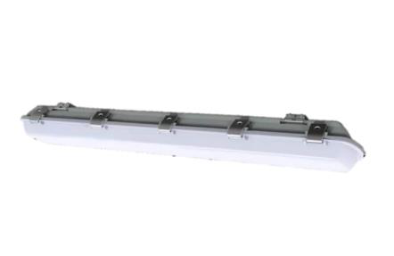
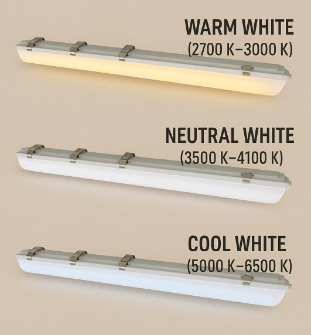
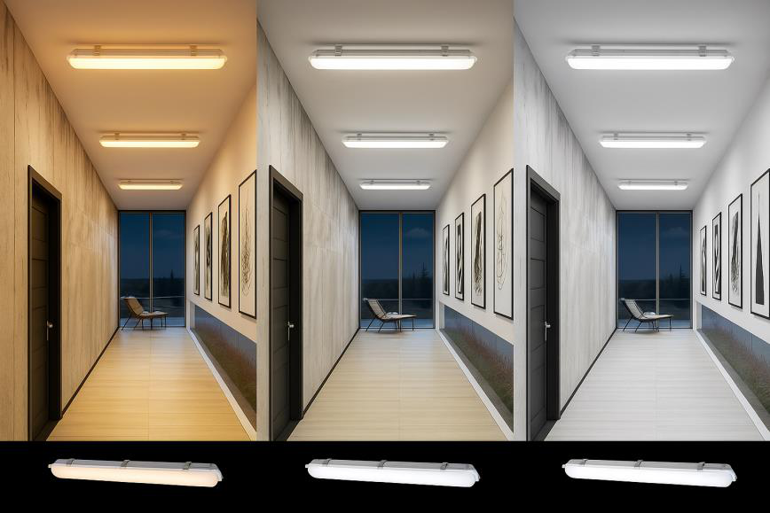

# Weatherproof 120cm 40W Datasheet

<!--
source_file: Weatherproof 120cm 40W Datasheet.pdf
pages: 2
images_extracted: 5
needs_manual_review: False
-->

## Page 1

PRODUCT DATASHEET
Weatherproof 120cm
LED WEATHERPROOF 120CM
AREAS OF APPLICATION
• Outdoor Pathways and Corridors
• Underground and Covered Parking Lots
• Industrial Facilities and Warehouses
• Tunnels and Underpasses
• Fuel Stations and Service Areas
• Building Exteriors and Perimeters
• Marine and Coastal Installations
PRODUCT BENEFITS
PRODUCT FEATURES
• Easy installation with fast connection
• Operating Voltage range: 220-240V AC
• Housing Material : Polycarbonate
• LED Lights consume significantly less energy
compared to traditional lighting sources
• Energy saving up to 60%
TECHNICAL DATA
ELECTRICAL DATA
Driver Philips
Nominal wattage 40w
Nominal Voltage 220-240V AC
Main frequency 50 /60 Hz
PHOTOMETRIC DATA
Chip Phillips
LED Efficacy 120 lm /W
Total Luminous 4,800 Lm
Color temperature 4000 K
Other varieties are available upon request

|  | AREAS OF APPLICATION
• Outdoor Pathways and Corridors
• Underground and Covered Parking Lots
• Industrial Facilities and Warehouses
• Tunnels and Underpasses
• Fuel Stations and Service Areas
• Building Exteriors and Perimeters
• Marine and Coastal Installations |
| --- | --- |
|  |  |
| PRODUCT FEATURES
• Operating Voltage range: 220-240V AC
• Housing Material : Polycarbonate |  |

|  | Driver |  | Philips |  |
| --- | --- | --- | --- | --- |

|  | Nominal Voltage |  | 220-240V AC |  |
| --- | --- | --- | --- | --- |

|  | PHOTOMETRIC DATA |  |  |
| --- | --- | --- | --- |

|  | LED Efficacy |  | 120 lm /W |  |
| --- | --- | --- | --- | --- |

|  | Color temperature |  | 4000 K |  |
| --- | --- | --- | --- | --- |

## Page 2

PRODUCT DATASHEET
LED WEATHERPROOF 120CM
COLORS & MATERIALS
Body Color Grey
Body Material Polycarbonate
LIFESPAN
Lifespan 50,000
Warranty 5
PROTECTION
Electrical protection IP 65
MOUNTING
Mounting Type Surface/Suspended
Mounting Location Ceiling / Wall
Color temperature range
Other varieties are available upon request

|  | COLORS & MATERIALS |  |  |
| --- | --- | --- | --- |
|  | Body Color | Grey |  |

|  | LIFESPAN |  |  |
| --- | --- | --- | --- |
|  | Lifespan | 50,000 |  |

|  | PROTECTION |  |  |  |
| --- | --- | --- | --- | --- |
|  | Electrical protection |  | IP 65 |  |
|  | MOUNTING |  |  |  |
|  | Mounting Type |  | Surface/Suspended |  |

