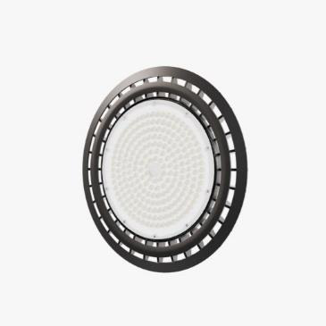
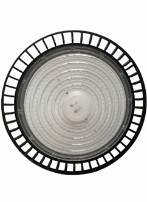

# 150w Highbay Light  datasheet 3Y

<!--
source_file: 150w Highbay Light  datasheet 3Y.pdf
pages: 2
images_extracted: 4
needs_manual_review: False
-->

## Page 1

PRODUCT DATASHEET
HighBay
LED SMD Highbay
AREAS OF APPLICATION
• Factories
PRODUCT FEATURES PRODUCT BENEFITS
• Operating Voltage range: 85-265V AC • Easy installation with fast connection
• Housing Material : Aluminum • LED Lights consume significantly less energy
• Driver Box : A BS compared to traditional lighting sources
• B eamAngle:120° • Energy saving up to 60%
TECHNICAL DATA
ELECTRICAL DATA
Driver SC
Nominal Wattage 150W
Nominal Voltage 85-265V AC
Main frequency 50 /60 Hz
PHOTOMETRIC DATA
Chip Philips 2835
LED Efficacy 130 lm /W
Total Luminous 19,500 Lm
Color temperature 6500K
Other varieties are available upon request

|  | Driver |  | SC |  |
| --- | --- | --- | --- | --- |

|  | Nominal Voltage |  | 85-265V AC |  |
| --- | --- | --- | --- | --- |

|  | PHOTOMETRIC DATA |  |  |  |
| --- | --- | --- | --- | --- |
|  | Chip |  | Philips 2835 |  |
|  | LED Efficacy |  | 130 lm /W |  |

|  | Color temperature |  | 6500K |  |
| --- | --- | --- | --- | --- |

## Page 2

PRODUCT DATASHEET
LED SMD HighBay
COLORS & MATERIALS
Body Color Black
Housing Mater ial Aluminum
LIFESPAN
Lifespan 30,000
Warranty 3
PROTECTION
Ingress Protection IP 65
Electrical Protection OVP-OCP- OTP
MOUNTING
Mounting Type Suspend ed
Mounting Location Ceiling
Other varieties are available upon request

|  | COLORS & MATERIALS |  |  |
| --- | --- | --- | --- |
|  | Body Color | Black |  |

|  | LIFESPAN |  |  |
| --- | --- | --- | --- |
|  | Lifespan | 30,000 |  |

|  | PROTECTION |  |  |  |
| --- | --- | --- | --- | --- |
|  | Ingress Protection |  | IP 65 |  |

|  |  |  |
| --- | --- | --- |
|  | MOUNTING |  |

|  | Mounting Location |  | Ceiling |  |
| --- | --- | --- | --- | --- |

