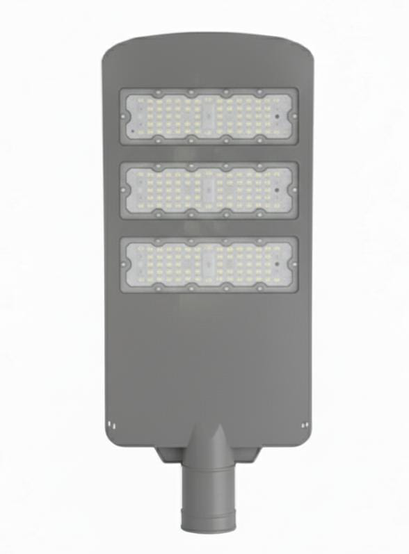

# 1Y 150 w Street Light Datasheet..

<!--
source_file: 1Y 150 w Street Light Datasheet...pdf
pages: 2
images_extracted: 6
needs_manual_review: False
-->

## Page 1

PRODUCT DATASHEET
Street Light
Street Light
10 W
A R E A SOFA PPL ICATION
• Pu plicroad ways and highways
• Pe destrian zones and public spaces
• Ind ustrial and commercial areas
• Tu nnels and underpasses
PRODUCT BENEFITS
PRODUCT FEATURES
• Operating Voltage range: 85-265V A C • Easy installation with fast connection
•Electrical Protection: OVP-O CP-OTP
• LED Lights consume significantly less energy
• Power Factor > 0.97
compared to traditional lighting sources
• Energy saving up to 60%
ELECTRICAL DATA
Driver N ea sae
Nominal Wattage 150 W
Nominal Voltage 85-265 V AC
Main frequency 50 /60 Hz
PHOTOMETRIC DATA
Chip Phillips
LED Efficacy 130 lm /W
Total Luminous 1 9,500L m
Color temperature 6000 K
Color Rendering index Ra >80
Other varieties are available upon request

| PRODUCT FEATURES
• Operating Voltage range: 85-265V A C
•Electrical Protection: OVP-O CP-OTP
• Power Factor > 0.97 |  |
| --- | --- |

|  | Driver |  | N ea sae |  |
| --- | --- | --- | --- | --- |

|  | Nominal Voltage |  | 85-265 V AC |  |
| --- | --- | --- | --- | --- |

|  | PHOTOMETRIC DATA |  |  |
| --- | --- | --- | --- |

|  | LED Efficacy |  | 130 lm /W |  |
| --- | --- | --- | --- | --- |

|  | Color temperature |  | 6000 K |  |
| --- | --- | --- | --- | --- |

## Page 2

PRODUCT DATASHEET
TECHNICAL DATA
COLORS & MATERIALS
Body Color Grey
Body Material Aluminum
LIFESPAN
Lifespan 10,000
Warranty 1
PROTECTION
Ingress protection IP 65
Impact protection IK 08
MOUNTING
Mounting Location Poles
Other varieties are available upon request

|  | COLORS & MATERIALS |  |  |  |  |
| --- | --- | --- | --- | --- | --- |
|  |  |  |  |  |  |
|  | Body Color |  |  | Grey |  |

|  | LIFESPAN |  |  |  |
| --- | --- | --- | --- | --- |
|  | Lifespan |  | 10,000 |  |

|  | PROTECTION |  |  |  |
| --- | --- | --- | --- | --- |
|  | Ingress protection |  | IP 65 |  |

|  | MOUNTING |  |
| --- | --- | --- |

