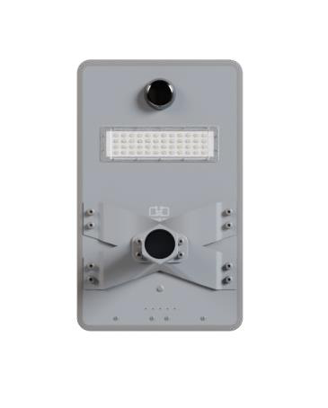
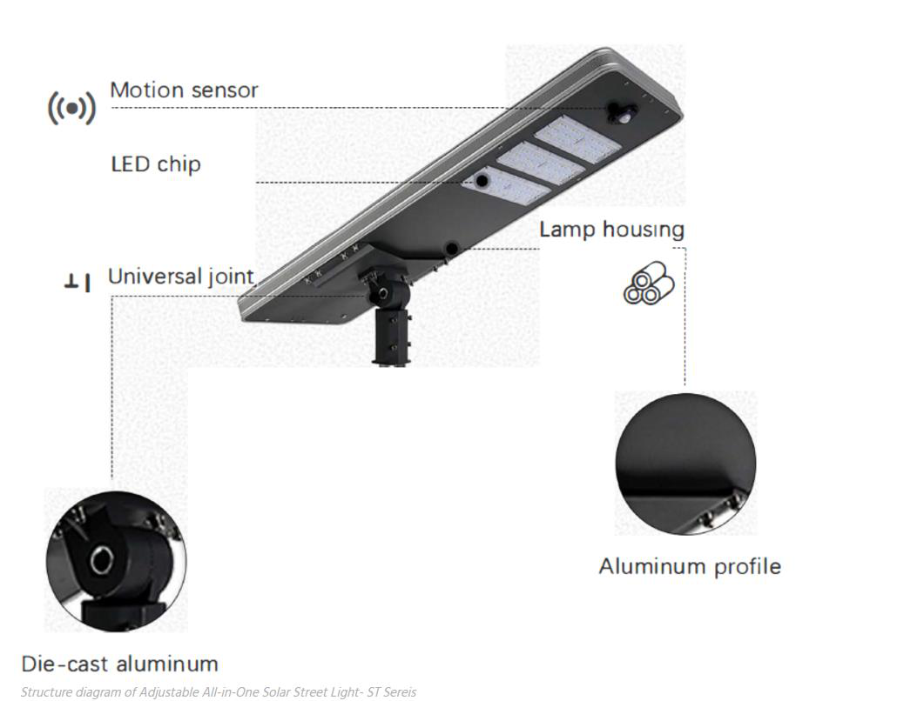
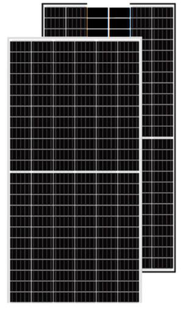
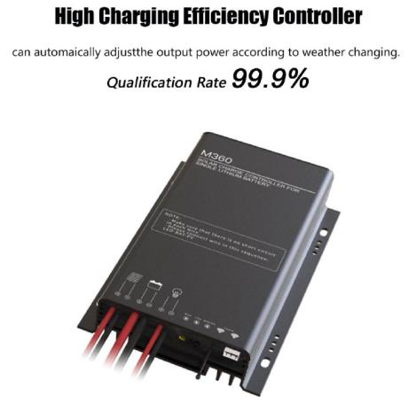
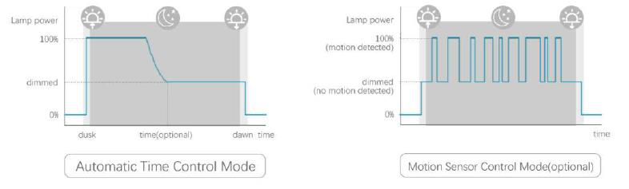

# 50w solar street datasheet..

<!--
source_file: 50w solar street datasheet...pdf
pages: 5
images_extracted: 10
needs_manual_review: False
-->

## Page 1

PRODUCT DATASHEET
Solar Street
LED Solar street
AREAS OF APPLICATION
• Compounds
• Highways
• Streets
PRODUCT BENEFITS
• Easy installation with fast connection
• LED Lights consume significantly less energy
compared to traditional lighting sources
• Energy saving up to 60%
TECHNICAL DATA
ELECTRICAL DATA
Nominal Wattage 50 W
PHOTOMETRIC DATA
LED Efficacy 160 lm /W
Total Luminous 8000Lm
Color temperature 3000 K
Other varieties are available upon request

|  | Nominal Wattage |  | 50 W |  |
| --- | --- | --- | --- | --- |
|  | PHOTOMETRIC DATA |  |  |  |
|  | LED Efficacy |  | 160 lm /W |  |

|  | Color temperature |  | 3000 K |  |
| --- | --- | --- | --- | --- |

## Page 2

PRODUCT DATASHEET
LED Solar street
COLORS & MATERIALS
Body Material Aluminum
Solar Panel Data
Solar Panel Monocrystalline
Solar Panel Power 18v- 85watt
Battery Data
Battery Type Lithium( Life PO4)
Battery Power 12.8v-30AH
Charging Time 4-8H
Discharging Time 8-12H
Lifespan
LifeSpan 50,000 Hours
warranty 3 years
Other varieties are available upon request

|  | COLORS & MATERIALS |  |  |
| --- | --- | --- | --- |
|  | Body Material | Aluminum |  |

|  | Solar Panel Data |  |  |
| --- | --- | --- | --- |
|  | Solar Panel | Monocrystalline |  |

|  | Battery Data |  |  |  |
| --- | --- | --- | --- | --- |
|  | Battery Type |  | Lithium( Life PO4) |  |

|  | Charging Time |  | 4-8H |  |
| --- | --- | --- | --- | --- |

|  | Lifespan |  |  |  |
| --- | --- | --- | --- | --- |
|  | LifeSpan |  | 50,000 Hours |  |

## Page 3

Die-Cast Aluminum:
Days of rust-catching iron solar street lights are gone. Now, it’s time to switch to a metal that stands strong
in every weather. Thus, we use Die-cast aluminum alloy in our solar LEDs for enhanced life and durability.
Unlike iron housing, the housing made of die-cast aluminum alloy doesn’t catch rust and stays
unvenerable even during rainy/snowy days. They are lightweight, easy to ship and install, and sturdy
enough to meet your needs.
IP67 Waterproof Certification:
No doubt die-hard aluminum alloy doesn’t catch rust even in the rains. However, an all-in-one solar street
light is an electrical appliance with various electrical components. These components are prone to develop
technical problems when they come in contact with water, dust, and snow.Thus, our solar street light
features IP67 to stand strong in every weather.
Other varieties are available upon request

## Page 4

Monocrystalline Solar Panel:
The solar panel is the lifeblood of every solar street light as a primary source of
energy. we understand the importance of solar panels and use monocrystalline
panels. These panels are highly efficient and offer an incredible conversion rate of
up to 20%.
Unlike Polycrystalline panels, they have single-crystal black cells that absorb the
highest solar energy. The best thing is these panels have twice the lifespan when
compared to polycrystalline and can serve up to 30 years.
We connect the LED lights with the panel using an anti-oxidation waterproof
connector. Interestingly, this connector is an excellent conductor and prevents solar light from
elements like Zinc and rust.
Control Modes:
Designed the ST Series of integrated solar LED lights as remotely controllable
appliances. You get a dedicated remote controller with the light that allows you
to adjust brightness, light mode, and more.
In ST Series, we offer three different control modes including light, time, and
microwave for easy customization. The light (L) mode enables you to time light
dispersion according to the time.
On the other hand, Microwave (M) mode works with our microwave sensor
with a sensing range of 8-15m. It detects the presence of people and cars and
adjusts the light accordingly. The sensor usually reduces the light dispersion when no one is there under
8-15m.
Other varieties are available upon request

## Page 5

LiFePo4 A-Class Lithium Battery:
Most manufacturers use Li-ion Lithium batteries to serve the purpose of a solar street light.
However, those lights may be set on fire on hot summer days and have a lifespan of only 3 years.
the industrial standards using A-Class LiFePO4 lithium battery in the solar parking lights.
Other varieties are available upon request

