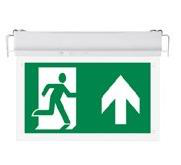

# Item EX-W-EXIT Sign 3W Datasheet

<!--
source_file: Item EX-W-EXIT Sign 3W Datasheet.pdf
pages: 2
images_extracted: 3
needs_manual_review: False
-->

## Page 1

PRODUCT DATASHEET
EXIT Sign Single Face
AREAS OF APPLICATION
• Interior Architectural Lighting
• Offices and Workspaces.
• Retail Stores and Showrooms
• Hospitality and Hotels
• Residential Spaces.
• Museums and Galleries
• Restaurants and Cafés
• Theaters and Cinemas
• P ROUDseUdC fTo Br EaNisEleF IlTigSh ting, floor guidance, and decorative
PRODUCT FEATURES
trims.
• Operating Voltage range: 220V AC •
• Easy installation with fast connection
• Housing Material : ABS
• LED Lights consume significantly less energy
compared to traditional lighting sources
• Energy saving up to 60%
ELECTRICAL DATA
Nominal Wattage 3W
Nominal Voltage 220V AC
Main frequency 50 /60 Hz
Power Factor > 0.8
PHOTOMETRIC DATA
LED Efficacy 100 lm /W
Total Luminous 300 Lm
Light color Green
Other varieties are available upon request

|  | AREAS OF APPLICATION
• Interior Architectural Lighting
• Offices and Workspaces.
• Retail Stores and Showrooms
• Hospitality and Hotels
• Residential Spaces.
• Museums and Galleries
• Restaurants and Cafés
• Theaters and Cinemas |
| --- | --- |
|  |  |
| PRODUCT FEATURES
• Operating Voltage range: 220V AC
• Housing Material : ABS |  |

|  | Nominal Wattage |  | 3W |  |
| --- | --- | --- | --- | --- |

|  | Main frequency |  | 50 /60 Hz |  |
| --- | --- | --- | --- | --- |

|  | PHOTOMETRIC DATA |  |  |
| --- | --- | --- | --- |

|  | Total Luminous |  | 300 Lm |  |
| --- | --- | --- | --- | --- |

## Page 2

PRODUCT DATASHEET
COLORS & MATERIALS
Body Color Green
Body Material ABS
Battery
Life span 20,000 (3 hours backup)
Warranty 2 years
0)
LIFESPAN
Lifespan 20,000
Warranty 2
PROTECTION
Electrical protection IP 44
MOUNTING
Mounting Type Surface
Mounting Location Wall
Other varieties are available upon request

|  | COLORS & MATERIALS |  |  |
| --- | --- | --- | --- |
|  | Body Color | Green |  |

|  | Battery |  |  |
| --- | --- | --- | --- |

|  | Warranty | 2 years
0) |  |
| --- | --- | --- | --- |
|  | LIFESPAN |  |  |
|  | Lifespan | 20,000 |  |

|  | PROTECTION |  |  |
| --- | --- | --- | --- |
|  | Electrical protection | IP 44 |  |
|  | MOUNTING |  |  |
|  | Mounting Type | Surface |  |

