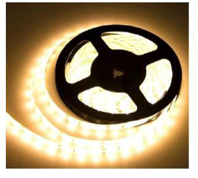

# Item LED-1-LED Strip  Datasheet

<!--
source_file: Item LED-1-LED Strip  Datasheet.pdf
pages: 2
images_extracted: 3
needs_manual_review: False
-->

## Page 1

PRODUCT DATASHEET
LED Strip
AREAS OF APPLICATION
• Interior Architectural Lighting
• Offices and Workspaces.
• Retail Stores and Showrooms
• Hospitality and Hotels
• Residential Spaces.
• Museums and Galleries
• Restaurants and Cafés
• Theaters and Cinemas
• P ROUDseUdC fTo Br EaNisEleF IlTigSh ting, floor guidance, and decorative
PRODUCT FEATURES
trims.
• Operating Voltage range: DC 12V •
• Easy installation with fast connection
• Length: 5m/Roll • LED Lights consume significantly less energy
compared to traditional lighting sources
• Energy saving up to 60%
ELECTRICAL DATA
Nominal Wattage 5 W/m
Nominal Voltage DC 12V
PHOTOMETRIC DATA
LED Efficacy 100 lm /W
Chip OSRAM PFP
Total Luminous 500L m/m
Color temperature 4000 K
Color Rendering index Ra >80
Other varieties are available upon request

|  | AREAS OF APPLICATION
• Interior Architectural Lighting
• Offices and Workspaces.
• Retail Stores and Showrooms
• Hospitality and Hotels
• Residential Spaces.
• Museums and Galleries
• Restaurants and Cafés
• Theaters and Cinemas |
| --- | --- |
|  |  |
| PRODUCT FEATURES
• Operating Voltage range: DC 12V
• Length: 5m/Roll |  |

|  | Nominal Wattage |  | 5 W/m |  |
| --- | --- | --- | --- | --- |

|  |  |  |  |  |
| --- | --- | --- | --- | --- |
|  | PHOTOMETRIC DATA |  |  |  |
|  | LED Efficacy |  | 100 lm /W |  |

|  | Total Luminous |  | 500L m/m |  |
| --- | --- | --- | --- | --- |

|  | Color Rendering index |  | Ra >80 |  |
| --- | --- | --- | --- | --- |

## Page 2

PRODUCT DATASHEET
LIFESPAN
Lifespan 20,000
Warranty 2
PROTECTION
Electrical protection IP 20
MOUNTING
Mounting Type Surface / recessed
Mounting Location Celling /Wall
Other varieties are available upon request

|  | LIFESPAN |  |  |  |
| --- | --- | --- | --- | --- |
|  | Lifespan |  | 20,000 |  |

|  | PROTECTION |  |  |  |
| --- | --- | --- | --- | --- |
|  | Electrical protection |  | IP 20 |  |
|  | MOUNTING |  |  |  |
|  | Mounting Type |  | Surface / recessed |  |

