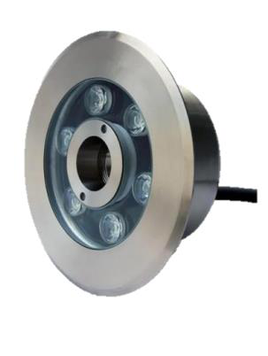

# Item UW-underwater  Datasheet

<!--
source_file: Item UW-underwater  Datasheet.pdf
pages: 2
images_extracted: 3
needs_manual_review: False
-->

## Page 1

PRODUCT DATASHEET
Underwater
AREAS OF APPLICATION
• Swimming pools
• Resorts & hotels
• Bridges with water elements
• Theme parks
• Public plazas & landscapes
• Fountains & water features
PRODUCT BENEFITS
PRODUCT FEATURES
• Operating Voltage range: DC 24v
• Easy installation with fast connection
• Di mension: 170*76mm • LED Lights consume significantly less energy
• Hole: 36mm
compared to traditional lighting sources
• Energy saving up to 60%
ELECTRICAL DATA
Nominal Wattage 9 W
Nominal Voltage DC 24v
PHOTOMETRIC DATA
LED Efficacy 100 lm /W
Total Luminous 900 Lm
Color temperature 3000 K
Color Rendering index Ra >80
Other varieties are available upon request

|  | AREAS OF APPLICATION
• Swimming pools
• Resorts & hotels
• Bridges with water elements
• Theme parks
• Public plazas & landscapes
• Fountains & water features
PRODUCT BENEFITS |  |
| --- | --- | --- |
|  |  | PRODUCT BENEFITS |
| PRODUCT FEATURES
• Operating Voltage range: DC 24v
• Di mension: 170*76mm
• Hole: 36mm |  |  |
|  |  |  |

|  | Nominal Wattage |  | 9 W |  |
| --- | --- | --- | --- | --- |

|  | PHOTOMETRIC DATA |  |  |
| --- | --- | --- | --- |

|  | Total Luminous |  | 900 Lm |  |
| --- | --- | --- | --- | --- |

|  | Color Rendering index |  | Ra >80 |  |
| --- | --- | --- | --- | --- |

## Page 2

PRODUCT DATASHEET
LIFESPAN
Lifespan 20,000
Warranty 2
PROTECTION
Electrical protection IP68
MOUNTING
Mounting Type recessed
Mounting Location In ground
Other varieties are available upon request

|  | LIFESPAN |  |  |
| --- | --- | --- | --- |
|  | Lifespan | 20,000 |  |

|  | PROTECTION |  |  |
| --- | --- | --- | --- |
|  | Electrical protection | IP68 |  |
|  | MOUNTING |  |  |
|  | Mounting Type | recessed |  |

