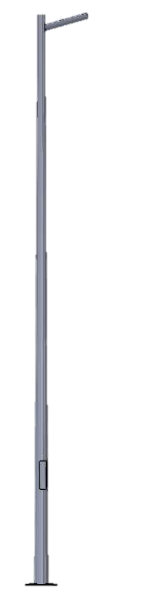
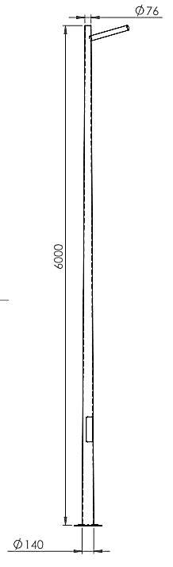
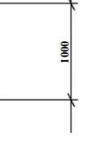
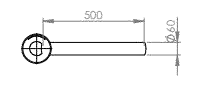
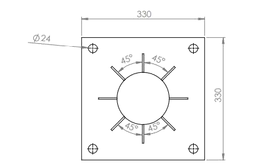
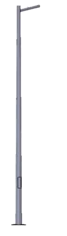

# Pole Single arm 6m datasheet

<!--
source_file: Pole Single arm 6m datasheet.pdf
pages: 2
images_extracted: 10
needs_manual_review: False
-->

## Page 1

Pole Single Arm
Modern Single-armed light column that is an elegant
lighting solutions that subtly complements its surroundings,
TOP mm
seamlessly blends in outdoor architecture and landscape
MM
concepts
Application
Public areas and Landscape lighting.
4 mm . THK Single Arm
Material : Steel Extrusion body
Arm Diameter : ø 60 mm Cross section: Circular
Arm Length : 500 mm
Hot Galvanized
Arm Details
4 x ø24mm BOLTS Diameter
Bolt Length : 700 mm
DOOR OPENING
4 x ø24mm BOLTS Diameter
Bolt Length : 700 mm
1.5 mm . THK
8 mm . THK
TemPlateDetails
BOTTOM mm
Base Plate Details
Pole Details
Page 1 of 2

## Page 2

Pole Single arm
Pole Single arm
Main Data
Material Steel extrusion body
Height 6000 mm
Diameter 140/76 mm
T h i c k n e s s 4 mm
Arm length 500 mm
Arm Diameter ø 60 mm
Number of Plates 2
Bolt Length 700 mm
Number of bolts 4
Technical Specifications
• Single Arm
• Body Material: Steel extrusion body (low Carbon)
• Height: 6000 mm
• Thickness: 4 mm
• Diameter: 140/76 mm
• Cross Section shape: Circular
• Base Plate Dimensions: 330 x 330 x 8 mm
• TemPlate Dimensions: 330 x 330 x 1.5 mm
• Arm Length : 500mm
• Bolt Length: 7 00 m m
• Bolt Material : Stainles s Steel
• Hot Galvanize d (zinc la yer thic knessrange: 80micro)
Page2of2

|  | Pole Single arm |  |
| --- | --- | --- |

| Material | Steel extrusion body |
| --- | --- |
| Height | 6000 mm |
| Diameter | 140/76 mm |
| T h i c k n e s s | 4 mm |
| Arm length | 500 mm |
| Arm Diameter | ø 60 mm |
| Number of Plates | 2 |
| Bolt Length | 700 mm |
| Number of bolts | 4 |

