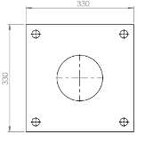

# Pole Single arm 8m datasheet..

<!--
source_file: Pole Single arm 8m datasheet...pdf
pages: 2
images_extracted: 13
needs_manual_review: False
-->

## Page 1

Pole Single Arm
Modern Single-armed light column that is an elegant
lighting solutions that subtly complements its surroundings,
TOP mm
seamlessly blends in outdoor architecture and landscape
MM
concepts
Application
Public areas and Landscape lighting.
3 mm . THK Single Arm
Material : Steel Extrusion body
Arm Diameter : ø 60 mm Cross section: Circular
Arm Length : 500 mm
Hot Galvanized
Arm Details
4 x ø18mm BOLTS Diameter
Bolt Length : 750 mm
DOOR OPENING
4 x ø18mm BOLTS Diameter
Bolt Length : 750 mm
2m m . THK
1 2mm .
THK
TemPlateDetails
Base Plate Details
PoleDetails
Page 1 of 2
0008
BottomФ160mm
.

## Page 2

Pole Single arm
Pole Single arm
Main Data
Material Steel extrusion body
Height 8000 mm
Diameter 160/76 mm
T h i c k n e s s 3 mm
Arm length 500 mm
Arm Diameter ø 60 mm
Number of Plates 2
Bolt Length 750 mm
Number of bolts 4
Technical Specifications
• Single Arm
• Body Material: Steel extrusion body (low Carbon)
• Height: 8000 mm
• Thickness: 3 mm
• Diameter: 160/76 mm
• Cross Section shape: Circular
• Base Plate Dimensions: 330 x 330 x 12 mm
• TemPlate Dimensions: 330 x 330 x 2 m m
• Arm Length : 500mm
• Bolt Length: 7 50 m m
• HotG alvaniz ed (zincl ayer)
Page2of2

|  | Pole Single arm |  |
| --- | --- | --- |

| Material | Steel extrusion body |
| --- | --- |
| Height | 8000 mm |
| Diameter | 160/76 mm |
| T h i c k n e s s | 3 mm |
| Arm length | 500 mm |
| Arm Diameter | ø 60 mm |
| Number of Plates | 2 |
| Bolt Length | 750 mm |
| Number of bolts | 4 |

