# SC- 500 w - Arena Sport Light - Datasheet-1 (1)

<!--
source_file: SC- 500 w - Arena Sport Light - Datasheet-1 (1).pdf
pages: 21
images_extracted: 59
needs_manual_review: True
-->

## Page 1

Arena Sport-500W.
DATASHEET
ABSTRACT
Short circuit arena sport light for industrial use.
High performance of 98% of led efficiency within more
than 30,000 operating hours.
Arena sport Light is protected against the electricity
instability with over voltage, current, and temperature
protection.
Arena Sport Light consists of Ledvance chips and
Philips drivers with warranty of 3 years.
SHORT CIRCUIT
ARENA SPORT
LIGHT
High lux, High performance, High protection with long life-
span for industrial use.

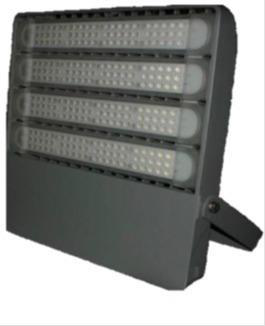

## Page 2

Arena Sport-500W. D ATASHEET
Table of Contents
1 General product information
1.1 General Specifications
1.2 Environmental Compliance
1.3 Compatibilities
1.4 Product Main Parts
2 Body and Heat-Sink
2.1 Heat-Sink Operation Theory
2.2 Body and Heat-Sink Description
3 LED Chips
3.1 Chip Performance Characteristics
3.2 Electrical and Thermal Characteristics
3.3 Absolute Maximum Ratings
3.4 Characteristics Curves
3.4.1 Light Output Characteristics
3.4.2 Forward Current Characteristics
3.4.3 Polar Curve
4 Driver
4.1 General Description
4.2 Features
4.3 Protections
4.4 Module Specification
4.4.1 AC Input Specification
4.4.2 DC Output Characteristics
4.4.3 Protection Specifications
4.4.4 Mechanical Specification

| Arena Sport-500W. D ATASHEET
Table of Contents
1 General product information
1.1 General Specifications
1.2 Environmental Compliance
1.3 Compatibilities
1.4 Product Main Parts
2 Body and Heat-Sink
2.1 Heat-Sink Operation Theory
2.2 Body and Heat-Sink Description
3 LED Chips
3.1 Chip Performance Characteristics
3.2 Electrical and Thermal Characteristics
3.3 Absolute Maximum Ratings
3.4 Characteristics Curves
3.4.1 Light Output Characteristics
3.4.2 Forward Current Characteristics
3.4.3 Polar Curve
4 Driver
4.1 General Description
4.2 Features
4.3 Protections
4.4 Module Specification
4.4.1 AC Input Specification
4.4.2 DC Output Characteristics
4.4.3 Protection Specifications
4.4.4 Mechanical Specification |  |
| --- | --- |
|  |  |

## Page 3

Arena Sport-500W. D ATASHEET
1. Product General Information
1.1 General Specifications:
Table1: Product General Specifications
Item Specification Unit
LED Chip LEDVANCE
Driver External Philips
LED efficacy 145 Lm / W
1
N.O.Modules
N.O.Drivers 3
Wattage 500 W
Total Luminous 72,500 Lm
Beam angle 30 Degree
Color temperature 6500 K
CRI > 90
Power factor > 0.95
Input voltage AC~100-277 V
Frequency 50-60 Hz
Operating Temperature -40 To 85 C
Humidity Up to 90 %
IP 65
Driver Protection OV, OC & OT
Life time 30,000 Hour
Warranty 3 Year

| Item | Specification | Unit |
| --- | --- | --- |
| LED Chip | LEDVANCE |  |
| Driver | External Philips |  |
|  |  |  |
| LED efficacy | 145 | Lm / W |
| N.O.Modules | 1 |  |
|  |  |  |
|  |  |  |
| N.O.Drivers | 3 |  |
| Wattage | 500 | W |
|  |  |  |
| Total Luminous | 72,500 | Lm |
| Beam angle | 30 | Degree |
|  |  |  |
| Color temperature | 6500 | K |
| CRI | > 90 |  |
|  |  |  |
|  |  |  |
| Power factor | > 0.95 |  |
| Input voltage | AC~100-277 | V |
|  |  |  |
| Frequency | 50-60 | Hz |
| Operating Temperature | -40 To 85 | C |
|  |  |  |
| Humidity | Up to 90 % |  |
| IP | 65 |  |
|  |  |  |
|  |  |  |
| Driver Protection | OV, OC & OT |  |
| Life time | 30,000 | Hour |
|  |  |  |
| Warranty | 3 | Year |

## Page 4

Arena Sport-500W. D ATASHEET
1.2 Environmental Compliance:
Short Circuit automation is committed to providing environmentally friendly products to the solid-state lighting market. Arena Sport
Light LED is compliant to the general environmental duty (GED). Short Circuit automation will not intentionally add the following
restricted material s to its products : lead , mercury , cadmium , hexavalent chromium , polybrominated biphenyls (PBB ) or
polybrominated diphenyl ethers (PBDE).
1.3 Compatibilities
1.4 Product Main Parts:
Arena Sport Light LED is mainly consisted of three parts described as following:
Body and heat sink which is made of Aluminum alloy to dissipate the internal temperature of Chips and Drivers
Ledvance LED Chips with efficiency of 145Lm/W.
Philips Driver which is responsible for supplying the chip with required voltage and current. Also, the driver is protected
against over voltage and over current occurrence.
2. Body and Heat-Sink
2.1 Heat-Sink Operation Theory
Due to electronic circuits nature, there is over internal heat generated during the operation period. That heat needs to be
dissipated to protect driver components from being damaged.
According to Heat Transfer Theory, materials with high thermal conductivity are used to transfer heat from the hot region to the
cold one, space in our case, so a heat-sink made from Aluminum alloy is a suitable choice for this mission.

|  |  |
| --- | --- |

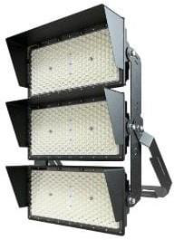

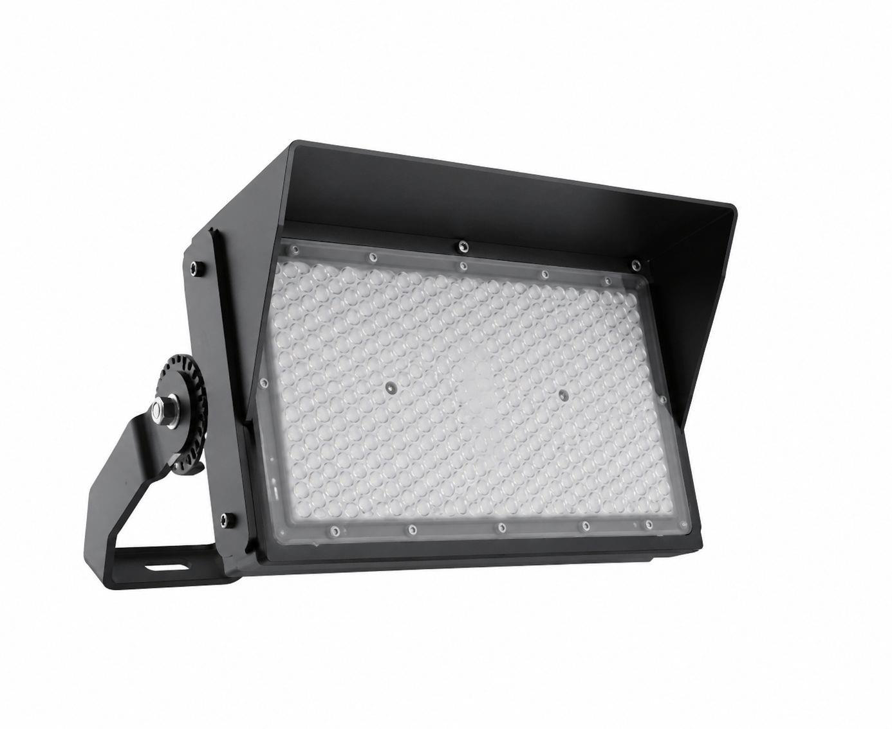

## Page 5

Arena Sport-500W. D ATASHEET
2.2 Body and Heat-Sink Description:
Table2: Body and Heat-Sink Description
Item Description
Body Anti-corrosion aluminum alloy heat sink (electrostatic painted)
Aluminum Purity 96-98 %
Number Of Modules 1
Dimensions W 51.5 * H 37.2 cm
Lenses UV Poly-carbonate heat resistant lenses
Beam Angle 30°
Gasket silicone rubber insulation
Glands Waterproof cable glands (silicone insulated)
IP 65
Wattage 500 W
Weight 15 kg
3. LED Chips
3.1 Chip Performance Characteristics
Product Nominal CCT Minimum CRI Typical Luminous Efficacy (lm/W) Luminous Flux (lm)
Minimum Typical
3030 2D 6500K 90 145 Lm/ W 116 130

| Item | Description |
| --- | --- |
| Body | Anti-corrosion aluminum alloy heat sink (electrostatic painted) |
| Aluminum Purity | 96-98 % |
|  |  |
| Number Of Modules | 1 |
| Dimensions | W 51.5 * H 37.2 cm |
| Lenses | UV Poly-carbonate heat resistant lenses |
| Beam Angle | 30° |
|  |  |
| Gasket | silicone rubber insulation |
| Glands | Waterproof cable glands (silicone insulated) |
|  |  |
| IP | 65 |
| Wattage | 500 W |
|  |  |
| Weight | 15 kg |

| Product | Nominal CCT | Minimum CRI | Typical Luminous Efficacy (lm/W) | Luminous Flux (lm) |  |
| --- | --- | --- | --- | --- | --- |
|  |  |  |  | Minimum | Typical |
| 3030 2D | 6500K | 90 | 145 Lm/ W | 116 | 130 |

## Page 6

Xitanium
LED driver
Datasheet
Xitanium LITE Prog LED drivers Independent
Xi LP 200W 0.5-1.5A S1 WL I195
9290 028 79480
Philips Xitanium Lite Programmable LED drivers are value engineered to deliver a carefully selected feature set and high-end performance,
making it a preferred choice for many outdoor applications. The portfolio offers high flexibility with a customizable operating window,
enabling differentiation in LED lighting designs via system tuning and being prepared for LED efficacy upgrades.
In this product family Philips introduces new drivers in a stretched form factor with a balanced feature set, which offer high value for both
OEM customers and end-users. The products can replace the existing programmable outdoor LED drivers and will bring significant
improvement in programming, assembly into a luminaire and electrical performance. One of the key features is SimpleSet®, an easy and fast
way to configure the driver without the need to power the driver.
Benefits Features Application
•Ultimate robustness, offering peace of •SimpleSet®, wireless configuration interface •Residential areas
mind and lower maintenance costs • H igh surge protection • R oad and street lighting
•Long lifetime and high survival rate • L ong lifetime and robust protection against moisture, • A rea and flood lighting
•Energy savings through high efficiency vibration and temperature • T unnel lighting
•Balanced configurable feature set •Configurable operating windows(AOC) • H igh-bay lighting
covering the most common •External control interface (1-10V) available
applications •Digital Configuration Interface (DCI) via MultiOne
•Superior thermal management Interface
•Consistent waterproof performance •Autonomous or Fixed time based (FTBD) dimming via
through the lifecycle integrated 5-step DynaDimmer
•Easy to design-in, configure and install •Programmable Constant Light Output (CLO)
for Class I applications •Integrated Driver Temperature protection
May 2021

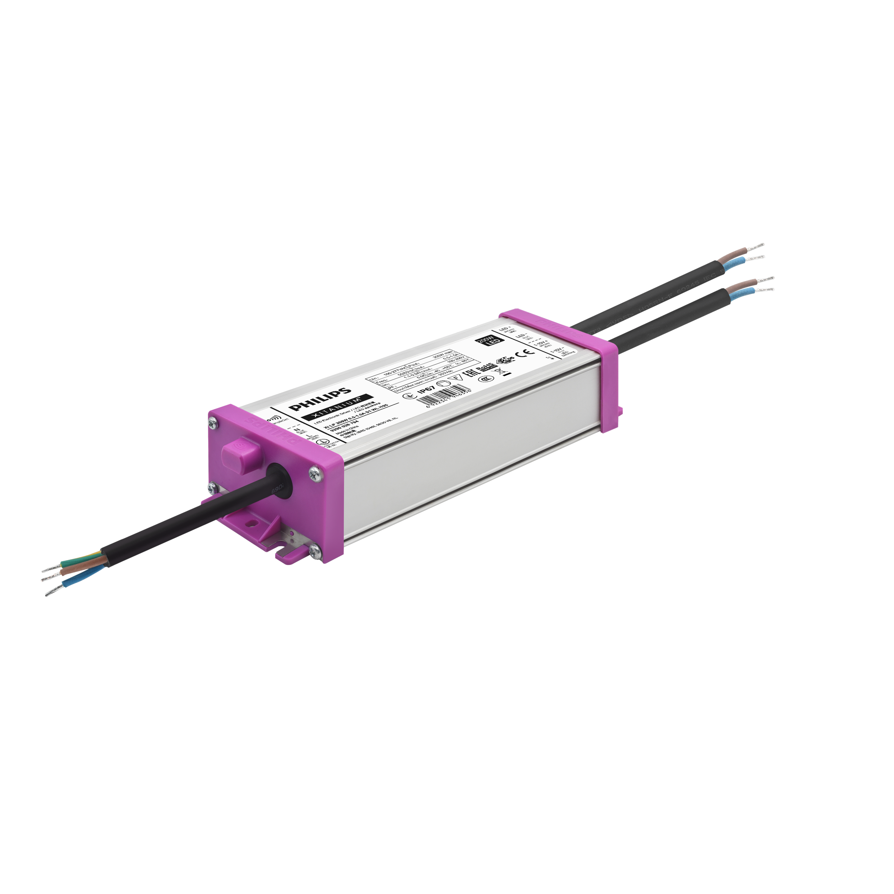

## Page 7

Electrical input data
Specification item Value Unit Condition
Rated input voltage range 202...254 Vac Performance range
Rated input voltage 230 Vac
Rated input frequency range 47...63 Hz Performance range
Rated input current 0.96 A @ rated output power @ rated input voltage
Max. input current 1.12 A @ rated output power @ minimum performance input voltage
Rated input power 224 W @ rated output power @ rated input voltage
Power factor 0.95 @ rated output power @ rated input voltage
Total harmonic distortion 10 % @ rated output power @ rated input voltage
Efficiency 92 % @ rated output power @ rated input voltage @ max. Uout
Input voltage AC range 85...305 Vac Operational range
Input frequency AC range 45...66 Hz Operational range
Isolation input to output Basic
Electrical output data
Specification item Value Unit Condition
Regulation method Constant Current
Output voltage 100...200 Vdc
Output voltage max. 300 V Maximum voltage at open load
Output current 0.5...1.5 A
Output current min programmable 500 mA
Output current min dimming 105 mA
Output current tolerance ± 5 %
Output current ripple LF ≤ 4 % Ripple = peak / average@ ≤3KHz
Output current ripple HF ≤ 15 %
Output PstLM ≤ 0.12 In entire operating window
Output SVM ≤ 0.07 In entire operating window
Output power (cid:400)(cid:399)...(cid:401)00 W
Electrical data controls input
Specification item Value Unit Condition
Control method 1-10V Default: 1-10V. Optional: reversed 1-9V, reversed 0-5V
Dimming range 10...100 % Default range
Isolation controls input to output Basic acc. IEC61347-1
2 / 8 Xi LP 200W 0.5-1.5A S1 WL I195 May 2021

| 202...254 | Vac |
| --- | --- |
| 230 | Vac |
| 47...63 | Hz |
| 0.96 | A |
| 1.12 | A |
| 224 | W |
| 0.95 |  |
| 10 | % |
| 92 | % |
| 85...305 | Vac |
| 45...66 | Hz |

| Constant Current |  |
| --- | --- |
| 100...200 | Vdc |
| 300 | V |
| 0.5...1.5 | A |
| 500 | mA |
| 105 | mA |
| 5 | % |
| ≤ 4 | % |
| ≤ 15 | % |
| ≤ 0.12 |  |
| ≤ 0.07 |  |

| 1-10V |  |
| --- | --- |
| 10...100 | % |

## Page 8

Wiring and Connections
Specification item Value Unit Type
Input wire cross-section 1 mm2 3x 1.0mm2 stranded wires, waterproof cable
Output wire cross-section 1 mm2 2x 1.0mm2 stranded wires, waterproof cable
Control wire cross-section 1 mm2 2x 1.0mm2 stranded wires, waterproof cable
Maximum cable length 2 m Total length of wiring including LED module, one way
Insulation
Insulation per IEC61347-1 Input Output 1-10V&Aux Ground
Input Basic Basic Basic
Output Basic Basic Basic
1-10V&Aux Basic Basic Basic
Ground Basic Basic Basic
Dimensions and weight
Specification item Value Unit Tolerance (mm)
Length (A1) 195 mm ± 1
Mounting hole distance (A2) 183 mm ± 1
Length (A3) 171 mm ± 1
Width (B1) 68 mm ± 0.5
Width (B2) 52.4 mm ± 0.5
Width (B3) 34 mm ± 0.3
Height (C1) 40 mm ± 1
Mounting hole diameter (D1) 4.2 mm ± 0.2
Input cable length (E1) 450 mm ± 30
Output cable length (E2) 450 mm ± 30
Control cable length (E3) 250 mm ± 30
Weight 830 gram
3 / 8 Xi LP 200W 0.5-1.5A S1 WL I195 May 2021

| 1 | mm2 |
| --- | --- |
| 1 | mm2 |
| 1 | mm2 |

|  | Basic | Basic |
| --- | --- | --- |
| Basic |  | Basic |
| Basic | Basic |  |

| 195 | mm |
| --- | --- |
| 183 | mm |
| 171 | mm |
| 68 | mm |
| 52.4 | mm |
| 34 | mm |
| 40 | mm |
| 4.2 | mm |
| 450 | mm |
| 450 | mm |
| 250 | mm |

## Page 9

Logistical data
Specification item Value
Product name Xi LP 200W 0.5-1.5A S1 WL I195
EOC 692234194635600
Logistic code 12NC 9290 028 79480
EAN1 (GTIN) 6922341946356
EAN3 (box) 06922341946363
Pieces per box 12
Operational temperatures and humidity
Specification item Value Unit Condition
Ambient temperature -40...+55 ºC Higher ambient temperature allowed as long as Tcase-max is not
exceeded
Tcase-max 85 ºC Maximum temperature measured at Tcase-point
Tcase-life 75 ºC Measured at Tcase-point
Maximum housing temperature 130 ºC In case of a failure, inherent by design
Relative humidity 10...90 % Non-condensing
Lifetime
Specification item Value Unit Condition
Driver lifetime 50,000 hours Measured temperature at Tcase-point is Tcase-max. Maximum
failures = 10%
Storage temperature and humidity
Specification item Value Unit Condition
Ambient temperature -40...+80 ºC
Relative humidity 5...95 % Non-condensing
4 / 8 Xi LP 200W 0.5-1.5A S1 WL I195 May 2021

| -40...+55 | ºC |
| --- | --- |
| 85 | ºC |
| 75 | ºC |
| 130 | ºC |

| -40...+80 | ºC |
| --- | --- |

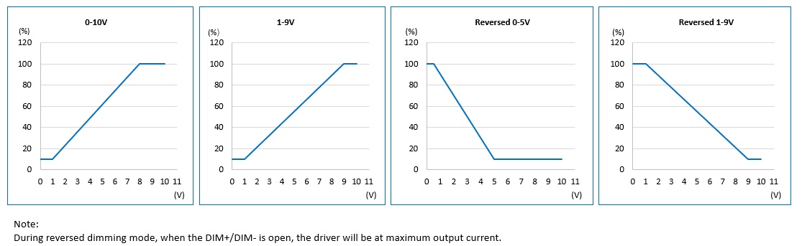

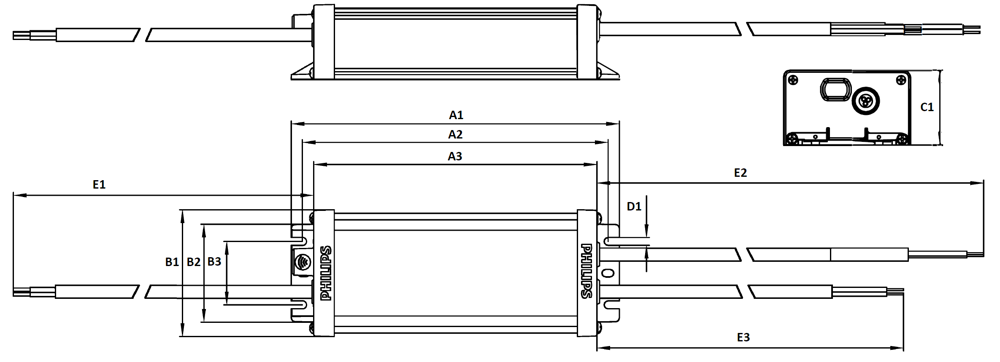

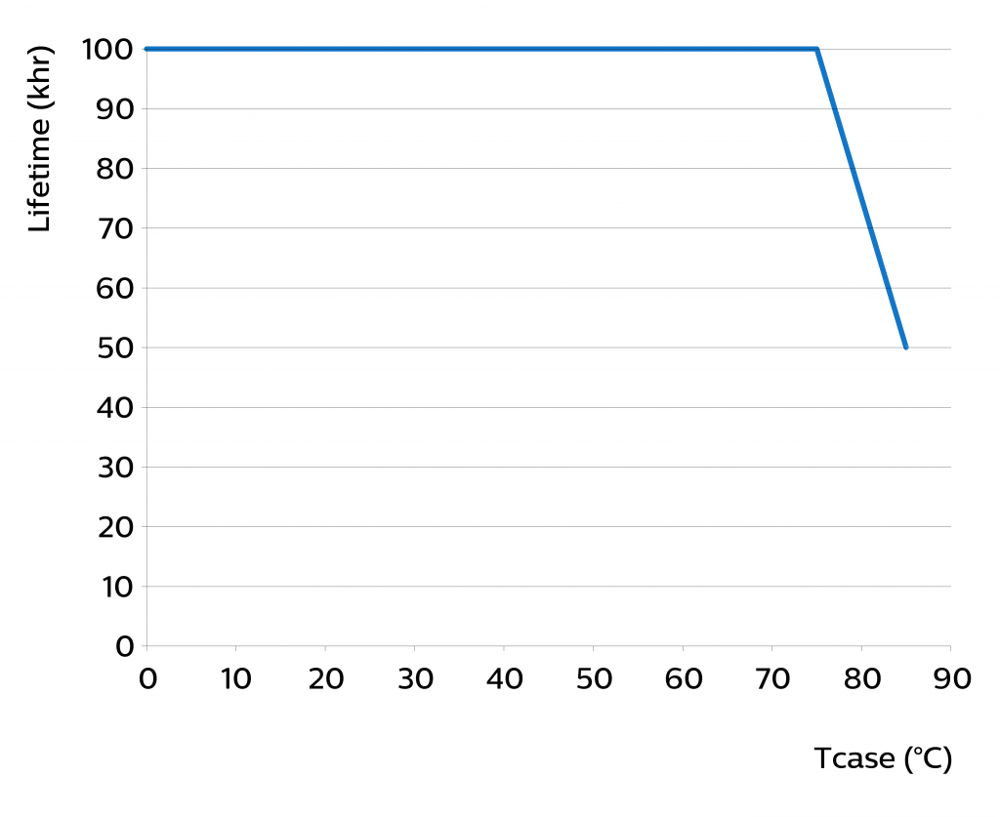

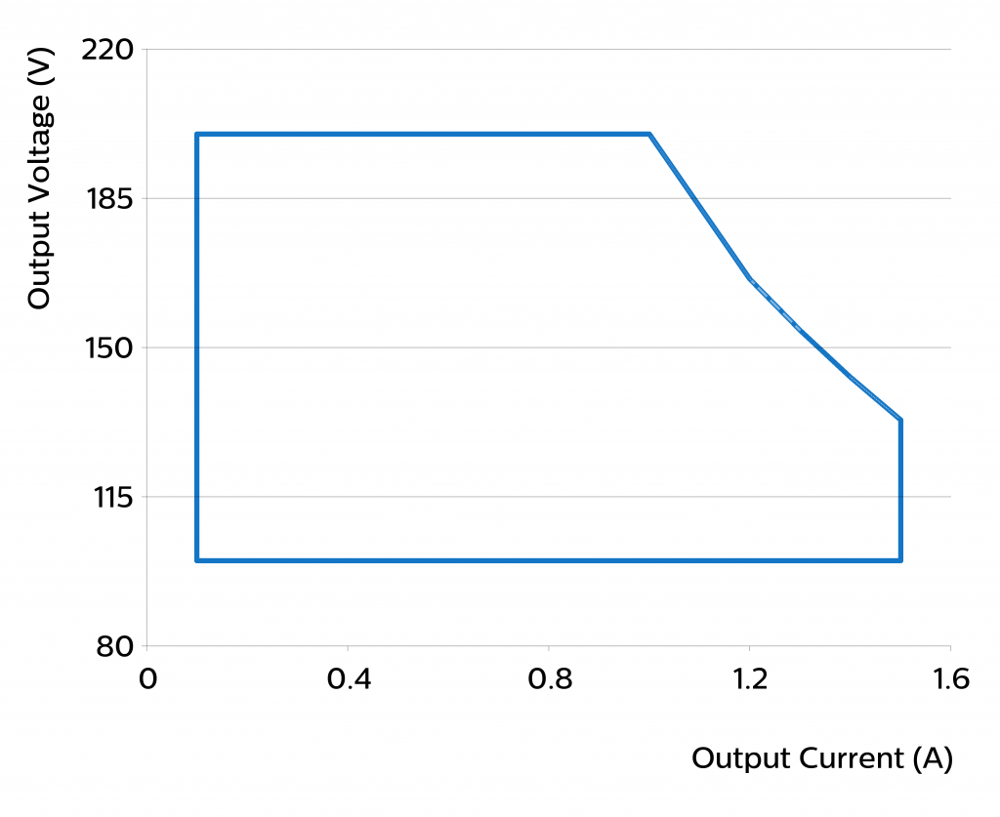

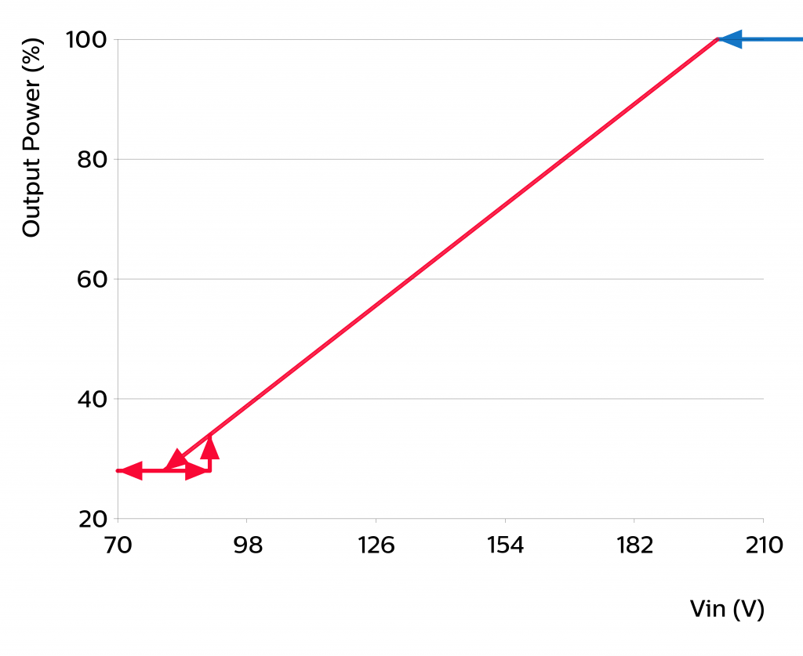

## Page 10

Programmable features
Specification item Available Default setting Condition
Set Adjustable Output Current (AOC) SimpleSet 1050 mA
Adjustable Light Output (ALO) Yes
Constant Light Output (CLO) Yes
1-10V Yes
Dynadimmer Yes
Features
Specification item Value Condition
Open load protection Yes Automatic recovering
Short circuit protection Yes Automatic recovering
Over power protection Yes Automatic recovering
Hot wiring No
Suitable for fixtures with protection class I per IEC60598
Overtemperature protection Yes Automatic recovering
Diagnostics Yes
Inrush current
Specification item Value Unit Condition
Inrush current Ipeak 65 A Input voltage 230V
Inrush current Twidth 378 µs Input voltage 230V, measured at 50% Ipeak
Drivers / MCB 16A type B ≤ 5 pcs Indicative value
MCB Rating Relative number of LED drivers
B 4A 25%
B 6A 40%
B 10A 63%
B 13A 81%
B 16A 100% (stated in datasheet)
B 20A 125%
B 25A 156%
B 32A 200%
B 40A 250%
C 4A 42%
C 6A 63%
C 10A 104%
C 13A 135%
C 16A 170%
C 20A 208%
C 25A 260%
C 32A 340%
C 40A 415%
Driver touch current / protective conductor current
Specification item Value Unit Condition
Typical Protective Conductor Current (ins. Class I) 0.7 mA rms Acc. IEC60598-1. LED module contribution not included
5 / 8 Xi LP 200W 0.5-1.5A S1 WL I195 May 2021

| SimpleSet | 1050 mA |
| --- | --- |
| Yes |  |
| Yes |  |
| Yes |  |

| Yes |  |
| --- | --- |
| Yes |  |
| Yes |  |
| No |  |
| I |  |
| Yes |  |

| 65 | A |
| --- | --- |
| 378 | µs |

| 4A |
| --- |
| 6A |
| 10A |
| 13A |
| 16A |
| 20A |
| 25A |
| 32A |
| 40A |
| 4A |
| 6A |
| 10A |
| 13A |
| 16A |
| 20A |
| 25A |
| 32A |

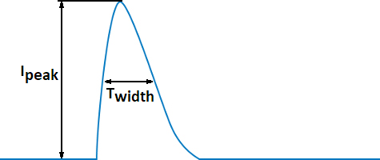

## Page 11

Surge immunity
Specification item Value Unit Condition
Mains surge immunity (diff. mode) 6 kV Acc. IEC61000-4-5. 2 Ohm, 1.2/50us, 8/20us
Mains surge immunity (comm. mode) 10 kV Acc. IEC61000-4-5. 12 Ohm 1.2/50us,8/20us
Application Info
Specification item Value
Approval marks CB / CCC / CE / ENEC / UKCA
Ingress Protection classification (IP) 67
Application Outdoor
Mounting Type Independent
Graphs
Operating window
Thermal Guard
6 / 8 Xi LP 200W 0.5-1.5A S1 WL I195 May 2021

| 6 | kV |
| --- | --- |

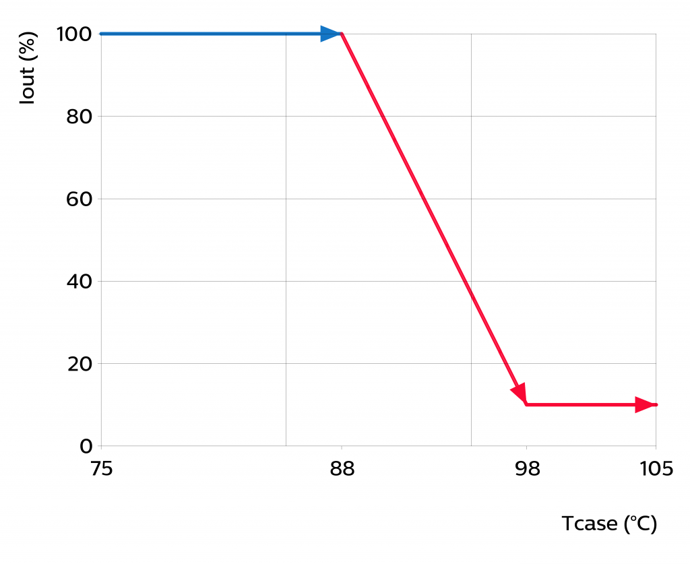

## Page 12

Mains Guard
Power factor versus output power
Efficiency versus output power
7 / 8 Xi LP 200W 0.5-1.5A S1 WL I195 May 2021

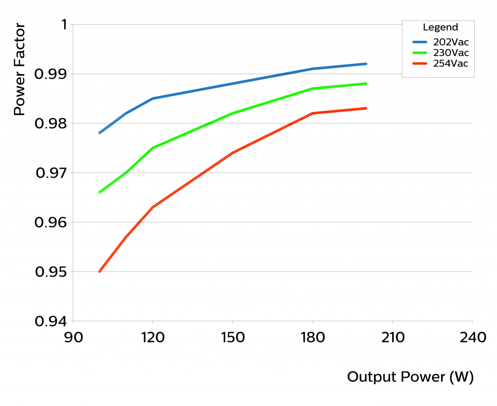

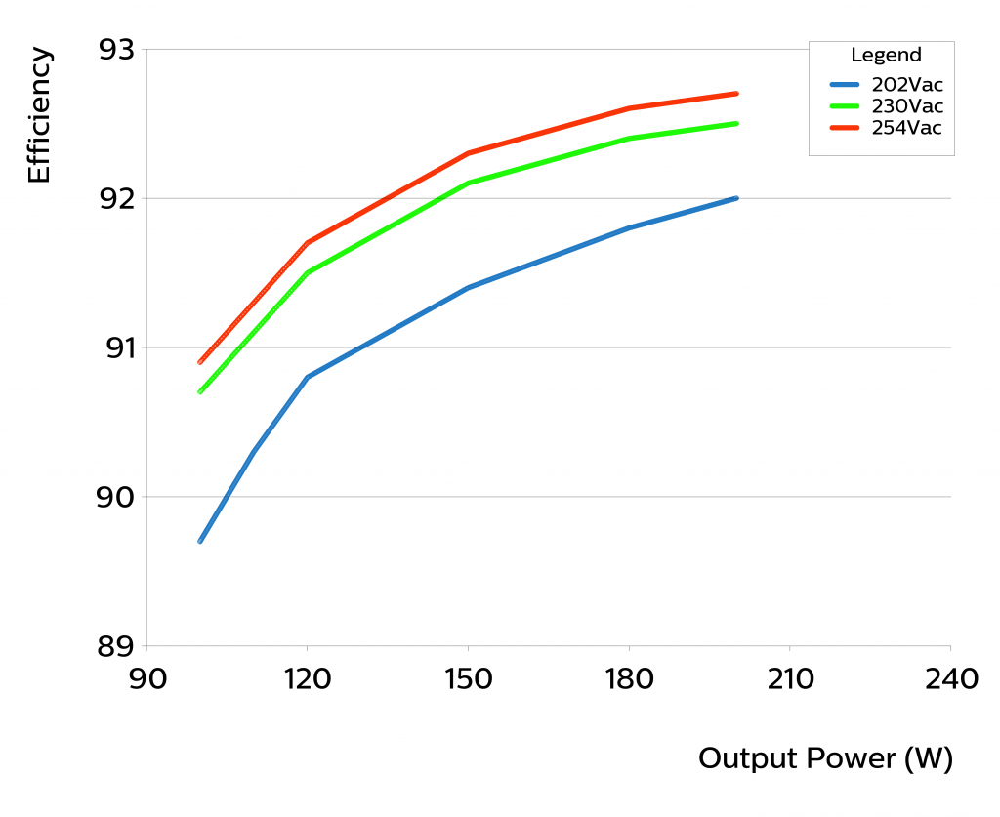

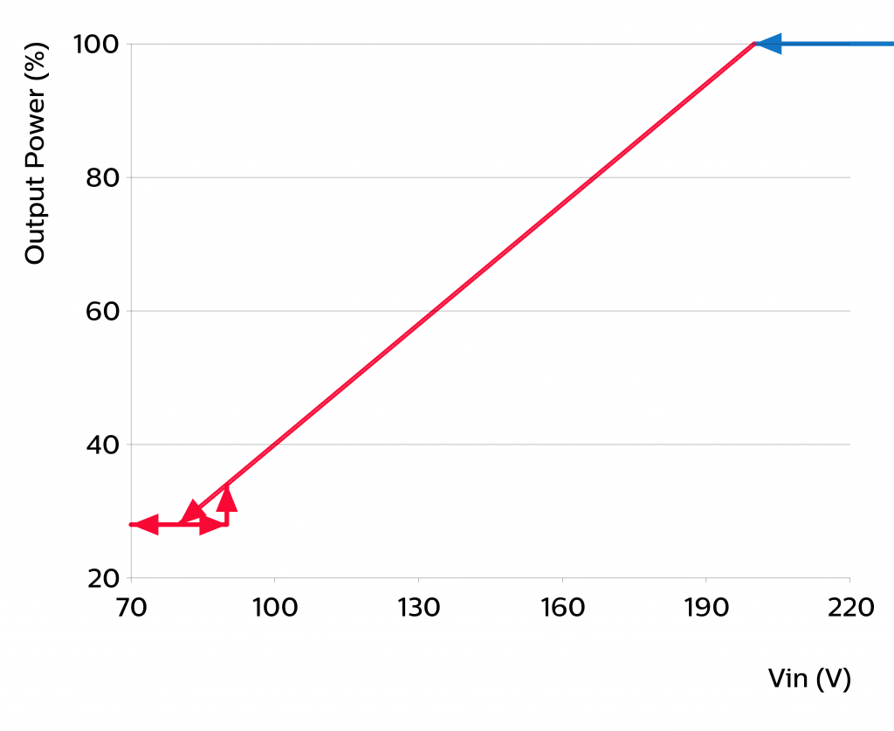

## Page 13

THD versus output power
I as function of 1-10V interface
out
©2021 Signify Holding, IBRS 10461, 5600 VB, NL. All rights reserved.
UK importer address: Signify Commercial UK Limited, 3, Guildford Business Park, GU2 8XG.
The information provided herein is subject to change without notice. Signify does not give any representation or warranty as to the accuracy or
completeness of the information included herein and shall not be liable for any action in reliance thereon. The information presented in this document
is not intended as any commercial offer and does not form part of any quotation or contract, unless otherwise agreed by Signify.
Philips and the Philips Shield Emblem are registered trademarks of Koninklijke Philips N.V. All other trademarks are owned by Signify Holding or their
respective owners.
Date of release: May 27, 2021 v1
www.philips.com/oem

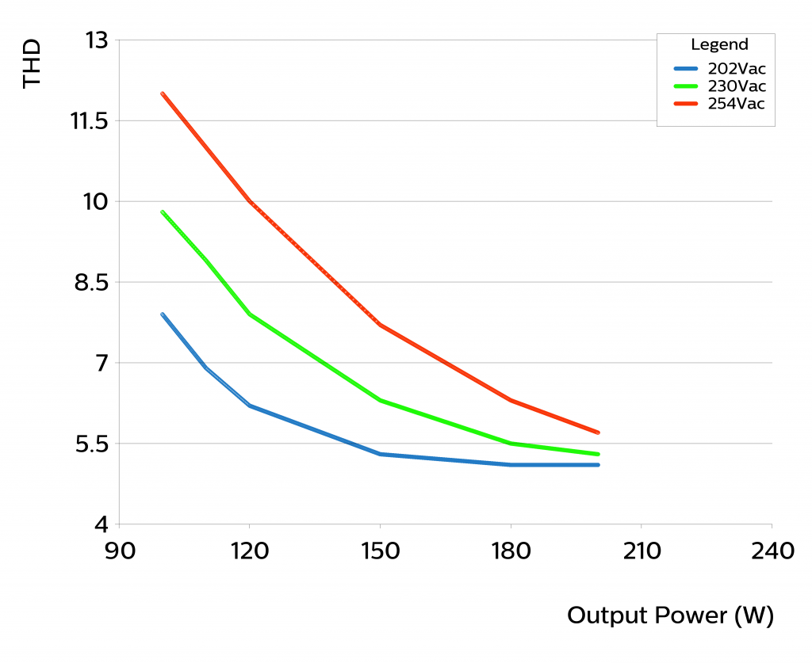

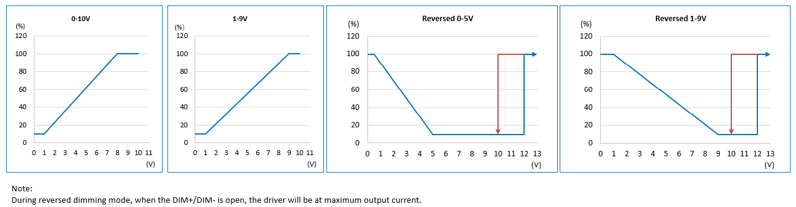

## Page 14

Xitanium
LED driver
Datasheet
Xitanium Outdoor Essential Programmable Low Voltage LED Drivers
Xi EP LV 200W 3.0-6.7A WL I195
9290 033 92980
Xitanium Essential Programmable (EP) LED drivers are designed for maximum reliability and flexibility, making it a preferred choice for
outdoor applications. The key feature is to adjust the output current with the new e-set tool, a simple and fast way to configure the driver
without the need to power on the driver and without the need for any software configuration. The WideLine family can operate on input
voltage 100-277Vac anywhere around the world and ensure 100% performance from 200-254Vac.
Features Benefits Application
• Digital and simple Adjustable Output • Reliable and repeatable adjustment of output • Road and street lighting
current/voltage to save labor cost and time
Current (AOC) with e-set tool, based • Area and flood lighting
• Easy to design-in and reduces SKUs
on NFC technology • High-bay lighting
• Low maintenance cost and peace of mind in
• WideLine input voltage range: extreme conditions
100-277Vac • Safe to use and provides luminaire design freedom
• Surge protection: 6/6kV (DM/CM)
• IP67 with 30,000 hours lifetime
• SELV certified
June 2023

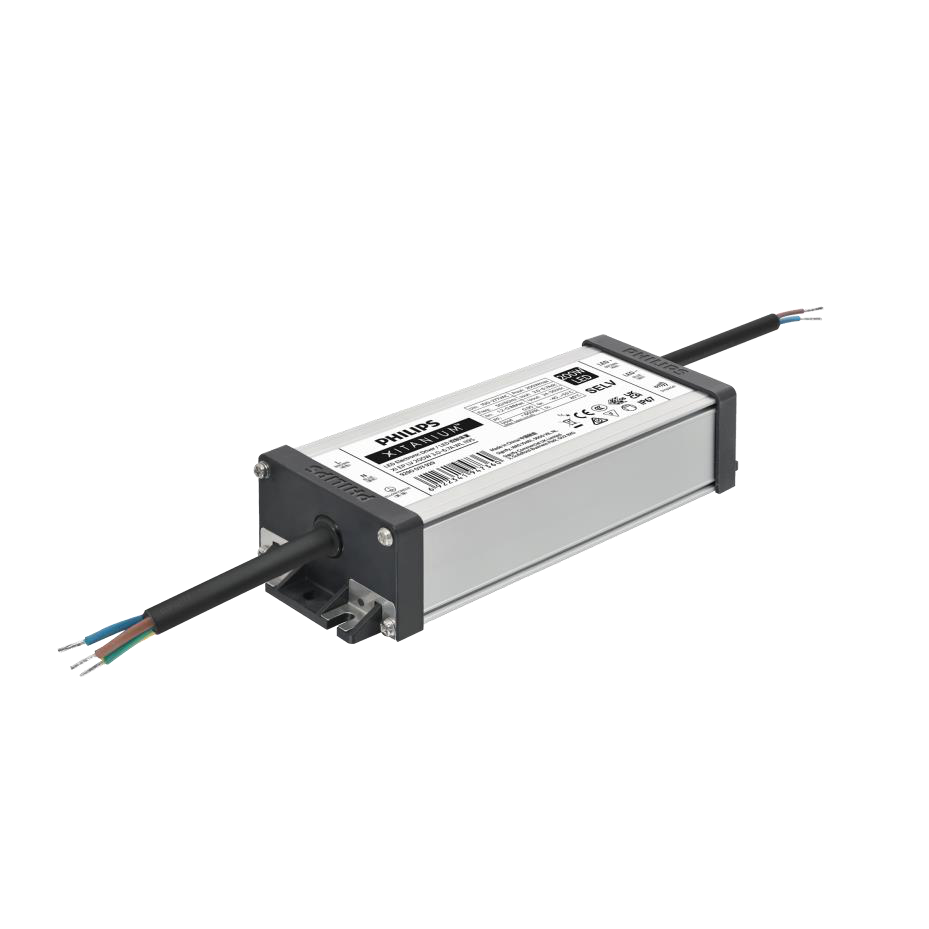

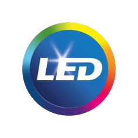

## Page 15

Electrical input data
Specification item Value Unit Condition
Rated input voltage range 200...254 Vac Performance range
Rated input voltage 230 Vac
Rated input frequency range 47...63 Hz Performance range
Rated input current 0.96 A @ rated output power @ rated input voltage
Max. input current 1.1 A @ rated output power @ minimum performance input voltage
Rated input power 220 W @ rated output power @ rated input voltage
Power factor 0.95 @ rated output power @ rated input voltage
Total harmonic distortion 10 % @ rated output power @ rated input voltage
Efficiency 93 % @ rated output power @ rated input voltage @max. Uout
Input voltage AC range 85...305 Vac Operational range
Input frequency AC range 45...66 Hz Operational range
Isolation input to output Double
Electrical output data
Specification item Value Unit Condition
Regulation method Constant Current
Output voltage 24...50 Vdc
Output voltage max. 60 V Maximum output voltage (rms)
Output current 3...6.7 A
Output current min programmable 3000 mA
Output current tolerance ± 5 % At max. output currentt, Ta=25°C
Output current ripple LF ≤ 5 % Ripple = peak / average, < 1kHz
Output current ripple HF ≤ 5 %
Output Pst LM ≤ 0.1 In entire operating window
Output SVM ≤ 0.1 In entire operating window
Output power 72...200 W Rated output power is 200W
Electrical data controls input
Specification item Value Unit Condition
Control method Fixed
2 / 8 Xi EP LV 200W 3.0-6.7A WL I195 June 2023

| 200...254 | Vac |
| --- | --- |
| 230 | Vac |
| 47...63 | Hz |
| 0.96 | A |
| 1.1 | A |
| 220 | W |
| 0.95 |  |
| 10 | % |
| 93 | % |
| 85...305 | Vac |
| 45...66 | Hz |

| Constant Current |  |
| --- | --- |
| 24...50 | Vdc |
| 60 | V |
| 3...6.7 | A |
| 3000 | mA |
| 5 | % |
| ≤ 5 | % |
| ≤ 5 | % |
| ≤ 0.1 |  |
| ≤ 0.1 |  |

## Page 16

Wiring and Connections
Specification item Value Unit Type
Input wire cross-section 1 mm2 3x 1.0mm2 stranded wires
Output wire cross-section 1 mm2 2x 1.0mm2 stranded wires
Maximum cable length 2 m Total length of wiring including LED module, one way
Insulation
Insulation per IEC61347-1 Input Output Ground
Input Double Basic
Output Double Basic
Ground Basic Basic
Dimensions and weight
Specification item Value Unit Tolerance (mm)
Length (A1) 195 mm ± 2
Mounting hole distance (A2) 184 mm ± 2
Length (A3) 172.5 mm ± 2
Width (B1) 67 mm ± 1
Width (B2) 52.5 mm ± 1
Width (B3) 34 mm ± 1
Height (C1) 40 mm ± 1
Mounting hole diameter (D1) 4 mm ± 0.3
Input cable length (E1) 450 mm ± 30
Output cable length (E2) 450 mm ± 30
Weight 820 gram
Logistical data
Specification item Value
Product name Xi EP LV 200W 3.0-6.7A WL I195
Logistic code 12NC 9290 033 92980
Pieces per box 12
3 / 8 Xi EP LV 200W 3.0-6.7A WL I195 June 2023

| 1 | mm2 |
| --- | --- |
| 1 | mm2 |

|  | Double |
| --- | --- |
| Double |  |

| 195 | mm |
| --- | --- |
| 184 | mm |
| 172.5 | mm |
| 67 | mm |
| 52.5 | mm |
| 34 | mm |
| 40 | mm |
| 4 | mm |
| 450 | mm |
| 450 | mm |

## Page 17

Operational temperatures and humidity
Specification item Value Unit Condition
Ambient temperature -40...+55 ºC Higher ambient temperature allowed as long as Tcase-max is not
exceeded
Tcase-max 85 ºC Maximum temperature measured at Tcase-point
Tcase-life 75 ºC Measured at Tcase-point
Relative humidity 10...90 % Non-condensing
Lifetime
Specification item Value Unit Condition
Driver lifetime 30,000 hours Measured temperature at Tcase-point is Tcase-max. Maximum
failures = 10%
Storage temperature and humidity
Specification item Value Unit Condition
Ambient temperature -40...+80 ºC
Relative humidity 5...95 % Non-condensing
Programmable features
Specification item Available Default setting Condition
Set Adjustable Output Current (AOC) NFC 4000 mA
Features
Specification item Value Condition
Open load protection Yes Automatic recovering
Short circuit protection Yes Automatic recovering
Over power protection Yes Automatic recovering
Hot wiring No
Suitable for fixtures with protection class I per IEC60598
Overtemperature protection Yes Automatic recovering, refer to thermal guard curve
4 / 8 Xi EP LV 200W 3.0-6.7A WL I195 June 2023

| -40...+55 | ºC |
| --- | --- |
| 85 | ºC |
| 75 | ºC |

| -40...+80 | ºC |
| --- | --- |

| Yes |  |
| --- | --- |
| Yes |  |
| Yes |  |
| No |  |
| I |  |

## Page 18

Inrush current
Specification item Value Unit Condition
Inrush current 72 A Input voltage 230V
Inrush peak width 276 µs Input voltage 230 V, measured at 50% height
Drivers / MCB 16A type B ≤ 4 pcs Indicative value at 230V
Please refer to the driver design in guide if you use other MCB-types.
Driver touch current / protective conductor current
Specification item Value Unit Condition
Typical Protective Conductor Current (ins. Class I) 0.7 mA rms Acc. IEC60598-1. LED module contribution not included
Surge immunity
Specification item Value Unit Condition
Mains surge immunity (diff. mode) 6 kV Acc. IEC61000-4-5. 2 Ohm, 1.2/50us, 8/20us
Mains surge immunity (comm. mode) 6 kV Acc.IEC61000-4-5. 12 Ohm 1.2/50us,8/20us
Application Info
Specification item Value
Approval marks and Certifications CB / CCC / CE / ENEC / RCM / SELV / UKCA
Ingress Protection classification (IP) 67
Application Outdoor
Mounting Type Independent
5 / 8 Xi EP LV 200W 3.0-6.7A WL I195 June 2023

| 72 | A |
| --- | --- |
| 276 | µs |

| 6 | kV |
| --- | --- |

## Page 19

Graphs
Operating window
Thermal Guard
Mains Guard
6 / 8 Xi EP LV 200W 3.0-6.7A WL I195 June 2023

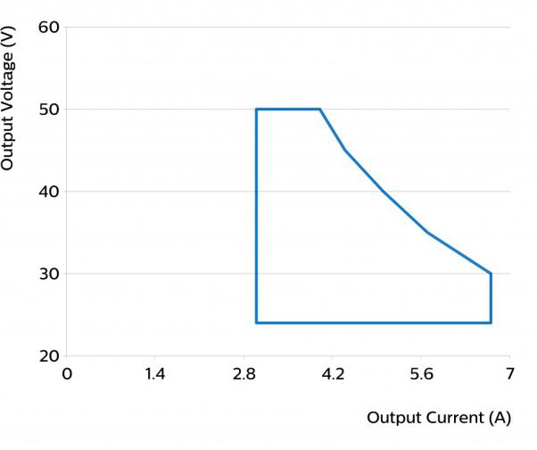

> ⚠️ Low text density on this page — check the image above manually, or re-run with `--vision`.

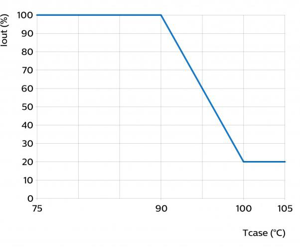

> ⚠️ Low text density on this page — check the image above manually, or re-run with `--vision`.

> ⚠️ Low text density on this page — check the image above manually, or re-run with `--vision`.

## Page 20

Power factor versus output power
Efficiency versus output power
THD versus output power
7 / 8 Xi EP LV 200W 3.0-6.7A WL I195 June 2023

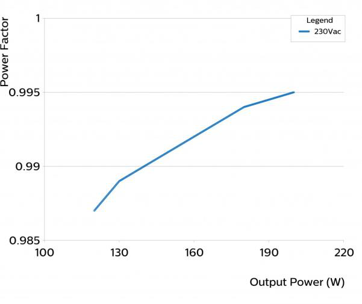

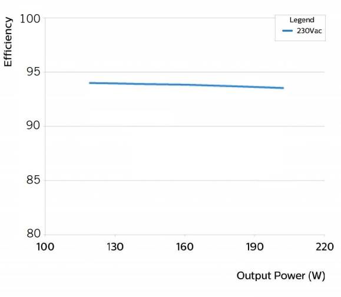

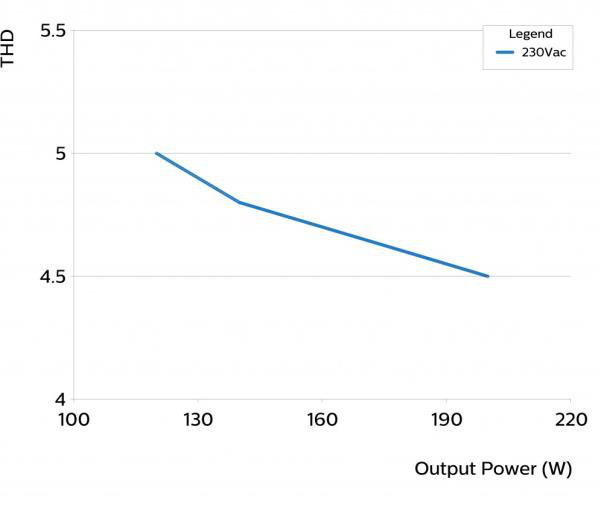

## Page 21

©2023 Signify Holding, IBRS 10461, 5600 VB, NL. All rights reserved.
UK importer address: Signify Commercial UK Limited, 3, Guildford Business Park, GU2 8XG.
The information provided herein is subject to change without notice. Signify does not give any representation or warranty as to the accuracy or
completeness of the information included herein and shall not be liable for any action in reliance thereon. The information presented in this document
is not intended as any commercial offer and does not form part of any quotation or contract, unless otherwise agreed by Signify.
Philips and the Philips Shield Emblem are registered trademarks of Koninklijke Philips N.V. All other trademarks are owned by Signify Holding or their
respective owners.
Date of release: June 30, 2023 v1
www.philips.com/oem

