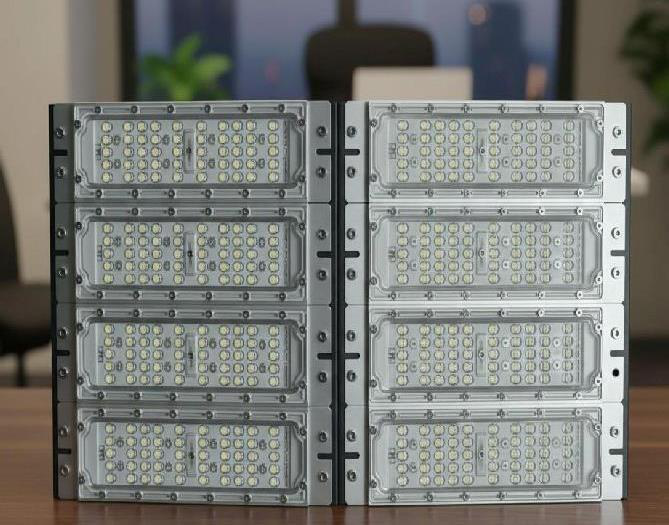
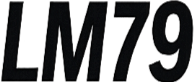
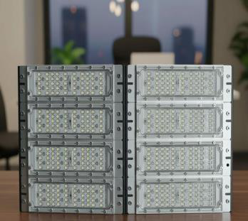
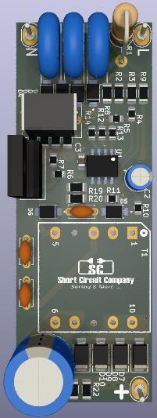
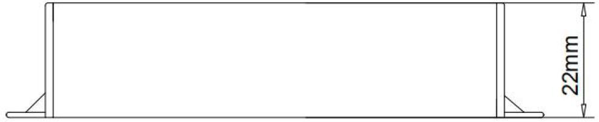
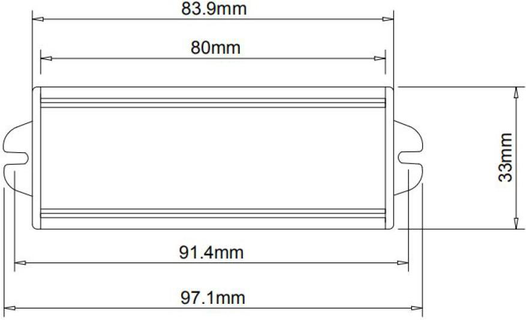

# SC- 800w - Arena Sport Light - Datasheet(option2 )

<!--
source_file: SC- 800w - Arena Sport Light - Datasheet(option2 ).pdf
pages: 9
images_extracted: 28
needs_manual_review: False
-->

## Page 1

Arena Sport-800W . DATASHEET
ABSTRACT
Short circuit arena sport light for industrial use.
High performance of 98% of led efficiency within more
than 30,000 operating hours.
Arena sport Light is protected against the electricity
instability with over voltage, current, and temperature
protection.
Arena Sport Light consists of Ledvance chips and
Sc drivers with warranty of 3 years.
SHORT CIRCUIT
ARENA SPORT
LIGHT
High lux, High performance, High protection with long life-
span for industrial use.

## Page 2

Arena Sport-800W . DATASHEET
Table of Contents
1 General product information
1.1 General Specifications
1.2 Environmental Compliance
1.3 Compatibilities
1.4 Product Main Parts
2 Body and Heat-Sink
2.1 Heat-Sink Operation Theory
2.2 Body and Heat-Sink Description
3 LED Chips
3.1 Chip Performance Characteristics
3.2 Electrical and Thermal Characteristics
3.3 Absolute Maximum Ratings
3.4 Characteristics Curves
3.4.1 Light Output Characteristics
3.4.2 Forward Current Characteristics
3.4.3 Polar Curve
4 Driver
4.1 General Description
4.2 Features
4.3 Protections
4.4 Module Specification
4.4.1 AC Input Specification
4.4.2 DC Output Characteristics
4.4.3 Protection Specifications
4.4.4 Mechanical Specification

| Arena Sport-800W . DATASHEET
Table of Contents
1 General product information
1.1 General Specifications
1.2 Environmental Compliance
1.3 Compatibilities
1.4 Product Main Parts
2 Body and Heat-Sink
2.1 Heat-Sink Operation Theory
2.2 Body and Heat-Sink Description
3 LED Chips
3.1 Chip Performance Characteristics
3.2 Electrical and Thermal Characteristics
3.3 Absolute Maximum Ratings
3.4 Characteristics Curves
3.4.1 Light Output Characteristics
3.4.2 Forward Current Characteristics
3.4.3 Polar Curve
4 Driver
4.1 General Description
4.2 Features
4.3 Protections
4.4 Module Specification
4.4.1 AC Input Specification
4.4.2 DC Output Characteristics
4.4.3 Protection Specifications
4.4.4 Mechanical Specification |  |
| --- | --- |
|  |  |

## Page 3

Arena Sport-800W . DATASHEET
1. Product General Information
1.1 General Specifications:
Table1: Product General Specifications
Item Specification Unit
LED Chip LEDVANCE
Driver S C
LED efficacy 145 Lm / W
2*4 (100w for module)
N.O.Modules
N.O.Drivers 8-16
Wattage 800 W
Total Luminous 116,000 Lm
Beam angle 60 Degree
Color temperature 6500 K
CRI > 90
Power factor > 0.95
Input voltage AC~85-300 V
Frequency 50-60 Hz
Operating Temperature -40 To 85 C
Humidity Up to 90 %
IP 65
Driver Protection OV, OC & OT
Life time 30,000 Hour
Warranty 3 Year

| Item | Specification | Unit |
| --- | --- | --- |
| LED Chip | LEDVANCE |  |
| Driver | S C |  |
|  |  |  |
|  |  |  |
| LED efficacy | 145 | Lm / W |
| N.O.Modules | 2*4 (100w for module) |  |
|  |  |  |
|  |  |  |
| N.O.Drivers | 8-16 |  |
| Wattage | 800 | W |
|  |  |  |
| Total Luminous | 116,000 | Lm |
| Beam angle | 60 | Degree |
|  |  |  |
| Color temperature | 6500 | K |
| CRI | > 90 |  |
|  |  |  |
|  |  |  |
| Power factor | > 0.95 |  |
| Input voltage | AC~85-300 | V |
|  |  |  |
| Frequency | 50-60 | Hz |
| Operating Temperature | -40 To 85 | C |
|  |  |  |
| Humidity | Up to 90 % |  |
| IP | 65 |  |
|  |  |  |
|  |  |  |
| Driver Protection | OV, OC & OT |  |
| Life time | 30,000 | Hour |
|  |  |  |
| Warranty | 3 | Year |

## Page 4

Arena Sport-800W . DATASHEET
1.2 Environmental Compliance:
Short Circuit is committed to providing environmentally friendly products to the solid-state lighting market. Arena Sport Light LED is
compliant to the general environmental duty (GED). Short Circuit will not intentionally add the following restrictedmaterial s to its
products : lead , mercury , cadmium , hexavalentchromium , polybrominatedbi phenyls(PBB ) or polybromin ated diphe nyl ethers (
PBDE).
1.3 Compatibilities
1.4 Product Main Parts:
Arena Sport Light LED is mainly consisted of three parts described as following:
Body and heat sink which is made of Aluminum alloy to dissipate the internal temperature of Chips and Drivers
Ledvance LED Chips with efficiency of 145Lm/W.
SC Driver which is responsible for supplying the chip with required voltage and current. Also, the driver is protected
against over voltage and over current occurrence.
2. Body and Heat-Sink
2.1 Heat-Sink Operation Theory
Due to electronic circuits nature, there is over internal heat generated during the operation period. That heat needs to be
dissipated to protect driver components from being damaged.
According to Heat Transfer Theory, materials with high thermal conductivity are used to transfer heat from the hot region to the
cold one, space in our case, so a heat-sink made from Aluminum alloy is a suitable choice for this mission.

|  |  |
| --- | --- |

## Page 5

Arena Sport-800W . DATASHEET
2.2 Body and Heat-Sink Description:
Table2: Body and Heat-Sink Description
Item Description
Body Anti-corrosion aluminum alloy heat sink (electrostatic painted)
Aluminum Purity 96-98 %
Number Of Modules 2*4 (100w for module)
Thickness Of Fin 5 mm 1.5 mm
Dimensions 60 cm x 40 cm x 4 cm
Lenses UV Poly-carbonate heat resistant lenses
Beam Angle 60°
Gasket silicone rubber insulation
Glands Waterproof cable glands (silicone insulated)
IP 65
Wattage 800 W
Weight 6 kg
3. LED Chips
3.1 Chip Performance Characteristics
Product Nominal CCT Minimum CRI Typical Luminous Efficacy (lm/W) Luminous Flux (lm)
Minimum Typical
6500K 90 145 Lm/ W
3030 2D 116 130

| Item | Description |  |
| --- | --- | --- |
| Body | Anti-corrosion aluminum alloy heat sink (electrostatic painted) |  |
| Aluminum Purity | 96-98 % |  |
|  |  |  |
| Number Of Modules | 2*4 (100w for module) |  |
| Thickness Of Fin | 5 mm | 1.5 mm |
|  |  |  |
| Dimensions | 60 cm x 40 cm x 4 cm |  |
|  |  |  |
| Lenses | UV Poly-carbonate heat resistant lenses |  |
| Beam Angle | 60° |  |
|  |  |  |
| Gasket | silicone rubber insulation |  |
| Glands | Waterproof cable glands (silicone insulated) |  |
|  |  |  |
| IP | 65 |  |
| Wattage | 800 W |  |
|  |  |  |
| Weight | 6 kg |  |

| Product | Nominal CCT | Minimum CRI | Typical Luminous Efficacy (lm/W) | Luminous Flux (lm) |  |
| --- | --- | --- | --- | --- | --- |
|  |  |  |  | Minimum | Typical |
| 3030 2D | 6500K | 90 | 145 Lm/ W | 116 | 130 |

## Page 6

SH ORT CIRCUIT DRIVER
Model number SC-LDF-35V1450m A
Type Universal isolated LED driver
Sample date XX-YY-ZZZZ
Revision Rev-1.0

| Model number | SC-LDF-35V1450m A |
| --- | --- |
| Type | Universal isolated LED driver |
| Sample date | XX-YY-ZZZZ |
| Revision | Rev-1.0 |

## Page 7

50W isolated LED driver -
SC-LDF-35V1450 mA
High PF, Low THD LED driver
Rev-1.0
2. Features
1. General Description
✓ Primary-side control with single stage
LDF series is an offline LED lighting
PFC LED driver for low system cost,
controller with high power factor, low THD
✓ High PF (>0.95),
and high constant current (CC) precision. It
✓ Low THD (<10%),
can achieve low system cost for an isolated
✓ High efficiency (>85%),
lighting application by primary side control
✓ Pre-programmed VIN foldback,
in a single stage converter. It significantly
✓ Pre-programmed VIN OVP,
simplifies the LED lighting system design by
✓ Pre-programmed thermal foldback,
eliminating the secondary side feedback
✓ Pre-programmed CC regulation,
components and the opto-coupler.
✓ High precision constant current,
The proprietary CC control is used, and the
✓ Fast start-up time (<0.5s),
system can achieve high power factor with
✓ Built-in line/load compensation,
constant on-time control. Quasi-resonant
✓ No visible flicker, and audible noise free
(QR) operation and clamping frequency
improve the system efficiency. The advanced 3. Protection
start-up technology is used to meet the start- ✓ LED short circuit protection,
up time requirement (<0.5s). The constant ✓ LED open circuit protection,
output current is compensated for tolerance ✓ VDD over/under voltage protection,
of transformer inductance variation. Besides, ✓ Lightning surge voltage 4kV,
the line compensation and load compensation ✓ AC input overvoltage protection
are built in for high precisely constant output
The LED driver recovers automatically and
current control.
back to normal operation after all fault causes
This series offers comprehensive protection are removed.
coverage with auto-recovery features
including programmable VIN foldback,
programmable VIN OVP, programmable
thermal foldback, LED open loop protection,
LED short circuit protection, cycle-by-cycle
current limiting, built-in leading-edge
blanking, VDD under voltage lockout
(UVLO).
1

## Page 8

50W isolated LED driver
SC-LDF-35V1450m A
High PF, Low THD LED driver
Rev-1.0
4. Module Specification
This section presents the specification of the LED driver, normal operating range, and the driver
performance.
4.1 AC Input Specification
LED driver max. apparent power 56W at full load 95Vac<Vin<275Vac
AC input voltage rating 30Vac ~ 300Vac
AC input voltage range for normal operation 90Vac ~ 275Vac
AC input voltage range for foldback operation 30Vac ~ 90Vac
AC input frequency range 47Hz ~ 63Hz
Power factor >0.95 at 220Vac full load
AC input current THD <10% at 220Vac full load
AC max. input current <0.8A at 95Vac full load
Efficiency >85% at 220Vac full load
4.2 DC Output Characteristics
DC output voltage 20 ~ 35 Vdc
Output voltage ripples <2.5 V peak-peak at max. load
DC output constant-current 1450 mA, ±5%
Output current ripples <45%
Maximum output power 50 W
Line regulation ±5%
Load regulation ±5%
Start-up time < 600 ms at 220Vac full load
4.3 Protection Specifications
AC input overvoltage 275Vac ~ 285Vac
AC input foldback voltage 85Vac ~ 95Vac
DC output open circuit overvoltage 41 ~ 45 Vdc
Thermal foldback temperature 100℃
Lightning surge ±4kV
Controller IC VDD undervoltage protection 9 Vdc,
Controller IC VDD overvoltage protection 24 Vdc
2

| LED driver max. apparent power | 56W at full load 95Vac<Vin<275Vac |
| --- | --- |
| AC input voltage rating | 30Vac ~ 300Vac |
| AC input voltage range for normal operation | 90Vac ~ 275Vac |
| AC input voltage range for foldback operation | 30Vac ~ 90Vac |
| AC input frequency range | 47Hz ~ 63Hz |
| Power factor | >0.95 at 220Vac full load |
| AC input current THD | <10% at 220Vac full load |
| AC max. input current | <0.8A at 95Vac full load |
| Efficiency | >85% at 220Vac full load |

| DC output voltage | 20 ~ 35 Vdc |
| --- | --- |
| Output voltage ripples | <2.5 V peak-peak at max. load |
| DC output constant-current | 1450 mA, ±5% |
| Output current ripples | <45% |
| Maximum output power | 50 W |
| Line regulation | ±5% |
| Load regulation | ±5% |
| Start-up time | < 600 ms at 220Vac full load |

| AC input overvoltage | 275Vac ~ 285Vac |
| --- | --- |
| AC input foldback voltage | 85Vac ~ 95Vac |
| DC output open circuit overvoltage | 41 ~ 45 Vdc |
| Thermal foldback temperature | 100℃ |
| Lightning surge | ±4kV |
| Controller IC VDD undervoltage protection | 9 Vdc, |
| Controller IC VDD overvoltage protection | 24 Vdc |

## Page 9

50W isolated LED driver
SC-LDF-35V1450m A
High PF, Low THD LED driver
Rev-1.0
6. Mechanical Specification
Figure 1 Driver mechanical dimensions in water-proof case IP67
3

|  |
| --- |
|  |
| Figure 1 Driver mechanical dimensions in water-proof case IP67 |

