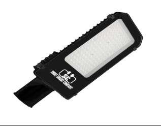
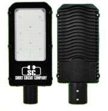
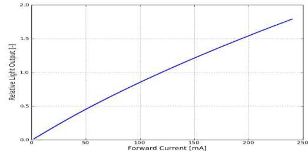
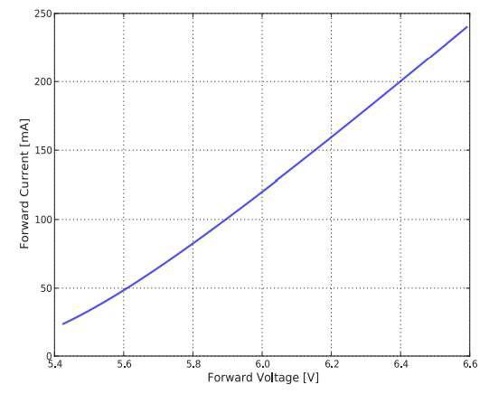
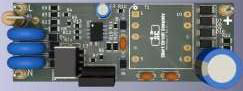
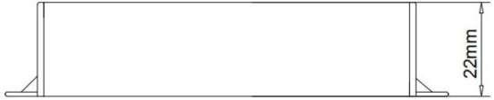
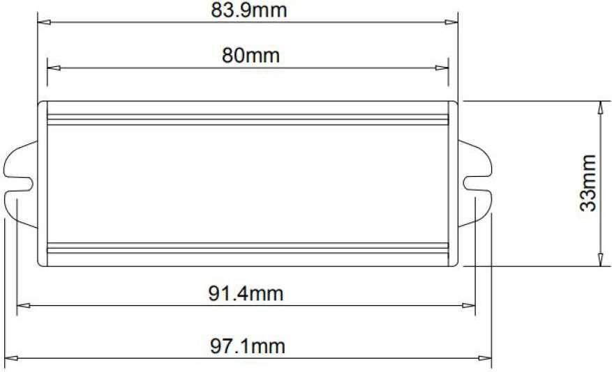

# SC 50,85, 100 W Street Light Datasheet

<!--
source_file: SC 50,85, 100 W Street Light Datasheet.pdf
pages: 12
images_extracted: 37
needs_manual_review: True
-->

## Page 1

ABSTRACT
Short circuit street light for industrial use.
High performance of 98% of led efficiency within
more than 50,000 operating hours.
Street Light is protected against the electricity
instability with over voltage, current, and
temperature protection.
SHORT CIRCUIT Street light consists of Philips chips and short-
circuit drivers with warranty of 5 years.
STREET LIGHT
High lux, High performance, High protection with
long life-span for industrial use.

## Page 2

Table of Contents
1 General product information......................................................................................................................................
1.1 General Specifications ...............................................................................................................................................
1.2 Environmental Compliance
1.3 Compatibilities .......................................................................................................................................................
1.4 Product Main Parts ............................................................................................................................................
2 Body and Heat-Sink ....................................................................................................................................................
2.1 Heat-Sink Operation Theory.....................................................................................................................................
2.2 Body and Heat-Sink Description............................................................................................................................
3 LED Chips .....................................................................................................................................................................
3.1 Chip Performance Characteristics ...........................................................................................................................
3.2 Electrical and Thermal Characteristics ..................................................................................................................
3.3 Absolute Maximum Ratings................................................................................................................................
3.4 Characteristics Curves......................................................................................................................................
3.4.1 Light Output Characteristics ........................................................................................................................
3.4.2 Forward Current Characteristics ..............................................................................................................
3.4.3 Polar Curve ............................................................................................................................................
4 Driver ...........................................................................................................................................................................
4.1 General Description.....................................................................................................................................................
4.2 Features....................................................................................................................................................................
4.3 Protections ............................................................................................................................................................
4.4 Module Specification ..........................................................................................................................................
4.4.1 AC Input Specification ....................................................................................................................................
4.4.2 DC Output Characteristics ..........................................................................................................................
4.4.3 Protection Specifications..........................................................................................................................
4.4.4 Mechanical Specification.......................................................................................................................

## Page 3

1. Product General Information
1.1 General Specifications:
Table1: Product General Specifications
Item Specification Unit
LED Chip Philips 3030
Driver S.C
Wattage 50,85,100 W
Full Efficiency 230 Lm\W
Actual Efficiency 220 Lm\W
N.O.Chips 120
N.O.Drivers 2
Beam angle 120 Degree
Color temperature 6500 K
CRI > 90
Power factor > 0.95
Input voltage AC~85-300 V
Frequency 50-60 Hz
Operating -40 To 85 C
Temperature
Humidity Up to 90 %
IP 65
Driver Protection OV, OC & OT
Life time 50,000 Hour
Warranty 5 Year

| Item | Specification | Unit |
| --- | --- | --- |
| LED Chip | Philips 3030 |  |
| Driver | S.C |  |
| Wattage | 50,85,100 | W |
| Full Efficiency | 230 | Lm\W |
| Actual Efficiency | 220 | Lm\W |
| N.O.Chips | 120 |  |
| N.O.Drivers | 2 |  |
| Beam angle | 120 | Degree |
| Color temperature | 6500 | K |
| CRI | > 90 |  |
| Power factor | > 0.95 |  |
| Input voltage | AC~85-300 | V |
| Frequency | 50-60 | Hz |
| Operating
Temperature | -40 To 85 | C |
| Humidity | Up to 90 % |  |
| IP | 65 |  |
| Driver Protection | OV, OC & OT |  |
| Life time | 50,000 | Hour |
| Warranty | 5 | Year |

## Page 4

1.2 Environmental Compliance:
Short Circuit is committed to providing environmentally friendly products to the solid-state lighting market.
Street light LED is compliant to the general environmental duty (GED). Short Circuit will not intentionally add
the following restricted materials to its products: lead, mercury, cadmium, hexavalent chromium,
polybrominated biphenyls (PBB) or polybrominated diphenyl ethers (PBDE).
1.3 Compatibilities
1.4 Product Main Parts:
Street light LED is mainly consisted of three parts described as following:
Body and heat sink which is made of Aluminum alloy to dissipate the internal temperature of Chips and
Drivers.
Philips 3030 LED Chips with efficiency of 145Lm/W.
Short Circuit Driver which is responsible for supplying the chip with required voltage and current. Also, the
driver is protected against over voltage and over current occurrence.
2. Body and Heat-Sink
2.1 Heat-Sink Operation Theory
Due to electronic circuits nature, there is over internal heat generated during the
operation period. That heat needs to be dissipated to protect driver components from
being damaged.
According to Heat Transfer Theory, materials with high thermal conductivity are
used to transfer heat from the hot region to the cold one, space in our case, so a
heat-sink made from Aluminum alloy is a suitable choice for this mission.
Figure1: Body and Heat-Sink

## Page 5

2.2 Body and Heat-Sink Description:
Table2: Body and Heat-Sink Description
Item Description
Body Anti-corrosion aluminum alloy heat sink (electrostatic painted)
Aluminum Purity 96-98 %
Number Of Fins 16
Thickness Of Fin Inner Outer
5 mm 1.5 mm
Front Glass Thickness 4 mm
Front Glass Max.temperature
750° C
Lenses UV Poly-carbonate heat resistant lenses
Beam Angle 120°
Gasket silicone rubber insulation
Glands Waterproof cable glands (silicone insulated)
IP 65
Weight 3 Kg
Wattage 50,85,100 W
Installation Arm Diameter 2 Inches

| Item | Description |  |
| --- | --- | --- |
| Body | Anti-corrosion aluminum alloy heat sink (electrostatic painted) |  |
| Aluminum Purity | 96-98 % |  |
| Number Of Fins | 16 |  |
| Thickness Of Fin | Inner | Outer |
|  | 5 mm | 1.5 mm |
| Front Glass Thickness | 4 mm |  |
| Front Glass Max.temperature | 750° C |  |
| Lenses | UV Poly-carbonate heat resistant lenses |  |
| Beam Angle | 120° |  |
| Gasket | silicone rubber insulation |  |
| Glands | Waterproof cable glands (silicone insulated) |  |
| IP | 65 |  |
| Weight | 3 Kg |  |
| Wattage | 50,85,100 W |  |
| Installation Arm Diameter | 2 Inches |  |

## Page 6

3 LED Chips
Figure2: Philips Lumiled 3030
3.1 Chip Performance Characteristics
Table3: Chip Performance Characteristics
Product Nominal Minimum Typical Luminous Flux (lm) Part
CCT CRI Luminous Number
Minimum Typical
Efficacy (lm/W)
LUXEON 6500K 90 144 94 104 L130-
3030 2D 6590003000X21
(Square LES)
3.2 Electrical and Thermal Characteristics
Table4: Chip Electrical and Thermal Characteristics
Part Forward Voltage (Vf ) Typical Temperature Coefficient of
Number Forward Voltage [2] (mV/°C)
Minimum Typical Maximum
L130- 5.8 6 6.6 -2 to -4
6590003000X21
a. Absolute Maximum Ratings
Table5: Chip Absolute Maximum Ratings
Parameter Maximum Performance
DC Forward Current 240mA
Peak Pulsed Forward Current 300mA
LED Junction Temperature (DC & Pulse) 125°C
Operating Case Temperature -40°C to 105°C
LED Storage Temperature -40°C to 105°C

| Product | Nominal
CCT | Minimum
CRI | Typical
Luminous
Efficacy (lm/W) | Luminous Flux (lm) |  | Part
Number |
| --- | --- | --- | --- | --- | --- | --- |
|  |  |  |  | Minimum | Typical |  |
| LUXEON
3030 2D
(Square LES) | 6500K | 90 | 144 | 94 | 104 | L130-
6590003000X21 |

| Part
Number | Forward Voltage (Vf ) |  |  | Typical Temperature Coefficient of
Forward Voltage [2] (mV/°C) |
| --- | --- | --- | --- | --- |
|  | Minimum | Typical | Maximum |  |
| L130-
6590003000X21 | 5.8 | 6 | 6.6 | -2 to -4 |

| Parameter | Maximum Performance |
| --- | --- |
| DC Forward Current | 240mA |
| Peak Pulsed Forward Current | 300mA |
| LED Junction Temperature (DC & Pulse) | 125°C |
| Operating Case Temperature | -40°C to 105°C |
| LED Storage Temperature | -40°C to 105°C |

## Page 7

3.4 Characteristics Curves
3.4.1 Light Output Characteristics
Figure3.a: Chip Light Output Characteristics
Figure3.b: Chip Light Output Characteristics

## Page 8

3.4.2 Forward Current Characteristics
Figure4: Chip Forward Current Characteristics
3.4.3 Polar Curve
Figure5: Chip Polar Curve

## Page 9

4 Driver
Model number SC-LDF-35V1450mA
Type Universal isolated LED driver
Figure6: Short Circuit Driver
4.1 General Description 4.2 Features
LDF series is an offline LED lighting controller
This series offers comprehensive protection
with high power factor, low THD and high
coverage with auto-recovery features including
constant current (CC) precision. It can achieve low
programmable VIN foldback, programmable VIN
system cost for an isolated lighting application by
OVP, programmable thermal foldback, LED open
primary side control in a single stage converter. It
loop protection, LED short circuit protection,
significantly simplifies the LED lighting system
cycle-by-cycle current limiting, built-in leading-
design by eliminating the secondary side feedback
edge blanking, VDD under voltage lockout
components and the opto-coupler.
(UVLO).
The proprietary CC control is used, and the system
can achieve high power factor with constant on-
time control. Quasi-resonant (QR) operation and
clamping frequency improve the system efficiency.
The advanced start-up technology is used to meet
the start- up time requirement (<0.5s). The
constant output current is compensated for
tolerance of transformer inductance variation.
Besides, the line compensation and load
compensation are built in for high precisely
constant output current control.

| Model number | SC-LDF-35V1450mA |
| --- | --- |
| Type | Universal isolated LED driver |

## Page 10

✓ Primary-side control with single stage ✓ No visible flicker, and audible noise free
PFC LED driver for low system cost,
✓ High PF (>0.95), a. Protection
✓ Low THD (<10%), ✓ LED short circuit protection,
✓ LED open circuit protection,
✓ High efficiency (>85%),
✓ VDD over/under voltage protection,
✓ Life time up to 50,000 hours
✓ Lightning surge voltage up to 10 kV,
✓ Pre-programmed VIN foldback,
✓ AC input overvoltage protection,
✓ Pre-programmed VIN OVP, ✓ AC input overcurrent protection.
✓ Pre-programmed thermal foldback,
The LED driver recovers automatically and back to
✓ Pre-programmed CC regulation,
normal operation after all fault causes are
✓ High precision constant current,
removed.
✓ Fast start-up time (<0.5s),
✓ Built-in line/load compensation,
4.4 Module Specification
This section presents the specification of the LED driver, normal operating range, and the driver
performance.
b. .1 AC Input Specification
Table6: AC input specification
LED driver max. apparent power 56W at full load 95Vac<Vin<275Vac
AC input voltage rating 30Vac ~ 300Vac
AC input voltage range for normal operation 90Vac ~ 275Vac
AC input voltage range for foldback operation 30Vac ~ 90Vac
AC input frequency range 47Hz ~ 63Hz
Power factor >0.95 at 220Vac full load
AC input current THD <10% at 220Vac full load
AC max. input current <0.8A at 95Vac full load
Efficiency >85% at 220Vac full load

| LED driver max. apparent power | 56W at full load 95Vac<Vin<275Vac |
| --- | --- |
| AC input voltage rating | 30Vac ~ 300Vac |
| AC input voltage range for normal operation | 90Vac ~ 275Vac |
| AC input voltage range for foldback operation | 30Vac ~ 90Vac |
| AC input frequency range | 47Hz ~ 63Hz |
| Power factor | >0.95 at 220Vac full load |
| AC input current THD | <10% at 220Vac full load |
| AC max. input current | <0.8A at 95Vac full load |
| Efficiency | >85% at 220Vac full load |

## Page 11

4.4.2 DC Output Characteristics
Table7: DC output characteristics
DC output voltage 20 ~ 35 Vdc
Output voltage ripples <2.5 V peak-peak at max. load
DC output constant-current 1450 mA, ±5%
Output current ripples <45%
Maximum output power 50 W
Line regulation ±5%
Load regulation ±5%
Start-up time < 600 ms at 220Vac full load
4.4.3 Protection Specifications
Table8: Protection specifications
AC input overvoltage 275Vac ~ 300Vac
AC input foldback voltage 85Vac ~ 95Vac
DC output open circuit overvoltage 41 ~ 45 Vdc
Thermal foldback temperature 100℃
Lightning surge Up to 10 kV
Controller IC VDD undervoltage protection 9 Vdc,
Controller IC VDD overvoltage protection 24 Vdc

| DC output voltage | 20 ~ 35 Vdc |
| --- | --- |
| Output voltage ripples | <2.5 V peak-peak at max. load |
| DC output constant-current | 1450 mA, ±5% |
| Output current ripples | <45% |
| Maximum output power | 50 W |
| Line regulation | ±5% |
| Load regulation | ±5% |
| Start-up time | < 600 ms at 220Vac full load |

| AC input overvoltage | 275Vac ~ 300Vac |
| --- | --- |
| AC input foldback voltage | 85Vac ~ 95Vac |
| DC output open circuit overvoltage | 41 ~ 45 Vdc |
| Thermal foldback temperature | 100℃ |
| Lightning surge | Up to 10 kV |
| Controller IC VDD undervoltage protection | 9 Vdc, |
| Controller IC VDD overvoltage protection | 24 Vdc |

## Page 12

4.4.4 Mechanical Specification
Figure 7: Driver mechanical dimensions in water-proof case IP65

|  |
| --- |
|  |
| Figure 7: Driver mechanical dimensions in water-proof case IP65 |

> ⚠️ Low text density on this page — check the image above manually, or re-run with `--vision`.

> ⚠️ Low text density on this page — check the image above manually, or re-run with `--vision`.

> ⚠️ Low text density on this page — check the image above manually, or re-run with `--vision`.

> ⚠️ Low text density on this page — check the image above manually, or re-run with `--vision`.
