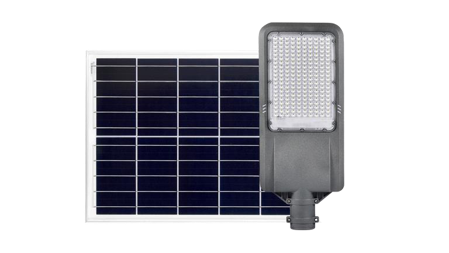
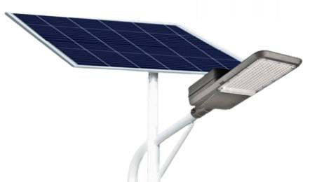

# 100 w Solar Street Light 

<!--
source_file: 100 w Solar Street Light .pdf
pages: 2
images_extracted: 4
needs_manual_review: False
-->

## Page 1

PRODUCT DATASHEET
Solar Street Light 100 w
PRODUCT FEATURES
WARRANTY
• System : 2 in 1 • Solar Panel Warranty: 5 yrs
• Solar Panel : Mono Crystalline • Battery Warranty: 2 yrs
• Body Material : Aluminum
• Turn on : Auto ON-OFF
TECHNICAL DATA
Technical DATA
Power 100W
Color Temperature 5000-6000 K
Solar Panel 18V-100W
Battery LifePO4
charging Time 6-8 hrs
Discharging Time 6-8 hrs
PHOTOMETRIC DATA
LED Efficacy 150 lm /W
Total Luminous 15,000 Lm
Other varieties are available upon request

|  |  |  |  |  |
| --- | --- | --- | --- | --- |
|  | Power |  | 100W |  |

|  | Solar Panel |  | 18V-100W |  |
| --- | --- | --- | --- | --- |

|  | charging Time |  | 6-8 hrs |  |
| --- | --- | --- | --- | --- |

|  | PHOTOMETRIC DATA |  |  |
| --- | --- | --- | --- |

|  | Total Luminous |  | 15,000 Lm |  |
| --- | --- | --- | --- | --- |

## Page 2

PRODUCT DATASHEET
Solar Street Light 100 w
COLORS & MATERIALS
Body Material Aluminum
PROTECTION
Ingress Protection IP 66
MOUNTING
Mounting Location On Pole
Other varieties are available upon request

|  | COLORS & MATERIALS |  |  |
| --- | --- | --- | --- |
|  | Body Material | Aluminum |  |

|  | PROTECTION |  |  |  |
| --- | --- | --- | --- | --- |
|  | Ingress Protection |  | IP 66 |  |

|  | MOUNTING |  |  |  |
| --- | --- | --- | --- | --- |
|  |  |  |  |  |
|  | Mounting Location |  | On Pole |  |

