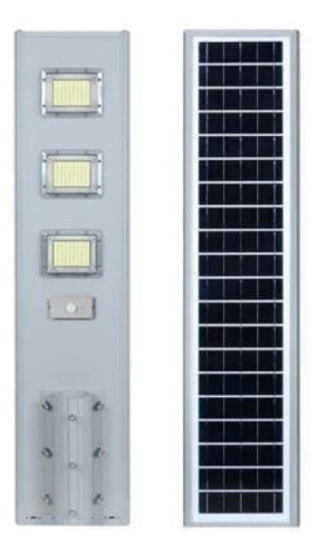

# 60w solar street datasheet

<!--
source_file: 60w solar street datasheet.pdf
pages: 2
images_extracted: 3
needs_manual_review: False
-->

## Page 1

PRODUCT DATASHEET
Solar Street
LED Solar street
AREAS OF APPLICATION
• Compounds
• Highways
• Streets
PRODUCT BENEFITS
• Easy installation with fast connection
• LED Lights consume significantly less energy
compared to traditional lighting sources
• Energy saving up to 60%
TECHNICAL DATA
ELECTRICAL DATA
Nominal Wattage 60 W
PHOTOMETRIC DATA
LED Efficacy 160 lm /W
Total Luminous 9600Lm
Color temperature 6000 K
Color Rendering index Ra >90
Other varieties are available upon request

| AREAS OF APPLICATION
• Compounds
• Highways
• Streets |
| --- |
| PRODUCT BENEFITS
• Easy installation with fast connection
• LED Lights consume significantly less energy
compared to traditional lighting sources
• Energy saving up to 60% |

|  | Nominal Wattage |  | 60 W |  |
| --- | --- | --- | --- | --- |
|  | PHOTOMETRIC DATA |  |  |  |
|  | LED Efficacy |  | 160 lm /W |  |

|  | Color temperature |  | 6000 K |  |
| --- | --- | --- | --- | --- |

## Page 2

PRODUCT DATASHEET
LED Solar street
COLORS & MATERIALS
Body Material Aluminum
Solar Panel Data
Solar Panel Polycrystalline
Solar Panel Power 10v- 28watt
Battery Data
Battery Type Lithium( Life PO4)
Battery Power 6.4v-24AH
Charging Time 6-8H
Discharging Time 2-3H
Lifespan
LifeSpan 20,000 Hours
warranty 2 years
Other varieties are available upon request

|  | COLORS & MATERIALS |  |  |
| --- | --- | --- | --- |
|  | Body Material | Aluminum |  |

|  | Solar Panel Data |  |  |
| --- | --- | --- | --- |
|  | Solar Panel | Polycrystalline |  |

|  | Battery Data |  |  |  |
| --- | --- | --- | --- | --- |
|  | Battery Type |  | Lithium( Life PO4) |  |

|  | Charging Time |  | 6-8H |  |
| --- | --- | --- | --- | --- |

|  |  |  |  |  |
| --- | --- | --- | --- | --- |
|  | Lifespan |  |  |  |
|  | LifeSpan |  | 20,000 Hours |  |

