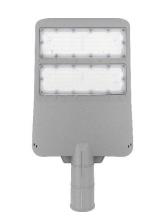

# 2Y 100 w Street Light Datasheet

<!--
source_file: 2Y 100 w Street Light Datasheet.pdf
pages: 2
images_extracted: 3
needs_manual_review: False
-->

## Page 1

PRODUCT DATASHEET
Street Light
Street Light 100 W
A R E A SOFA PPL ICATION
• Pu plicroad ways and highways
• Pe destrian zones and public spaces
• Ind ustrial and commercial areas
• Tu nnels and underpasses
PRODUCT BENEFITS
PRODUCT FEATURES
• Operating Voltage range: 85-265 V AC • Easy installation with fast connection
•Electrical Protection: Over Voltage Protection
• LED Lights consume significantly less energy
compared to traditional lighting sources
• Energy saving up to 60%
ELECTRICAL DATA
Driver SC
Nominal Wattage 100 W
Nominal Voltage 85-265 V AC
Main frequency 50 /60 Hz
PHOTOMETRIC DATA
Chip Phillips
LED Efficacy 130 lm /W
Total Luminous 13,000 Lm
Color temperature 6000 K
Color Rendering index Ra >80
Other varieties are available upon request

| PRODUCT FEATURES
• Operating Voltage range: 85-265 V AC
•Electrical Protection: Over Voltage Protectio | n |
| --- | --- |

|  | Driver |  | SC |  |
| --- | --- | --- | --- | --- |

|  | Nominal Voltage |  | 85-265 V AC |  |
| --- | --- | --- | --- | --- |

|  | PHOTOMETRIC DATA |  |  |
| --- | --- | --- | --- |

|  | LED Efficacy |  | 130 lm /W |  |
| --- | --- | --- | --- | --- |

|  | Color temperature |  | 6000 K |  |
| --- | --- | --- | --- | --- |

## Page 2

PRODUCT DATASHEET
TECHNICAL DATA
Street Light 100 W
COLORS & MATERIALS
Body Color Grey
Body Material Aluminum
LIFESPAN
Lifespan 20,000
Warranty 2
PROTECTION
Ingress protection IP 65
Impact protection IK 08
MOUNTING
Mounting Location Poles
Other varieties are available upon request

|  | S
COLORS & MATERIALS | S | treet Light 100 W |  |
| --- | --- | --- | --- | --- |
|  |  |  |  |  |
|  | Body Color |  | Grey |  |

|  | LIFESPAN |  |  |
| --- | --- | --- | --- |
|  | Lifespan | 20,000 |  |

|  | PROTECTION |  |  |  |
| --- | --- | --- | --- | --- |
|  | Ingress protection |  | IP 65 |  |

|  | MOUNTING |  |
| --- | --- | --- |

